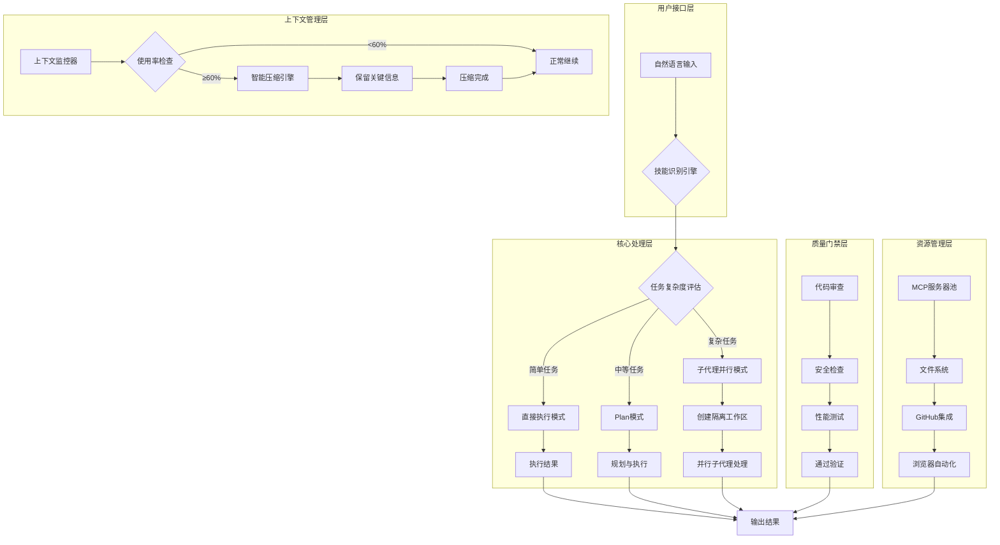
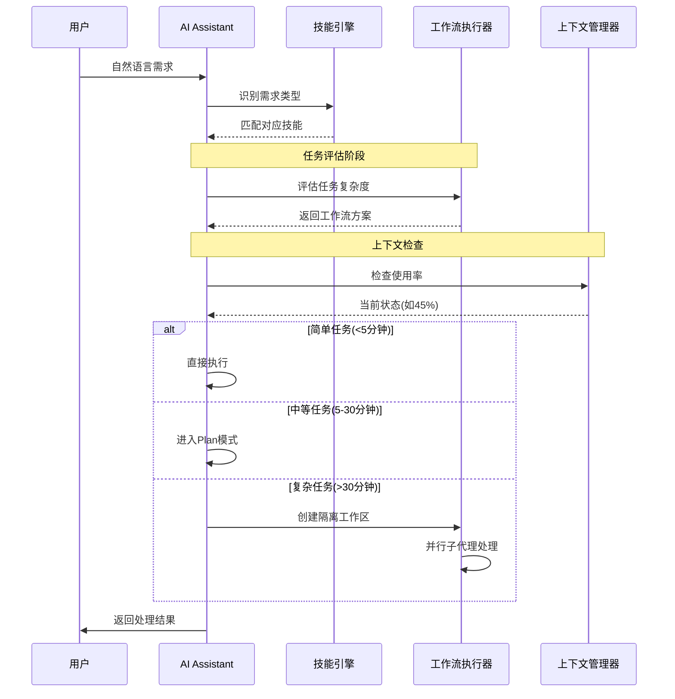
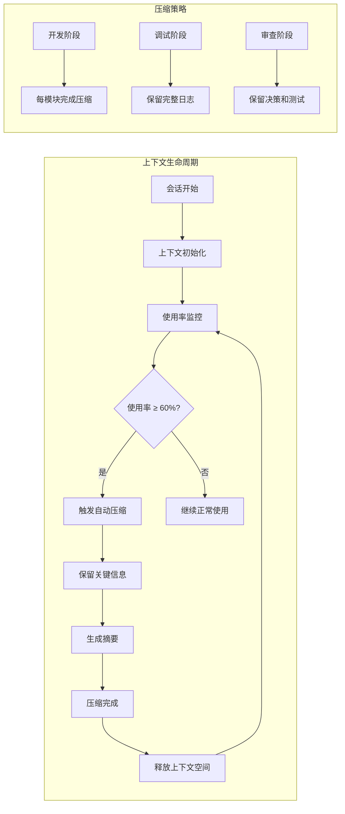
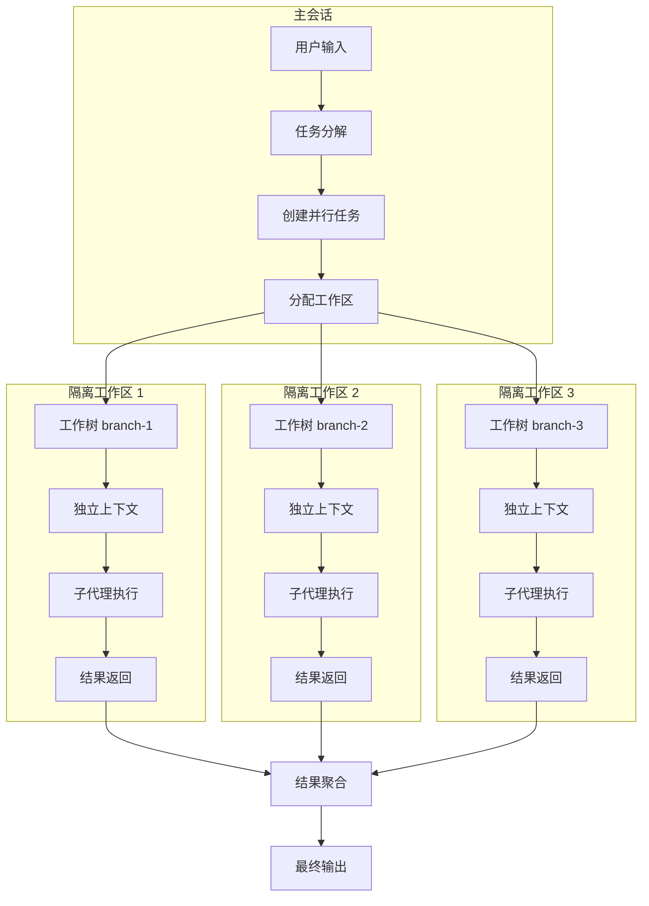
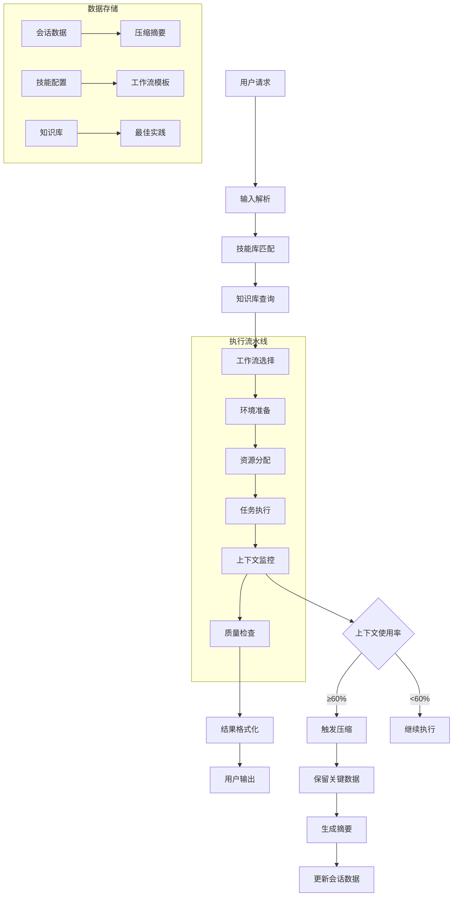
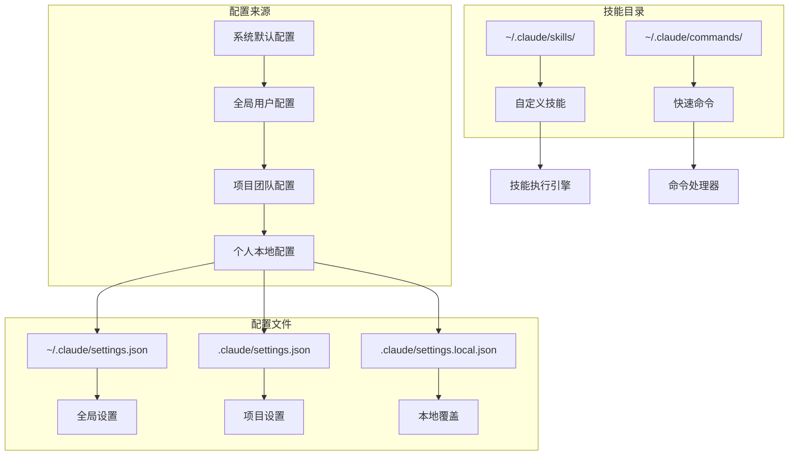

# AI Assistant 智能工作流系统架构图

## 🏗️ 系统整体架构



## 🔄 详细工作流程

### 1. 用户输入处理流程



### 2. 上下文管理机制



### 3. 并行处理架构



## 🛠️ 核心组件详解

### 1. 技能识别引擎
```
输入: 用户自然语言描述
输出: 匹配的技能和工作流
功能:
  - 关键词匹配
  - 意图识别
  - 技能优先级排序
  - 自动调用对应Skill
```

### 2. 任务评估模块
```
评估维度:
  - 时间预估 (<5min, 5-30min, >30min)
  - 资源需求 (CPU/内存/IO)
  - 复杂度评分 (1-10)
  - 依赖关系分析
  
输出策略:
  - 简单任务: 直接执行
  - 中等任务: Plan模式
  - 复杂任务: 并行处理 + 工作区隔离
```

### 3. 工作流执行器
```
执行模式:
  1. 直接执行模式
     - 无需规划
     - 立即响应
     - 使用/btw避免污染历史
     
  2. Plan模式
     - 详细规划步骤
     - 用户确认后执行
     - 任务完成时压缩
     
  3. 并行模式
     - git worktree创建隔离
     - 子代理并行处理
     - 结果聚合返回
```

### 4. 上下文管理器
```
核心功能:
  - 实时监控使用率
  - 60%自动压缩触发
  - 智能信息保留
  - 会话生命周期管理

环境变量:
  - AI_AUTOCOMPACT_PCT_OVERRIDE=60
  - AI_AUTO_COMPACT_WINDOW=120000
```

### 5. MCP集成层
```
核心MCP服务:
  - filesystem: 文件操作
  - github: 代码管理
  - playwright: 浏览器自动化
  
优化策略:
  - 连接池管理
  - 故障自动恢复
  - 性能监控
```

## 📊 数据流向图



## 🎯 智能决策矩阵

### 任务类型判断逻辑
```
IF 用户描述包含 "优化" OR "性能" OR "更快"
   → 调用 /cc-help 查询最佳实践

IF 用户描述包含 "复杂" OR "大型" OR "重构"
   → 评估为复杂任务 → 并行处理 + 工作区隔离

IF 用户描述包含 "MCP" OR "连接" OR "失败"
   → 调用 /mcp-optimizer 故障排查

IF 用户描述包含 "上下文" OR "压缩" OR "满了"
   → 调用 /context-manager 管理上下文

IF 用户描述包含 "工作流" OR "并行" OR "效率"
   → 调用 /optimized-workflow 优化处理
```

### 上下文管理决策
```
上下文使用率 < 60%: 继续正常使用
上下文使用率 ≥ 60%: 触发自动压缩
上下文使用率 ≥ 80%: 警告用户 + 强制压缩
上下文使用率 ≥ 95%: 紧急清理 + 可能丢失信息

压缩时机策略:
  - 开发阶段: 每功能模块完成
  - 调试阶段: 保留完整堆栈
  - 审查阶段: 保留决策记录
```

## 🔧 配置层级架构



## 🚀 性能优化策略

### 1. 缓存机制
```
- 技能匹配结果缓存
- 知识库查询缓存  
- MCP连接缓存
- 压缩摘要缓存
```

### 2. 并行优化
```
- 工作区物理隔离避免锁冲突
- 子代理负载均衡
- 资源限制防止内存溢出
- 超时机制避免死锁
```

### 3. 上下文优化
```
- 60%早期压缩保持质量
- 智能信息保留策略
- 定期清理旧会话
- 按需加载大文件
```

## 📈 监控与日志

### 监控指标
```
- 上下文使用率趋势
- 任务执行时间分布
- 技能调用频率
- MCP服务可用性
- 并行任务完成率
```

### 日志系统
```
- 会话操作日志
- 压缩决策日志
- 错误追踪日志
- 性能分析日志
```

## 💡 使用场景示例

### 场景1: 复杂功能开发
```
用户输入: "开发用户认证系统，包括登录、注册、密码重置"
系统响应:
  1. 识别为复杂任务
  2. 创建3个隔离工作区
  3. 并行处理三个子功能
  4. 每45分钟检查上下文
  5. 60%时智能压缩保留代码
  6. 聚合结果返回
```

### 场景2: 性能问题排查
```
用户输入: "AI Assistant运行很慢，怎么优化？"
系统响应:
  1. 调用 /cc-help 查询知识库
  2. 检查 MCP 连接状态
  3. 分析上下文使用模式
  4. 提供具体优化建议
```

### 场景3: 多任务并行
```
用户输入: "同时处理API重构、UI优化、测试编写"
系统响应:
  1. 创建三个独立工作树
  2. 每个任务独立上下文
  3. 并行执行互不干扰
  4. 统一进度监控
```

---

**架构总结**: AI Assistant智能工作流系统通过**技能识别引擎**自动理解用户意图，**任务评估模块**智能选择执行策略，**上下文管理器**保证系统稳定性，**并行处理架构**提升效率，形成完整的智能化开发辅助系统。

**核心优势**:
- 🎯 自然语言驱动，无需记忆命令
- ⚡ 智能任务评估，自动选择最优策略  
- 🛡️ 上下文自管理，避免溢出风险
- 🔄 物理隔离并行，真正无冲突处理
- 📚 知识库支撑，最佳实践内置