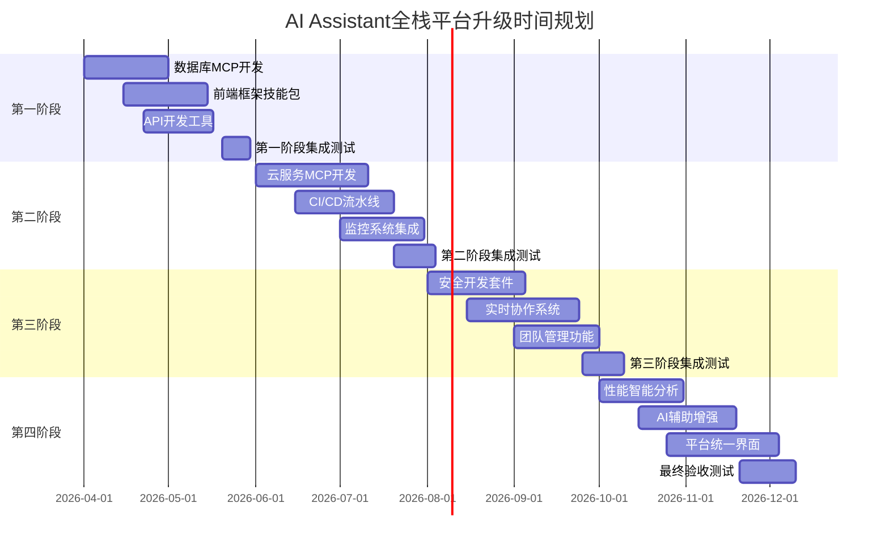

# AI Assistant 全栈开发平台升级实施计划

## 📋 项目概述

### 项目名称
AI Assistant 全栈开发平台升级计划 (代号: "CodeForge")

### 项目愿景
将 AI Assistant 从"智能代码助手"升级为"全栈开发平台"，覆盖从需求分析到部署上线的完整软件开发生命周期。

### 核心目标
1. **能力扩展**: 补全数据库、云服务、前端框架等关键能力缺口
2. **流程整合**: 统一需求、开发、测试、部署、运维全流程
3. **智能升级**: 从被动响应到主动建议的AI辅助开发
4. **团队协作**: 支持多人实时协作和代码审查
5. **质量保证**: 内置安全、性能、合规性检查

### 项目周期
**总周期**: 6-9个月 (分4个阶段)
**启动时间**: 2026年4月
**完成时间**: 2026年10月-12月

## 📊 当前状态分析

### 优势基础
1. **智能工作流引擎**: 任务评估、并行处理、上下文管理
2. **MCP扩展架构**: 支持服务集成和扩展
3. **技能系统**: 自定义技能开发和调用
4. **知识库支撑**: 69条最佳实践和故障排查指南
5. **开发体验**: 自然语言交互、60%自动压缩

### 关键能力缺口 (基于分析)
1. **数据库操作**: ❌ 无专用MCP，依赖外部工具
2. **云服务部署**: ❌ 基础Bash命令，无云API集成
3. **前端框架**: ⚠️ 文件操作，缺乏框架智能辅助
4. **API开发**: ⚠️ 基础支持，缺少标准化流程
5. **安全合规**: ❌ 基本检查，无系统化安全扫描
6. **团队协作**: ⚠️ GitHub基础集成，缺乏实时协作

## 🏗️ 架构设计原则

### 1. 扩展性原则
- **模块化设计**: 每个能力独立MCP或技能
- **插件化架构**: 支持按需加载功能模块
- **API标准化**: 统一接口规范，便于集成

### 2. 兼容性原则
- **向后兼容**: 确保现有技能和工作流继续可用
- **渐进升级**: 用户可选择启用新功能
- **配置迁移**: 平滑迁移现有配置到新平台

### 3. 智能性原则
- **上下文感知**: 基于项目类型自动推荐工具链
- **主动建议**: AI主动识别优化机会
- **学习演进**: 从用户行为学习最佳实践

### 4. 协作性原则
- **权限分级**: 支持团队角色和权限管理
- **状态同步**: 实时协作状态同步
- **知识共享**: 团队经验积累和复用

## 🗓️ 分阶段实施计划

### 第一阶段: 基础能力补全 (1.5-2个月)
**时间**: 2026年4月-5月
**目标**: 补全最紧急的数据库和前端开发能力

#### 1.1 数据库操作能力 (优先级: 🟡高)
| 任务 | 描述 | 技术方案 | 交付物 |
|------|------|----------|--------|
| **DB-MCP框架** | 通用数据库MCP框架 | 基于SQLAlchemy + 连接池 | `mcp-database`核心库 |
| **PostgreSQL集成** | PostgreSQL操作支持 | psycopg2连接器 + 查询生成 | `postgres-mcp`服务器 |
| **Redis集成** | 缓存和消息队列 | redis-py + Pub/Sub支持 | `redis-mcp`服务器 |
| **MongoDB集成** | 文档数据库支持 | pymongo + 聚合管道 | `mongodb-mcp`服务器 |
| **ORM集成** | SQLAlchemy/Prisma集成 | ORM模型生成和操作 | `orm-mcp`服务器 |

#### 1.2 前端框架支持 (优先级: 🟡高)
| 任务 | 描述 | 技术方案 | 交付物 |
|------|------|----------|--------|
| **React开发套件** | React组件和Hook生成 | 基于TS模板 + 组件库 | `/react-developer`技能 |
| **Vue.js开发套件** | Vue3 + Composition API | Vue模板 + Pinia状态 | `/vue-developer`技能 |
| **样式系统管理** | Tailwind/SCSS支持 | 样式生成和优化 | `/style-manager`技能 |
| **构建工具集成** | Vite/Webpack配置 | 自动构建配置生成 | `/build-config`技能 |

#### 1.3 API开发标准化 (优先级: 🟢中)
| 任务 | 描述 | 技术方案 | 交付物 |
|------|------|----------|--------|
| **OpenAPI规范** | API设计规范生成 | FastAPI/Express模板 | `/api-designer`技能 |
| **接口测试套件** | REST/GraphQL测试 | 基于pytest + requests | `/api-tester`技能 |
| **认证授权集成** | JWT/OAuth2支持 | 安全中间件生成 | `/auth-manager`技能 |

#### 第一阶段里程碑
- ✅ 数据库CRUD操作完整支持
- ✅ React/Vue项目初始化到组件生成
- ✅ REST API从设计到测试完整流程
- 📊 **效率提升目标**: 开发时间减少35-40%

---

### 第二阶段: DevOps与部署自动化 (2-2.5个月)
**时间**: 2026年6月-7月
**目标**: 实现完整的CI/CD流水线和云服务集成

#### 2.1 云服务集成 (优先级: 🟡高)
| 任务 | 描述 | 技术方案 | 交付物 |
|------|------|----------|--------|
| **AWS集成** | AWS服务操作支持 | boto3 SDK包装 | `aws-mcp`服务器 |
| **Docker管理** | 容器构建和运行 | Docker API包装 | `docker-mcp`服务器 |
| **Kubernetes集成** | K8s部署和管理 | kubernetes-client | `kubernetes-mcp`服务器 |
| **Serverless支持** | AWS Lambda/Vercel | 无服务器函数部署 | `/serverless-deploy`技能 |

#### 2.2 CI/CD流水线 (优先级: 🟡高)
| 任务 | 描述 | 技术方案 | 交付物 |
|------|------|----------|--------|
| **流水线生成器** | GitHub Actions/Jenkins | YAML模板生成 | `/ci-cd-pipeline`技能 |
| **测试自动化** | 单元/集成/E2E测试 | 测试套件编排 | `/test-orchestrator`技能 |
| **部署自动化** | 多环境部署 | 环境配置管理 | `/deployment-automation`技能 |

#### 2.3 监控与日志 (优先级: 🟢中)
| 任务 | 描述 | 技术方案 | 交付物 |
|------|------|----------|--------|
| **应用监控** | 性能指标收集 | Prometheus + Grafana | `/monitoring-setup`技能 |
| **日志管理** | 结构化日志系统 | ELK/EFK栈配置 | `/logging-system`技能 |
| **告警配置** | 异常检测和通知 | Alertmanager集成 | `/alert-manager`技能 |

#### 第二阶段里程碑
- ✅ 从代码提交到生产部署完整流水线
- ✅ 多云环境统一管理
- ✅ 实时监控和告警系统
- 📊 **效率提升目标**: 部署时间减少50-60%

---

### 第三阶段: 安全与协作增强 (1.5-2个月)
**时间**: 2026年8月-9月
**目标**: 建立系统化安全体系和团队协作平台

#### 3.1 安全开发体系 (优先级: 🟢中)
| 任务 | 描述 | 技术方案 | 交付物 |
|------|------|----------|--------|
| **安全扫描** | 代码漏洞检测 | Semgrep/CodeQL集成 | `/security-scan`技能 |
| **依赖检查** | 第三方漏洞检测 | OWASP Dependency-Check | `/dependency-check`技能 |
| **合规审计** | 安全标准符合性 | CIS基准检查 | `/compliance-audit`技能 |
| **秘钥管理** | 敏感信息保护 | HashiCorp Vault集成 | `/secrets-manager`技能 |

#### 3.2 团队协作平台 (优先级: 🟡高)
| 任务 | 描述 | 技术方案 | 交付物 |
|------|------|----------|--------|
| **实时协作** | 多人同时编辑 | WebSocket + OT算法 | `/real-time-collab`技能 |
| **代码审查** | 智能审查助手 | 代码质量分析 + AI建议 | `/code-review-assistant`技能 |
| **知识管理** | 团队经验库 | 知识图谱构建 | `/knowledge-sync`技能 |
| **权限管理** | 团队角色控制 | RBAC权限系统 | `/team-permissions`技能 |

#### 3.3 项目管理集成 (优先级: 🟢低)
| 任务 | 描述 | 技术方案 | 交付物 |
|------|------|----------|--------|
| **需求管理** | 用户故事和任务 | Jira/Linear集成 | `/requirement-manager`技能 |
| **进度追踪** | 项目进度可视化 | Gantt图 + 燃尽图 | `/progress-tracker`技能 |
| **文档协同** | 技术文档协作 | Markdown + 版本控制 | `/document-collab`技能 |

#### 第三阶段里程碑
- ✅ 端到端安全开发流程
- ✅ 团队实时协作开发环境
- ✅ 项目管理和知识共享系统
- 📊 **效率提升目标**: 团队协作效率提升40-50%

---

### 第四阶段: 智能优化与平台整合 (1-2个月)
**时间**: 2026年10月-11月
**目标**: 实现AI驱动的智能优化和平台统一体验

#### 4.1 性能智能分析 (优先级: 🟢中)
| 任务 | 描述 | 技术方案 | 交付物 |
|------|------|----------|--------|
| **性能剖析** | 代码性能分析 | cProfile + 火焰图 | `/performance-profiler`技能 |
| **内存分析** | 内存泄漏检测 | memory-profiler + 堆分析 | `/memory-analyzer`技能 |
| **优化建议** | 智能优化推荐 | ML模型 + 模式识别 | `/optimization-suggestions`技能 |
| **前端性能** | 加载渲染优化 | Lighthouse + Core Web Vitals | `/frontend-optimizer`技能 |

#### 4.2 AI辅助开发增强 (优先级: 🟡高)
| 任务 | 描述 | 技术方案 | 交付物 |
|------|------|----------|--------|
| **代码生成2.0** | 上下文感知生成 | 基于项目上下文的智能生成 | `/smart-codegen`技能 |
| **重构建议** | 架构改进建议 | 代码质量分析 + 重构模式 | `/refactoring-advisor`技能 |
| **错误预测** | 潜在问题预警 | 静态分析 + 历史模式 | `/error-predictor`技能 |
| **学习演进** | 用户行为学习 | 个性化推荐系统 | `/learning-evolution`技能 |

#### 4.3 平台统一体验 (优先级: 🟡高)
| 任务 | 描述 | 技术方案 | 交付物 |
|------|------|----------|--------|
| **统一控制台** | 集成管理界面 | Web UI + 命令行统一 | `/platform-console`技能 |
| **工作流编排** | 可视化工作流 | 拖拽式流程设计 | `/workflow-orchestrator`技能 |
| **个性化配置** | 用户偏好学习 | 个性化设置和推荐 | `/personalization`技能 |
| **生态市场** | 插件和模板市场 | 第三方扩展商店 | `/ecosystem-marketplace`技能 |

#### 第四阶段里程碑
- ✅ AI驱动的智能开发助手
- ✅ 统一的平台管理界面
- ✅ 个性化开发体验
- 📊 **效率提升目标**: 整体开发效率提升60-70%

## 🛠️ 技术实现方案

### 1. MCP服务器架构扩展
```yaml
# 新MCP服务器矩阵
mcp_servers:
  # 数据库类
  postgres-mcp:
    command: "python -m mcp_postgres"
    env: ["POSTGRES_URL"]
  redis-mcp:
    command: "python -m mcp_redis" 
    env: ["REDIS_URL"]
  
  # 云服务类
  aws-mcp:
    command: "python -m mcp_aws"
    env: ["AWS_ACCESS_KEY_ID", "AWS_SECRET_ACCESS_KEY"]
  docker-mcp:
    command: "python -m mcp_docker"
    
  # 监控类
  prometheus-mcp:
    command: "python -m mcp_prometheus"
    env: ["PROMETHEUS_URL"]
```

### 2. 技能系统扩展架构
```python
# 新技能架构模式
class FullstackSkill:
    """全栈技能基类"""
    def __init__(self):
        self.mcp_clients = {}  # MCP客户端池
        self.context = {}      # 项目上下文
        self.config = {}       # 技能配置
        
    def assess_complexity(self, task):
        """智能任务评估"""
        # 基于技术栈、规模、依赖评估复杂度
        
    def execute_workflow(self, task):
        """执行工作流"""
        # 根据评估结果选择执行策略
```

### 3. 数据持久化方案
```
~/.claude/fullstack/
├── projects/              # 项目配置
├── templates/            # 项目模板
├── knowledge/           # 学习知识库
├── logs/               # 运行日志
└── cache/              # 缓存数据
```

### 4. 实时协作技术栈
```
前端: React + WebSocket + CodeMirror
后端: FastAPI + WebSocket + Redis Pub/Sub
算法: Operational Transformation (OT)
存储: PostgreSQL + Redis
```

## 📈 资源与时间规划

### 人力资源需求
| 角色 | 数量 | 职责 | 参与阶段 |
|------|------|------|----------|
| **后端工程师** | 2-3 | MCP开发、API集成 | 全周期 |
| **前端工程师** | 1-2 | UI开发、协作功能 | 阶段3-4 |
| **DevOps工程师** | 1-2 | 云服务、部署流水线 | 阶段2-3 |
| **AI工程师** | 1 | 智能算法、ML模型 | 阶段4 |
| **产品经理** | 1 | 需求分析、功能设计 | 全周期 |

### 时间规划甘特图


## ⚠️ 风险评估与应对策略

### 技术风险
| 风险 | 概率 | 影响 | 应对策略 |
|------|------|------|----------|
| **MCP性能问题** | 中 | 高 | 连接池优化、异步处理、缓存机制 |
| **云API稳定性** | 低 | 高 | 降级方案、重试机制、本地模拟 |
| **实时协作同步** | 中 | 中 | OT算法测试、冲突解决策略 |
| **安全漏洞风险** | 低 | 高 | 安全审计、权限最小化、漏洞奖励计划 |

### 资源风险
| 风险 | 概率 | 影响 | 应对策略 |
|------|------|------|----------|
| **开发人员不足** | 中 | 高 | 分阶段实施、优先核心功能、外包非核心 |
| **时间超支** | 高 | 中 | 敏捷开发、MVP先行、定期进度评审 |
| **技术债务累积** | 高 | 中 | 代码审查、重构计划、技术债务跟踪 |

### 用户接受度风险
| 风险 | 概率 | 影响 | 应对策略 |
|------|------|------|----------|
| **学习曲线陡峭** | 中 | 中 | 渐进式引导、详细文档、视频教程 |
| **迁移成本高** | 低 | 高 | 兼容模式、迁移工具、数据转换 |
| **功能冗余感** | 低 | 低 | 模块化安装、功能开关、个性化配置 |

## 📊 成功指标与评估

### 技术指标
| 指标 | 目标值 | 测量方法 |
|------|--------|----------|
| **MCP响应时间** | <200ms (P95) | 性能监控系统 |
| **API可用性** | >99.5% | 健康检查 |
| **内存使用** | <500MB/实例 | 资源监控 |
| **并发用户** | 支持100+ | 压力测试 |

### 用户体验指标
| 指标 | 目标值 | 测量方法 |
|------|--------|----------|
| **开发效率提升** | 60-70% | 任务完成时间对比 |
| **用户满意度** | >4.5/5 | 用户调研问卷 |
| **学习成本** | <2小时基础使用 | 新手任务完成时间 |
| **功能使用率** | >80%核心功能 | 功能埋点分析 |

### 业务指标
| 指标 | 目标值 | 测量方法 |
|------|--------|----------|
| **团队采用率** | >70%开发团队 | 团队调研统计 |
| **代码质量提升** | 缺陷率下降40% | 代码审查数据 |
| **部署频率** | 提升3-5倍 | 部署流水线统计 |
| **事故响应时间** | 减少60% | 监控系统数据 |

## 🚀 实施路线图总结

### 关键决策点
1. **技术选型确认** (2026年4月第1周)
   - MCP框架选型
   - 数据库连接方案
   - 前端技术栈

2. **第一阶段验收** (2026年5月底)
   - 数据库操作能力验证
   - 前端开发流程测试
   - API开发工具评估

3. **平台架构评审** (2026年7月底)
   - 扩展性评估
   - 性能基准测试
   - 安全架构审查

4. **最终发布准备** (2026年11月底)
   - 用户验收测试
   - 文档完善
   - 培训材料准备

### 迭代发布计划
- **v1.0 Alpha** (2026年5月): 基础能力补全
- **v1.5 Beta** (2026年7月): DevOps自动化
- **v2.0 RC** (2026年9月): 安全与协作
- **v2.5 GA** (2026年11月): 智能优化平台

### 长期演进方向
1. **AI原生开发** (2027年)
   - 代码意图理解
   - 自动重构优化
   - 智能错误修复

2. **低代码扩展** (2027年)
   - 可视化开发界面
   - 拖拽式组件设计
   - 业务逻辑编排

3. **生态体系建设** (2028年)
   - 第三方插件市场
   - 企业定制版本
   - 云托管服务

## 💡 核心创新点

### 1. **智能上下文感知**
- 基于项目类型自动推荐工具链
- 开发习惯学习和适应
- 跨项目经验迁移

### 2. **全链路可追溯**
- 需求→代码→部署完整追溯
- 性能影响分析
- 变更影响评估

### 3. **主动安全防护**
- 开发时安全检测
- 运行时防护
- 合规性自动检查

### 4. **协作智能增强**
- 智能代码审查
- 结对编程辅助
- 团队知识积累

---

**项目启动准备**: 
- [ ] 组建核心团队 (1周)
- [ ] 详细技术方案设计 (2周)
- [ ] 开发环境搭建 (1周)
- [ ] 原型验证 (2周)

**成功关键因素**:
1. **用户为中心**: 持续收集反馈，快速迭代
2. **技术稳健性**: 保证系统稳定性和性能
3. **生态开放性**: 支持第三方扩展和集成
4. **数据驱动**: 基于指标优化产品方向

**最终愿景**: 打造一个**智能、协作、安全、高效**的全栈开发平台，重新定义AI辅助软件开发的新标准。