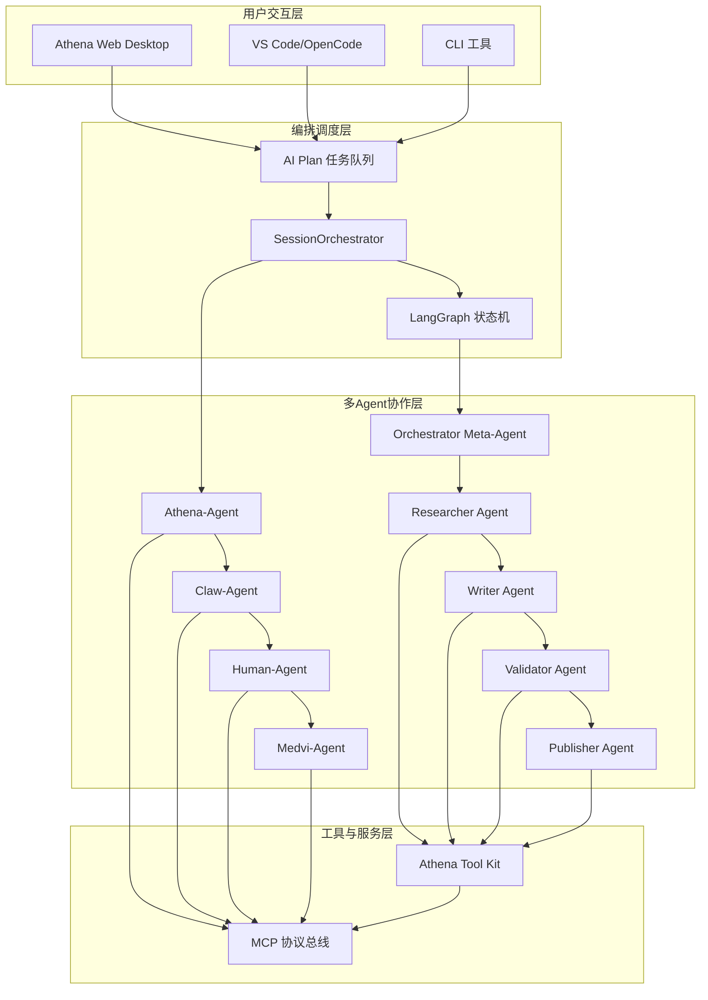

# Athena-Agentic 与 OpenHuman 对齐工程实施方案

## 📋 项目概述

### 对齐目标
将 **Athena-Agentic**（Karpathy式多Agent并行编排系统）与 **Athena-OpenHuman**（GEO-Agent架构的多Agent协作系统）进行深度集成，构建统一的Agent编排平台。

### 当前状态分析

#### Athena-Agentic 现状（已完成）
- ✅ **MCP协议层**：标准化的Agent间通信协议
- ✅ **SessionOrchestrator**：Karpathy式多Agent并行编排器
- ✅ **4个核心Agent**：Athena、Claw、Human、Medvi
- ✅ **递归闭环**：自动演进和优化机制

#### Athena-OpenHuman 现状（已规划）
- ✅ **GEO-Agent架构设计**：四层Agent协作模式
- ✅ **LangGraph状态机**：类型安全的状态管理
- ✅ **统一工具封装层**：错误重试、缓存机制
- ⏳ **实施阶段**：8周工程化实施方案

## 🎯 对齐架构设计

### 统一架构图



### Agent 角色映射表

| Athena-Agentic Agent | Athena-OpenHuman Agent | 角色定位 | 核心能力 |
|---------------------|-----------------------|----------|----------|
| **Athena-Agent** | **Orchestrator Meta-Agent** | 策略规划、任务分解 | 全局协调、质量门禁 |
| **Claw-Agent** | **Researcher Agent** + **Publisher Agent** | 工具执行、发布管理 | 关键词挖掘、多平台发布 |
| **Human-Agent** | **Writer Agent** | 内容生成、知识编译 | 大纲生成、正文撰写 |
| **Medvi-Agent** | **Validator Agent** | 质量审核、社区反馈 | GEO评分、事实核查 |

## 🔧 技术集成方案

### 1. MCP协议统一化

#### 目标
将 Athena-OpenHuman 的 Agent 通信统一到 MCP 协议标准。

#### 实施步骤
```python
# 在 Athena-OpenHuman 中实现 MCP 适配器
class OpenHumanMCPAdapter:
    """OpenHuman Agent 的 MCP 协议适配器"""
    
    def __init__(self, agent: BaseAgent):
        self.agent = agent
        self.mcp_bus = message_bus
    
    async def handle_mcp_message(self, message: MCPMessage) -> MCPMessage:
        """处理 MCP 消息"""
        if message.type == MessageType.TASK_DISPATCH:
            # 将 MCP 任务转换为 OpenHuman Agent 可执行的任务
            task = self._convert_to_openhuman_task(message.payload)
            result = await self.agent.execute(task)
            return MCPMessage.create_response(message, result)
        
        elif message.type == MessageType.CAPABILITY_ANNOUNCE:
            # 宣告 OpenHuman Agent 的能力
            capabilities = self.agent.get_capabilities()
            return MCPMessage.create_capability_announce(capabilities)
```

### 2. SessionOrchestrator 与 LangGraph 集成

#### 目标
实现 SessionOrchestrator 的并行编排能力与 LangGraph 状态机的无缝集成。

#### 实施步骤
```python
class UnifiedOrchestrator:
    """统一的编排器 - 结合 SessionOrchestrator 和 LangGraph"""
    
    def __init__(self):
        self.session_orchestrator = SessionOrchestrator()
        self.langgraph_workflow = GeoWorkflow()
    
    async def dispatch_intent(self, user_intent: str) -> ExecutionResult:
        """分发用户意图到合适的编排引擎"""
        
        # 1. 使用 IntentEngine 分析意图类型
        intent_type = await self.intent_engine.analyze_intent_type(user_intent)
        
        if intent_type == "geo_content_generation":
            # 使用 LangGraph 状态机处理 GEO 内容生成
            return await self._dispatch_to_langgraph(user_intent)
        elif intent_type == "parallel_execution":
            # 使用 SessionOrchestrator 处理并行任务
            return await self._dispatch_to_session_orchestrator(user_intent)
        else:
            # 默认使用 SessionOrchestrator
            return await self._dispatch_to_session_orchestrator(user_intent)
    
    async def _dispatch_to_langgraph(self, intent: str) -> ExecutionResult:
        """分发到 LangGraph 状态机"""
        # 创建初始状态
        initial_state = GeoState(
            seed_keyword=intent,
            semantic_clusters=[],
            content_outline={},
            quality_score=0.0
        )
        
        # 执行工作流
        final_state = await self.langgraph_workflow.run(initial_state)
        
        return ExecutionResult(
            plan_id=str(uuid.uuid4()),
            results={"langgraph": final_state},
            completed_at=datetime.now().timestamp(),
            overall_status="success",
            summary=f"GEO内容生成完成: {final_state.get('publish_urls', [])}"
        )
```

### 3. 统一工具封装层

#### 目标
将 Athena-Agentic 的工具执行能力与 Athena-OpenHuman 的统一工具封装层集成。

#### 实施步骤
```python
class UnifiedToolKit:
    """统一的工具封装层"""
    
    def __init__(self):
        self.cli_wrappers = CLIToolWrapper()
        self.cache_manager = CacheManager()
    
    @retry(stop=stop_after_attempt(3), wait=wait_exponential(multiplier=1, min=4, max=10))
    async def execute_tool(self, tool_name: str, command: str, params: Dict[str, Any]) -> Dict[str, Any]:
        """执行工具命令（带重试和缓存）"""
        
        # 生成缓存键
        cache_key = f"tool:{tool_name}:{command}:{hash(str(params))}"
        
        # 检查缓存
        cached_result = await self.cache_manager.get(cache_key)
        if cached_result:
            return cached_result
        
        try:
            # 执行工具
            if tool_name == "serpapi":
                result = await self.cli_wrappers.serpapi_search(command, params)
            elif tool_name == "readability":
                result = await self.cli_wrappers.readability_analyze(command, params)
            elif tool_name == "ollama":
                result = await self.cli_wrappers.ollama_generate(command, params)
            else:
                # 使用 Claw-Agent 执行通用工具
                result = await self._execute_via_claw_agent(tool_name, command, params)
            
            # 缓存结果
            await self.cache_manager.set(cache_key, result, ttl=3600)
            
            return result
            
        except Exception as e:
            # 记录错误并重试
            logger.error(f"工具执行失败: {tool_name} - {e}")
            raise
```

## 📊 实施计划

### 第一阶段：协议集成（第1-2周）

#### 目标
实现 MCP 协议在 Athena-OpenHuman 中的完整支持。

#### 交付物
- ✅ MCP 协议适配器 (`openhuman_mcp_adapter.py`)
- ✅ OpenHuman Agent 的 MCP 能力宣告
- ✅ MCP 消息路由和转换机制
- ✅ 集成测试用例

#### 技术任务
1. **MCP 协议实现**
   - 实现 MCPMessage 的序列化/反序列化
   - 创建消息总线集成
   - 实现心跳机制

2. **Agent 适配器开发**
   - Researcher Agent MCP 适配器
   - Writer Agent MCP 适配器  
   - Validator Agent MCP 适配器
   - Publisher Agent MCP 适配器

### 第二阶段：编排引擎集成（第3-4周）

#### 目标
实现 SessionOrchestrator 与 LangGraph 的无缝协作。

#### 交付物
- ✅ 统一编排器 (`unified_orchestrator.py`)
- ✅ 意图类型识别引擎
- ✅ 工作流路由机制
- ✅ 性能基准测试

#### 技术任务
1. **意图分析引擎**
   - 扩展 IntentEngine 支持 GEO 内容识别
   - 实现工作流类型分类
   - 创建意图到工作流的映射规则

2. **编排器集成**
   - 实现 UnifiedOrchestrator 核心逻辑
   - 创建工作流分发机制
   - 实现结果汇总和状态同步

### 第三阶段：工具层统一（第5-6周）

#### 目标
构建统一的工具封装层，支持两种架构的工具调用。

#### 交付物
- ✅ 统一工具封装层 (`unified_toolkit.py`)
- ✅ 工具缓存和重试机制
- ✅ 性能监控和优化
- ✅ 工具调用日志和审计

#### 技术任务
1. **工具封装层开发**
   - 实现 UnifiedToolKit 核心功能
   - 集成 Claw-Agent 的工具执行能力
   - 实现缓存和重试策略

2. **性能优化**
   - 工具调用性能基准测试
   - 缓存策略优化
   - 并发执行优化

### 第四阶段：系统集成和测试（第7-8周）

#### 目标
完成系统集成，进行全面的功能测试和性能测试。

#### 交付物
- ✅ 集成测试套件
- ✅ 性能测试报告
- ✅ 用户文档和API文档
- ✅ 部署和运维指南

#### 技术任务
1. **集成测试**
   - 端到端功能测试
   - 错误处理和恢复测试
   - 性能压力测试

2. **文档和部署**
   - 编写用户使用指南
   - 创建API文档
   - 制定部署和运维流程

## 🚀 技术架构演进

### 当前架构 → 目标架构

```
当前架构（分离）:
Athena-Agentic ──┐
                 ├─→ 用户
Athena-OpenHuman ─┘

目标架构（统一）:
          ┌─→ Athena-Agentic Agents
用户 ──→ 统一编排平台 ──→ 统一工具层
          └─→ Athena-OpenHuman Agents
```

### 关键技术创新

#### 1. 混合编排模式
- **并行编排**：SessionOrchestrator 的 Karpathy 式并行执行
- **状态机编排**：LangGraph 的类型安全状态流转
- **智能路由**：基于意图类型自动选择最优编排方式

#### 2. 统一通信协议
- **MCP 标准化**：所有 Agent 使用统一的通信协议
- **消息路由**：智能消息路由和转换
- **能力发现**：动态 Agent 能力发现和注册

#### 3. 工具执行优化
- **统一封装**：所有工具调用通过统一接口
- **智能缓存**：基于内容哈希的智能缓存
- **错误恢复**：多层错误处理和重试机制

## 📈 预期收益

### 技术收益
1. **架构统一**：消除系统间的技术债务和集成复杂度
2. **性能提升**：通过统一工具层减少重复的工具调用
3. **可维护性**：统一的代码库和架构标准
4. **扩展性**：支持更多 Agent 类型的无缝集成

### 业务收益
1. **开发效率**：减少跨系统集成的开发时间
2. **运营成本**：统一的监控和运维体系
3. **用户体验**：一致的用户界面和交互体验
4. **创新能力**：更快的新功能迭代速度

## 🔒 风险控制

### 技术风险
1. **集成复杂度**：通过分阶段实施降低风险
2. **性能影响**：通过基准测试和性能监控控制
3. **兼容性问题**：保持向后兼容的API设计

### 实施风险
1. **进度风险**：通过敏捷迭代和持续交付控制
2. **质量风险**：通过自动化测试和代码审查控制
3. **团队协作**：通过清晰的接口定义和文档控制

---

**文档版本**: v1.0  
**创建时间**: 2026-04-06  
**维护团队**: Athena 架构集成组  
**参考文档**: 
- Athena-Agentic IMPLEMENTATION_GUIDE.md
- Athena-OpenHuman GEO-Agent工程化实施方案.md
- Athena系统架构图.md