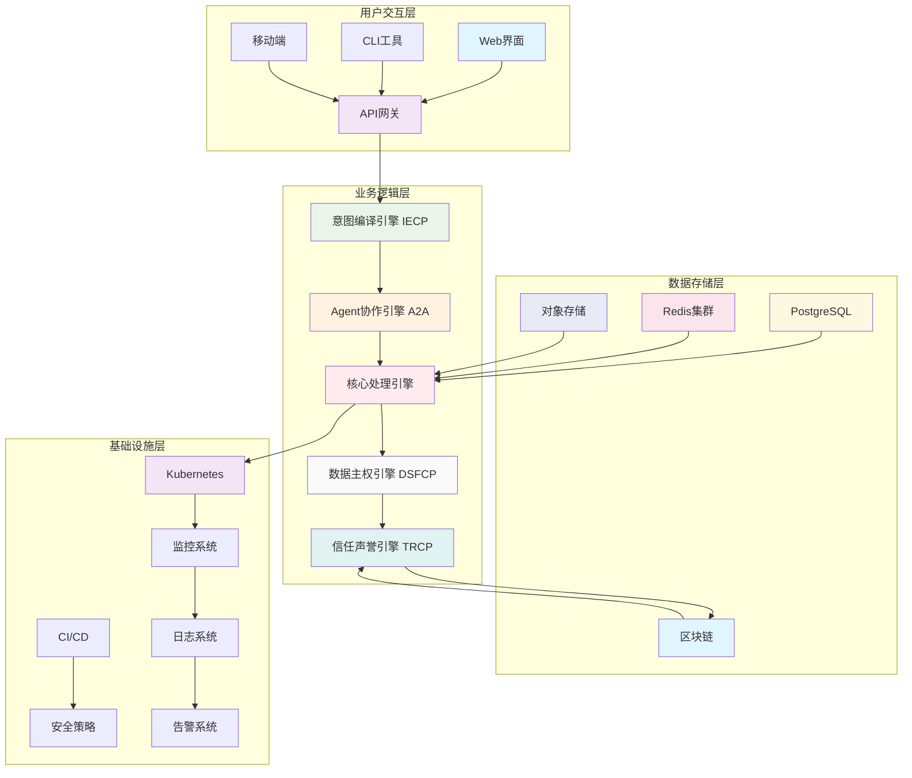

# Athena/open human技术架构详细设计文档

**基于参考升级资料的技术实现规范**  
**版本**：v1.0 | **时间**：2026-04-01 | **目标**：为开发团队提供具体技术指导  
**受众**：架构师、开发工程师、运维工程师

---

## 执行摘要

本文档为Athena/open human项目提供详细的技术架构设计，涵盖系统架构、组件设计、接口规范、数据模型等具体技术实现细节。基于Claude Code架构、Agent互联网协议和Athena修复机制的三层融合，确保技术实现的可行性和可维护性。

### 核心设计原则
1. **模块化设计**：清晰的模块边界和接口定义
2. **安全优先**：多层安全机制贯穿整个架构
3. **可扩展性**：支持水平扩展和功能演进
4. **工程化标准**：符合企业级开发规范

---

## 第一章：系统架构详细设计

### 1.1 整体架构组件图



### 1.2 技术栈详细配置

#### 1.2.1 后端技术栈

```typescript
// package.json 核心依赖配置
{
  "name": "athena-openhuman-backend",
  "version": "1.0.0",
  "type": "module",
  "engines": {
    "bun": ">=1.1.0",
    "node": ">=20.0.0"
  },
  "dependencies": {
    // 运行时
    "@types/bun": "^1.1.0",
    "typescript": "^5.3.0",
    
    // Web框架
    "fastify": "^4.0.0",
    "@fastify/websocket": "^8.0.0",
    
    // 数据访问
    "prisma": "^5.0.0",
    "@prisma/client": "^5.0.0",
    "redis": "^4.0.0",
    
    // 安全
    "@fastify/jwt": "^7.0.0",
    "bcrypt": "^5.0.0",
    "helmet": "^7.0.0",
    
    // AI集成
    "openai": "^4.0.0",
    "langchain": "^0.1.0",
    
    // 工具和工具
    "zod": "^3.22.0",
    "pino": "^9.0.0"
  },
  "devDependencies": {
    "@types/node": "^20.0.0",
    "jest": "^29.0.0",
    "supertest": "^6.0.0",
    "eslint": "^8.0.0"
  }
}
```

#### 1.2.2 前端技术栈

```typescript
// 前端技术栈配置
{
  "framework": "Next.js 14.x",
  "ui": "React 18.x + Tailwind CSS",
  "state": "Zustand + React Query",
  "form": "React Hook Form + Zod",
  "chart": "Recharts",
  "testing": "Jest + React Testing Library"
}
```

---

## 第二章：核心组件详细设计

### 2.1 意图编译引擎（IECP）设计

#### 2.1.1 组件架构

```typescript
// IECP引擎核心接口定义
interface IIECPEngine {
  // 自然语言解析
  parseIntent(userInput: string, context: Context): Promise<ParsedIntent>;
  
  // 执行计划生成
  generateExecutionPlan(intent: ParsedIntent): Promise<ExecutionPlan>;
  
  // 上下文管理
  manageContext(sessionId: string, context: Context): Promise<void>;
  
  // 错误处理
  handleIntentError(error: IntentError): Promise<RecoveryPlan>;
}

// 解析后的意图结构
interface ParsedIntent {
  id: string;
  type: IntentType; // QUERY, COMMAND, QUESTION, etc.
  entities: Entity[];
  actions: Action[];
  constraints: Constraint[];
  confidence: number;
  timestamp: Date;
}

// 执行计划结构
interface ExecutionPlan {
  steps: ExecutionStep[];
  dependencies: Dependency[];
  estimatedDuration: number;
  riskLevel: RiskLevel;
  fallbackPlan?: ExecutionPlan;
}
```

#### 2.1.2 实现细节

```typescript
// IECP引擎实现类
class IECPEngine implements IIECPEngine {
  private llmClient: LLMClient;
  private intentClassifier: IntentClassifier;
  private entityExtractor: EntityExtractor;
  private planGenerator: PlanGenerator;
  
  async parseIntent(userInput: string, context: Context): Promise<ParsedIntent> {
    // 1. 意图分类
    const intentType = await this.intentClassifier.classify(userInput);
    
    // 2. 实体提取
    const entities = await this.entityExtractor.extract(userInput);
    
    // 3. 动作识别
    const actions = await this.identifyActions(intentType, entities);
    
    // 4. 约束分析
    const constraints = await this.analyzeConstraints(userInput, context);
    
    return {
      id: generateId(),
      type: intentType,
      entities,
      actions,
      constraints,
      confidence: await this.calculateConfidence(intentType, entities),
      timestamp: new Date()
    };
  }
  
  async generateExecutionPlan(intent: ParsedIntent): Promise<ExecutionPlan> {
    // 基于意图类型和实体生成执行计划
    const steps = await this.planGenerator.generateSteps(intent);
    const dependencies = this.analyzeDependencies(steps);
    
    return {
      steps,
      dependencies,
      estimatedDuration: this.estimateDuration(steps),
      riskLevel: this.assessRisk(steps),
      fallbackPlan: await this.generateFallbackPlan(intent)
    };
  }
}
```

### 2.2 Agent协作引擎（A2A）设计

#### 2.2.1 协议消息格式

```typescript
// A2A协议消息格式
interface A2AMessage {
  header: A2AHeader;
  body: A2ABody;
  signature: string;
}

interface A2AHeader {
  messageId: string;
  timestamp: Date;
  senderDid: string;
  receiverDid: string;
  messageType: MessageType;
  ttl: number; // 生存时间（秒）
  intentFingerprint: string;
  executionTraceHash: string;
}

interface A2ABody {
  type: BodyType;
  content: any;
  metadata: Metadata;
}

// 能力广告消息
interface CapabilityAdvertisement {
  agentId: string;
  capabilities: Capability[];
  reputationScore: number;
  pricing: PricingModel;
  availability: Availability;
}

// 任务委托消息
interface TaskDelegation {
  taskId: string;
  requirements: Requirement[];
  deadline: Date;
  budget: Budget;
  successCriteria: SuccessCriterion[];
}
```

#### 2.2.2 Agent注册发现机制

```typescript
// Agent注册表实现
class AgentRegistry {
  private storage: StorageAdapter;
  private discovery: DiscoveryService;
  
  async registerAgent(agent: AgentInfo): Promise<void> {
    const capabilityHash = this.hashCapabilities(agent.capabilities);
    const registration: AgentRegistration = {
      agentId: agent.id,
      capabilities: agent.capabilities,
      capabilityHash,
      reputation: agent.reputation,
      lastSeen: new Date(),
      metadata: agent.metadata
    };
    
    await this.storage.store(`agent:${agent.id}`, registration);
    await this.discovery.broadcastRegistration(registration);
  }
  
  async discoverAgents(criteria: DiscoveryCriteria): Promise<AgentInfo[]> {
    const agents = await this.storage.query({
      type: 'agent',
      capabilities: criteria.requiredCapabilities,
      minReputation: criteria.minReputation,
      maxLatency: criteria.maxLatency
    });
    
    return agents.filter(agent => 
      this.matchesCriteria(agent, criteria)
    );
  }
  
  async delegateTask(task: Task, candidateAgents: AgentInfo[]): Promise<DelegationResult> {
    // 1. 收集报价
    const bids = await this.collectBids(task, candidateAgents);
    
    // 2. 选择最优Agent
    const selectedAgent = this.selectOptimalAgent(bids, task);
    
    // 3. 建立委托关系
    const contract = await this.createContract(task, selectedAgent);
    
    // 4. 监控执行
    const monitor = this.monitorExecution(contract);
    
    return { contract, monitor };
  }
}
```

---

## 第三章：数据模型设计

### 3.1 核心数据表设计

#### 3.1.1 用户和身份管理

```sql
-- 用户表
CREATE TABLE users (
  id UUID PRIMARY KEY DEFAULT gen_random_uuid(),
  did VARCHAR(255) UNIQUE NOT NULL, -- 去中心化身份标识
  email VARCHAR(255) UNIQUE,
  username VARCHAR(100) UNIQUE,
  created_at TIMESTAMP DEFAULT NOW(),
  updated_at TIMESTAMP DEFAULT NOW(),
  status USER_STATUS DEFAULT 'active'
);

-- 用户配置表
CREATE TABLE user_preferences (
  user_id UUID REFERENCES users(id),
  language VARCHAR(10) DEFAULT 'zh-CN',
  timezone VARCHAR(50) DEFAULT 'Asia/Shanghai',
  notification_settings JSONB DEFAULT '{}',
  privacy_settings JSONB DEFAULT '{}',
  PRIMARY KEY (user_id)
);

-- 身份验证表
CREATE TABLE authentications (
  id UUID PRIMARY KEY DEFAULT gen_random_uuid(),
  user_id UUID REFERENCES users(id),
  provider AUTH_PROVIDER NOT NULL, -- 'password', 'oauth', 'webauthn'
  provider_id VARCHAR(255), -- OAuth provider user ID
  credentials JSONB, -- 加密的凭据数据
  created_at TIMESTAMP DEFAULT NOW(),
  last_used_at TIMESTAMP
);
```

#### 3.1.2 Agent和技能管理

```sql
-- Agent注册表
CREATE TABLE agents (
  id UUID PRIMARY KEY DEFAULT gen_random_uuid(),
  did VARCHAR(255) UNIQUE NOT NULL,
  name VARCHAR(255) NOT NULL,
  description TEXT,
  owner_id UUID REFERENCES users(id),
  capabilities JSONB NOT NULL, -- 能力定义
  reputation_score DECIMAL(3,2) DEFAULT 0.0,
  total_tasks INTEGER DEFAULT 0,
  success_rate DECIMAL(5,4) DEFAULT 0.0,
  created_at TIMESTAMP DEFAULT NOW(),
  updated_at TIMESTAMP DEFAULT NOW(),
  status AGENT_STATUS DEFAULT 'active'
);

-- 技能资产表（STP协议）
CREATE TABLE skills (
  id UUID PRIMARY KEY DEFAULT gen_random_uuid(),
  name VARCHAR(255) NOT NULL,
  description TEXT,
  category SKILL_CATEGORY NOT NULL,
  input_schema JSONB NOT NULL,
  output_schema JSONB NOT NULL,
  implementation JSONB, -- 技能实现（加密存储）
  owner_id UUID REFERENCES users(id),
  price_model PRICING_MODEL NOT NULL,
  stp_token_address VARCHAR(255), -- 区块链地址
  created_at TIMESTAMP DEFAULT NOW(),
  version INTEGER DEFAULT 1,
  is_public BOOLEAN DEFAULT false
);

-- 任务执行记录
CREATE TABLE task_executions (
  id UUID PRIMARY DEFAULT gen_random_uuid(),
  task_id UUID REFERENCES tasks(id),
  agent_id UUID REFERENCES agents(id),
  started_at TIMESTAMP DEFAULT NOW(),
  completed_at TIMESTAMP,
  status EXECUTION_STATUS DEFAULT 'pending',
  result JSONB, -- 执行结果
  error_message TEXT,
  execution_time INTEGER, -- 执行耗时（毫秒）
  resource_usage JSONB -- 资源使用情况
);
```

### 3.2 数据访问层设计

```typescript
// 使用Prisma ORM的数据访问层
import { PrismaClient } from '@prisma/client';

const prisma = new PrismaClient({
  log: ['query', 'info', 'warn', 'error']
});

// 用户数据访问类
class UserRepository {
  async findByDID(did: string): Promise<User | null> {
    return prisma.user.findUnique({
      where: { did },
      include: {
        preferences: true,
        authentications: true
      }
    });
  }
  
  async createUser(userData: CreateUserInput): Promise<User> {
    return prisma.user.create({
      data: {
        did: userData.did,
        email: userData.email,
        username: userData.username,
        preferences: {
          create: userData.preferences
        }
      },
      include: {
        preferences: true
      }
    });
  }
}

// Agent数据访问类
class AgentRepository {
  async findAgentsByCapability(capability: string): Promise<Agent[]> {
    return prisma.agent.findMany({
      where: {
        capabilities: {
          path: ['$[*].type'],
          array_contains: [capability]
        },
        status: 'active',
        reputation_score: { gte: 3.0 } // 最低声誉要求
      },
      orderBy: {
        reputation_score: 'desc'
      },
      take: 10
    });
  }
  
  async updateReputation(agentId: string, success: boolean): Promise<Agent> {
    const agent = await prisma.agent.findUnique({
      where: { id: agentId }
    });
    
    if (!agent) {
      throw new Error('Agent not found');
    }
    
    const newTotalTasks = agent.total_tasks + 1;
    const newSuccessCount = success ? agent.success_count + 1 : agent.success_count;
    const newSuccessRate = newSuccessCount / newTotalTasks;
    
    // 更新声誉分数（基于成功率和任务数量）
    const reputationScore = this.calculateReputation(newSuccessRate, newTotalTasks);
    
    return prisma.agent.update({
      where: { id: agentId },
      data: {
        total_tasks: newTotalTasks,
        success_count: newSuccessCount,
        success_rate: newSuccessRate,
        reputation_score: reputationScore,
        updated_at: new Date()
      }
    });
  }
}
```

---

## 第四章：API接口设计

### 4.1 REST API设计

#### 4.1.1 用户管理API

```typescript
// 用户注册接口
POST /api/v1/users/register
Content-Type: application/json

{
  "did": "did:ethr:0x123...",
  "email": "user@example.com",
  "username": "testuser",
  "preferences": {
    "language": "zh-CN",
    "timezone": "Asia/Shanghai"
  }
}

Response:
{
  "id": "uuid",
  "did": "did:ethr:0x123...",
  "email": "user@example.com",
  "username": "testuser",
  "created_at": "2026-04-01T10:00:00Z",
  "status": "active"
}

// 用户登录接口
POST /api/v1/auth/login
Content-Type: application/json

{
  "did": "did:ethr:0x123...",
  "signature": "0xabc..." // DID签名
}

Response:
{
  "access_token": "jwt_token",
  "refresh_token": "refresh_token",
  "expires_in": 3600,
  "user": {
    "id": "uuid",
    "did": "did:ethr:0x123...",
    "username": "testuser"
  }
}
```

#### 4.1.2 Agent管理API

```typescript
// Agent注册接口
POST /api/v1/agents/register
Authorization: Bearer {access_token}
Content-Type: application/json

{
  "name": "旅行规划Agent",
  "description": "专业的旅行行程规划服务",
  "capabilities": [
    {
      "type": "flight_booking",
      "input_schema": {
        "type": "object",
        "properties": {
          "departure": { "type": "string" },
          "destination": { "type": "string" },
          "date": { "type": "string", "format": "date" }
        },
        "required": ["departure", "destination", "date"]
      },
      "output_schema": {
        "type": "object",
        "properties": {
          "flight_options": { "type": "array" },
          "best_option": { "type": "object" }
        }
      },
      "pricing": {
        "model": "per_call",
        "price": "0.5 STP"
      }
    }
  ]
}

Response:
{
  "id": "agent_uuid",
  "did": "did:agent:0x456...",
  "name": "旅行规划Agent",
  "status": "pending_verification"
}

// 任务委托接口
POST /api/v1/tasks/delegate
Authorization: Bearer {access_token}
Content-Type: application/json

{
  "intent": "帮我规划一个从北京到上海的周末旅行",
  "requirements": {
    "budget": 5000,
    "time_constraints": ["周末", "2天1夜"],
    "preferences": ["舒适", "美食"]
  },
  "deadline": "2026-04-15T18:00:00Z"
}

Response:
{
  "task_id": "task_uuid",
  "status": "delegated",
  "assigned_agent": {
    "id": "agent_uuid",
    "name": "旅行规划Agent",
    "estimated_completion": "2026-04-01T15:30:00Z"
  },
  "monitoring_url": "/api/v1/tasks/task_uuid/monitor"
}
```

### 4.2 WebSocket实时通信

```typescript
// WebSocket连接建立
const ws = new WebSocket('wss://api.athena-openhuman.com/ws');

// 认证消息
ws.send(JSON.stringify({
  type: 'auth',
  token: 'jwt_token'
}));

// 订阅任务状态更新
ws.send(JSON.stringify({
  type: 'subscribe',
  channel: 'task_updates',
  task_id: 'task_uuid'
}));

// 接收实时更新
ws.onmessage = (event) => {
  const message = JSON.parse(event.data);
  
  switch (message.type) {
    case 'task_progress':
      updateTaskProgress(message.data);
      break;
    case 'task_completed':
      handleTaskCompletion(message.data);
      break;
    case 'task_failed':
      handleTaskFailure(message.data);
      break;
  }
};
```

---

## 第五章：安全架构设计

### 5.1 身份认证和授权

```typescript
// JWT认证中间件
import { FastifyRequest, FastifyReply } from 'fastify';
import jwt from '@fastify/jwt';

async function authenticate(request: FastifyRequest, reply: FastifyReply) {
  try {
    const token = request.headers.authorization?.replace('Bearer ', '');
    
    if (!token) {
      return reply.status(401).send({ error: 'Authentication required' });
    }
    
    const decoded = await request.jwtVerify(token);
    request.user = decoded as User;
  } catch (error) {
    return reply.status(401).send({ error: 'Invalid token' });
  }
}

// 基于角色的访问控制
function requireRole(role: string) {
  return async (request: FastifyRequest, reply: FastifyReply) => {
    if (!request.user.roles.includes(role)) {
      return reply.status(403).send({ error: 'Insufficient permissions' });
    }
  };
}

// DID签名验证
async function verifyDIDSignature(did: string, message: string, signature: string) {
  const publicKey = await resolveDIDPublicKey(did);
  return verifySignature(publicKey, message, signature);
}
```

### 5.2 数据加密和隐私保护

```typescript
// 同态加密计算容器
class HomomorphicContainer {
  private keyPair: KeyPair;
  
  async processEncryptedData(encryptedData: string, computation: string): Promise<string> {
    // 在同态加密状态下执行计算
    const result = await this.executeHomomorphicComputation(encryptedData, computation);
    
    // 生成计算正确性证明
    const proof = await this.generateComputationProof(encryptedData, computation, result);
    
    return JSON.stringify({
      encrypted_result: result,
      computation_proof: proof
    });
  }
  
  private async executeHomomorphicComputation(data: string, computation: string): Promise<string> {
    // 使用SEAL或OpenFHE库执行同态计算
    // 这里简化实现
    const computed = await homomorphicCompute(data, computation);
    return computed;
  }
}

// 数据脱敏处理
function sanitizeUserData(userData: any, context: Context): any {
  const sanitized = { ...userData };
  
  // 根据上下文决定哪些字段需要脱敏
  if (context.requiresPrivacy) {
    sanitized.email = maskEmail(userData.email);
    sanitized.phone = maskPhone(userData.phone);
  }
  
  return sanitized;
}
```

---

## 第六章：部署和运维设计

### 6.1 Kubernetes部署配置

```yaml
# deployment.yaml
apiVersion: apps/v1
kind: Deployment
metadata:
  name: athena-api
  namespace: athena-production
spec:
  replicas: 3
  selector:
    matchLabels:
      app: athena-api
  template:
    metadata:
      labels:
        app: athena-api
    spec:
      containers:
      - name: api
        image: registry.athena-openhuman.com/api:1.0.0
        ports:
        - containerPort: 3000
        env:
        - name: DATABASE_URL
          valueFrom:
            secretKeyRef:
              name: database-secret
              key: url
        - name: REDIS_URL
          valueFrom:
            secretKeyRef:
              name: redis-secret
              key: url
        resources:
          requests:
            memory: "256Mi"
            cpu: "250m"
          limits:
            memory: "512Mi"
            cpu: "500m"
        livenessProbe:
          httpGet:
            path: /health
            port: 3000
          initialDelaySeconds: 30
          periodSeconds: 10
        readinessProbe:
          httpGet:
            path: /ready
            port: 3000
          initialDelaySeconds: 5
          periodSeconds: 5
---
# service.yaml
apiVersion: v1
kind: Service
metadata:
  name: athena-api-service
  namespace: athena-production
spec:
  selector:
    app: athena-api
  ports:
  - port: 80
    targetPort: 3000
  type: LoadBalancer
```

### 6.2 监控和告警配置

```yaml
# prometheus-rules.yaml
apiVersion: monitoring.coreos.com/v1
kind: PrometheusRule
metadata:
  name: athena-alerts
  namespace: monitoring
spec:
  groups:
  - name: athena.rules
    rules:
    - alert: HighErrorRate
      expr: rate(http_requests_total{status=~"5.."}[5m]) > 0.1
      for: 5m
      labels:
        severity: critical
      annotations:
        summary: "High error rate detected"
        description: "Error rate is above 10% for the last 5 minutes"
    
    - alert: HighResponseTime
      expr: histogram_quantile(0.95, rate(http_request_duration_seconds_bucket[5m])) > 1
      for: 5m
      labels:
        severity: warning
      annotations:
        summary: "High response time detected"
        description: "95th percentile response time is above 1 second"
    
    - alert: ServiceDown
      expr: up{job="athena-api"} == 0
      for: 1m
      labels:
        severity: critical
      annotations:
        summary: "Service is down"
        description: "Athena API service is not responding"
```

---

## 第七章：测试策略详细设计

### 7.1 测试金字塔实施

```typescript
// 单元测试示例
import { IECPEngine } from '../src/engine/iecp';
import { MockLLMClient } from './mocks/llm-client';

describe('IECPEngine', () => {
  let engine: IECPEngine;
  let mockLLM: MockLLMClient;
  
  beforeEach(() => {
    mockLLM = new MockLLMClient();
    engine = new IECPEngine(mockLLM);
  });
  
  test('should parse simple query intent', async () => {
    const input = "今天北京的天气怎么样？";
    const context = { location: '北京' };
    
    const intent = await engine.parseIntent(input, context);
    
    expect(intent.type).toBe('QUERY');
    expect(intent.entities).toContainEqual({
      type: 'LOCATION',
      value: '北京'
    });
    expect(intent.confidence).toBeGreaterThan(0.8);
  });
  
  test('should handle intent parsing errors', async () => {
    mockLLM.shouldFail = true;
    
    const input = "无效的输入";
    
    await expect(engine.parseIntent(input, {})).rejects.toThrow();
  });
});

// 集成测试示例
describe('Agent Collaboration', () => {
  test('should successfully delegate task to available agent', async () => {
    const task = createTestTask();
    const availableAgents = await agentRegistry.discoverAgents({
      requiredCapabilities: ['travel_planning']
    });
    
    const result = await taskDelegator.delegateTask(task, availableAgents);
    
    expect(result.contract).toBeDefined();
    expect(result.monitor).toBeDefined();
    expect(result.contract.assignedAgent).toBe(availableAgents[0].id);
  });
});

// E2E测试示例
describe('End-to-End User Journey', () => {
  test('complete travel planning workflow', async () => {
    // 1. 用户登录
    const user = await loginUser(testUser);
    
    // 2. 提交旅行规划请求
    const taskResponse = await submitTravelRequest(user, {
      destination: '上海',
      duration: '2天',
      budget: 5000
    });
    
    // 3. 监控任务执行
    const monitor = await monitorTask(taskResponse.task_id);
    
    // 4. 验证最终结果
    const finalResult = await waitForTaskCompletion(monitor);
    
    expect(finalResult.status).toBe('completed');
    expect(finalResult.result.itinerary).toBeDefined();
    expect(finalResult.result.budget).toBeLessThanOrEqual(5000);
  });
});
```

---

## 第八章：性能优化策略

### 8.1 缓存策略设计

```typescript
// Redis缓存实现
class CacheManager {
  private redis: Redis;
  
  constructor() {
    this.redis = new Redis(process.env.REDIS_URL);
  }
  
  async get<T>(key: string): Promise<T | null> {
    const cached = await this.redis.get(key);
    return cached ? JSON.parse(cached) : null;
  }
  
  async set<T>(key: string, value: T, ttl: number = 3600): Promise<void> {
    await this.redis.setex(key, ttl, JSON.stringify(value));
  }
  
  async getOrSet<T>(key: string, factory: () => Promise<T>, ttl: number = 3600): Promise<T> {
    const cached = await this.get<T>(key);
    
    if (cached) {
      return cached;
    }
    
    const value = await factory();
    await this.set(key, value, ttl);
    
    return value;
  }
}

// Agent能力缓存
class AgentCapabilityCache {
  private cache: CacheManager;
  
  async getAgentsByCapability(capability: string): Promise<Agent[]> {
    const cacheKey = `agents:capability:${capability}`;
    
    return this.cache.getOrSet(cacheKey, async () => {
      return agentRepository.findAgentsByCapability(capability);
    }, 300); // 5分钟缓存
  }
}
```

### 8.2 数据库优化

```sql
-- 索引优化
CREATE INDEX idx_agents_capabilities ON agents USING gin(capabilities);
CREATE INDEX idx_tasks_status ON tasks(status);
CREATE INDEX idx_users_did ON users(did);
CREATE INDEX idx_skills_category ON skills(category);
CREATE INDEX idx_task_executions_agent_id ON task_executions(agent_id);

-- 分区表设计（针对大数据量表）
CREATE TABLE task_executions_partitioned (
  LIKE task_executions INCLUDING ALL
) PARTITION BY RANGE (started_at);

-- 按月分区
CREATE TABLE task_executions_2026_04 PARTITION OF task_executions_partitioned
  FOR VALUES FROM ('2026-04-01') TO ('2026-05-01');
```

### 8.3 负载均衡和水平扩展

```yaml
# Horizontal Pod Autoscaler配置
apiVersion: autoscaling/v2
kind: HorizontalPodAutoscaler
metadata:
  name: athena-api-hpa
  namespace: athena-production
spec:
  scaleTargetRef:
    apiVersion: apps/v1
    kind: Deployment
    name: athena-api
  minReplicas: 3
  maxReplicas: 20
  metrics:
  - type: Resource
    resource:
      name: cpu
      target:
        type: Utilization
        averageUtilization: 70
  - type: Resource
    resource:
      name: memory
      target:
        type: Utilization
        averageUtilization: 80
```

---

## 第九章：错误处理和容错机制

### 9.1 错误分类和处理策略

```typescript
// 错误分类枚举
enum ErrorCategory {
  NETWORK = 'network',
  AUTHENTICATION = 'authentication',
  AUTHORIZATION = 'authorization',
  VALIDATION = 'validation',
  BUSINESS_LOGIC = 'business_logic',
  EXTERNAL_SERVICE = 'external_service',
  DATABASE = 'database',
  UNKNOWN = 'unknown'
}

// 错误处理策略
class ErrorHandler {
  static async handleError(error: Error, context: ErrorContext): Promise<ErrorResponse> {
    const category = this.classifyError(error);
    
    switch (category) {
      case ErrorCategory.NETWORK:
        return this.handleNetworkError(error, context);
      
      case ErrorCategory.AUTHENTICATION:
        return this.handleAuthError(error, context);
      
      case ErrorCategory.VALIDATION:
        return this.handleValidationError(error, context);
      
      case ErrorCategory.EXTERNAL_SERVICE:
        return this.handleExternalServiceError(error, context);
      
      default:
        return this.handleGenericError(error, context);
    }
  }
  
  private static classifyError(error: Error): ErrorCategory {
    // 基于错误消息和类型进行分类
    if (error.message.includes('network') || error.message.includes('timeout')) {
      return ErrorCategory.NETWORK;
    }
    
    if (error.message.includes('auth') || error.message.includes('token')) {
      return ErrorCategory.AUTHENTICATION;
    }
    
    // 更多分类逻辑...
    return ErrorCategory.UNKNOWN;
  }
}
```

### 9.2 重试和熔断机制

```typescript
// 重试策略实现
class RetryPolicy {
  static async withRetry<T>(
    operation: () => Promise<T>,
    maxRetries: number = 3,
    baseDelay: number = 1000
  ): Promise<T> {
    let lastError: Error;
    
    for (let attempt = 1; attempt <= maxRetries; attempt++) {
      try {
        return await operation();
      } catch (error) {
        lastError = error as Error;
        
        if (attempt === maxRetries) {
          break;
        }
        
        // 指数退避
        const delay = baseDelay * Math.pow(2, attempt - 1);
        await this.sleep(delay);
      }
    }
    
    throw lastError!;
  }
  
  private static sleep(ms: number): Promise<void> {
    return new Promise(resolve => setTimeout(resolve, ms));
  }
}

// 熔断器模式
class CircuitBreaker {
  private state: 'CLOSED' | 'OPEN' | 'HALF_OPEN' = 'CLOSED';
  private failureCount = 0;
  private lastFailureTime = 0;
  private readonly failureThreshold = 5;
  private readonly resetTimeout = 60000; // 1分钟
  
  async execute<T>(operation: () => Promise<T>): Promise<T> {
    if (this.state === 'OPEN') {
      if (Date.now() - this.lastFailureTime > this.resetTimeout) {
        this.state = 'HALF_OPEN';
      } else {
        throw new Error('Circuit breaker is OPEN');
      }
    }
    
    try {
      const result = await operation();
      
      if (this.state === 'HALF_OPEN') {
        this.state = 'CLOSED';
        this.failureCount = 0;
      }
      
      return result;
    } catch (error) {
      this.failureCount++;
      this.lastFailureTime = Date.now();
      
      if (this.failureCount >= this.failureThreshold) {
        this.state = 'OPEN';
      }
      
      throw error;
    }
  }
}
```

---

## 第十章：文档和知识管理

### 10.1 API文档生成

```yaml
# OpenAPI规范配置
openapi: 3.0.0
info:
  title: Athena/open human API
  version: 1.0.0
  description: 智能传播系统API文档
servers:
  - url: https://api.athena-openhuman.com
    description: 生产环境
paths:
  /api/v1/users/register:
    post:
      summary: 用户注册
      tags:
        - Users
      requestBody:
        required: true
        content:
          application/json:
            schema:
              $ref: '#/components/schemas/UserRegistration'
      responses:
        '201':
          description: 用户注册成功
          content:
            application/json:
              schema:
                $ref: '#/components/schemas/User'
components:
  schemas:
    UserRegistration:
      type: object
      required:
        - did
        - email
      properties:
        did:
          type: string
          description: 去中心化身份标识
        email:
          type: string
          format: email
```

### 10.2 架构决策记录（ADR）

```markdown
# ADR-001: 技术栈选择

## 状态
已接受

## 上下文
需要选择适合大规模AI系统的技术栈

## 决策
选择TypeScript + Bun + PostgreSQL技术栈

## 后果
- 正面：类型安全，高性能，成熟生态
- 负面：Bun相对较新，社区支持不如Node.js成熟
```

---

## 结论

本文档为Athena/open human项目提供了详细的技术架构设计，涵盖了从系统架构到具体实现的各个方面。通过遵循本文档的设计原则和实现规范，开发团队可以构建出安全、可扩展、高性能的智能传播系统。

### 关键成功因素

1. **严格遵守安全规范**：从设计阶段就考虑安全性
2. **模块化开发**：确保各组件独立性和可测试性
3. **持续监控和优化**：建立完善的监控体系
4. **团队协作**：遵循统一的开发规范和流程

### 下一步行动

1. 组建开发团队并分配具体任务
2. 建立开发环境和工具链
3. 按照四阶段路线图开始实施
4. 定期进行代码审查和架构评审

**文档版本**：v1.0  
**最后更新**：2026-04-01  
**维护团队**：Athena技术架构组
