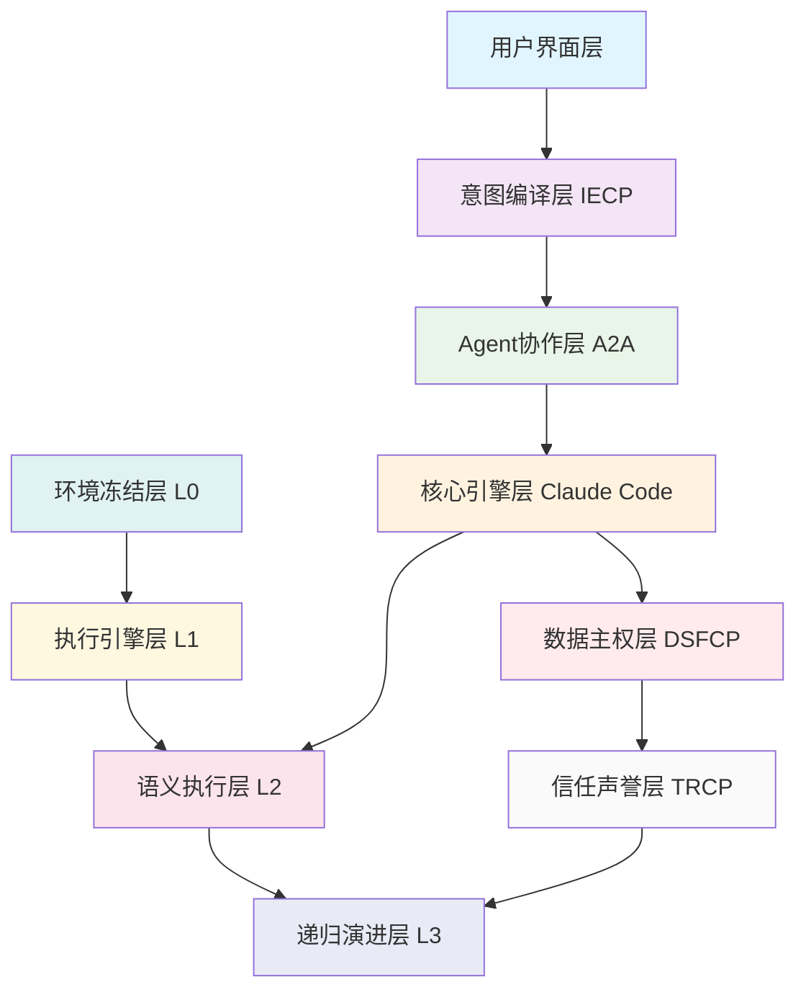

# Athena/open human项目工程化实施方案

**基于参考升级资料分析的可执行技术方案**  
**版本**：v1.0 | **时间**：2026-04-01 | **目标**：构建安全、可扩展的智能传播系统  
**分析基础**：Claude Code架构 + Agent互联网协议 + Athena修复架构

---

## 执行摘要

本方案基于对参考升级资料的深度分析，为Athena/open human项目制定完整的工程化实施路径。通过整合Claude Code的企业级架构、Agent互联网的五层协议标准以及Athena的四层修复机制，构建从环境稳定到智能传播的完整技术栈。

### 核心价值主张
1. **安全优先**：多层保护机制确保AI传播的安全性
2. **架构可扩展**：基于分层模式支持未来业务增长
3. **工程化成熟**：完整的开发运维流程和质量保障
4. **原创性保障**：清洁室开发确保知识产权安全

---

## 第一章：整体技术架构设计

### 1.1 融合架构理念

基于参考资料的深度分析，我们采用"三层融合架构"：

```python
class ThreeLayerFusionArchitecture:
    """三层融合架构设计"""
    
    def design_fusion_architecture(self) -> FusionArchitecture:
        """设计融合架构"""
        
        return FusionArchitecture(
            # Claude Code企业级架构基础
            claude_code_foundation={
                '技术栈': "TypeScript + Bun运行时",
                '模块化': "分层架构 + 接口优先设计",
                '扩展性': "工具系统 + 命令系统"
            },
            
            # Agent互联网协议标准
            agent_web_protocols={
                '数据主权': "DSFCP协议确保用户数据控制",
                'Agent协作': "A2A协议实现多智能体互操作", 
                '意图编译': "IECP协议处理自然语言意图",
                'Skill资产化': "STP协议实现技能模块化",
                '信任机制': "TRCP协议建立声誉系统"
            },
            
            # Athena修复架构机制
            athena_repair_mechanisms={
                '环境稳定': "L0层环境冻结和证书修复",
                '执行可靠': "L1层Runner重启契约",
                '语义准确': "L2层意图路由和失败处理",
                '持续演进': "L3层递归学习和技能蒸馏"
            }
        )
```

### 1.2 系统架构总览



---

## 第二章：技术栈选择与配置

### 2.1 核心技术栈

基于Claude Code的技术选型，结合项目需求进行优化：

```python
class OptimizedTechStack:
    """优化技术栈配置"""
    
    def configure_tech_stack(self) -> TechStackConfig:
        """配置技术栈"""
        
        return TechStackConfig(
            # 运行时环境
            runtime={
                'primary': "Bun 1.1.0+",
                'fallback': "Node.js 20.x",
                'reason': "高性能TS/JS执行，内置打包工具"
            },
            
            # 编程语言
            language={
                'primary': "TypeScript 5.3+",
                'strict_mode': True,
                'reason': "类型安全，大型项目可维护性"
            },
            
            # UI框架
            ui_framework={
                'terminal': "React + Ink 18.x/5.x",
                'web': "Next.js 14.x",
                'reason': "终端和Web统一技术栈"
            },
            
            # 数据存储
            storage={
                'primary': "PostgreSQL + Redis",
                'cache': "Redis Cluster",
                'file': "S3兼容对象存储",
                'reason': "企业级数据持久化和性能"
            },
            
            # 容器化
            containerization={
                'runtime': "Docker + Kubernetes",
                'orchestration': "K8s + Helm",
                'reason': "环境隔离和弹性伸缩"
            }
        )
```

### 2.2 安全技术栈

基于Athena修复架构的安全要求：

```python
class SecurityTechStack:
    """安全技术栈配置"""
    
    def configure_security_stack(self) -> SecurityConfig:
        """配置安全技术栈"""
        
        return SecurityConfig(
            # 证书和加密
            cryptography={
                'tls': "OpenSSL 3.0+",
                'cert_management': "Cert Manager",
                'reason': "企业级加密和证书管理"
            },
            
            # 身份认证
            authentication={
                'oidc': "Keycloak/Ory Hydra",
                'mfa': "TOTP/WebAuthn",
                'reason': "标准化身份管理和多因素认证"
            },
            
            # 策略执行
            policy_enforcement={
                'engine': "Open Policy Agent",
                'language': "Rego",
                'reason': "声明式策略管理和执行"
            },
            
            # 监控审计
            monitoring={
                'metrics': "Prometheus + Grafana",
                'logs': "ELK Stack",
                'traces': "Jaeger",
                'reason': "完整的可观测性栈"
            }
        )
```

---

## 第三章：四阶段实施路线图

### 3.1 阶段一：基础环境建设（4周）

**目标**：建立稳定的开发和生产环境

```python
class Phase1_Foundation:
    """阶段一：基础环境建设"""
    
    def implement_foundation(self) -> FoundationPlan:
        """实施基础环境"""
        
        return FoundationPlan(
            # 第1周：开发环境
            week1={
                '任务': "开发环境标准化",
                '交付物': [
                    "Docker开发环境配置",
                    "CI/CD流水线搭建", 
                    "代码质量工具链"
                ],
                '验收标准': "开发团队可立即开始编码"
            },
            
            # 第2周：安全基础设施
            week2={
                '任务': "安全基础设施部署",
                '交付物': [
                    "证书管理系统",
                    "身份认证服务",
                    "策略执行引擎"
                ],
                '验收标准': "通过安全扫描和渗透测试"
            },
            
            # 第3周：监控系统
            week3={
                '任务': "监控和可观测性",
                '交付物': [
                    "指标收集系统",
                    "日志聚合平台", 
                    "告警通知机制"
                ],
                '验收标准': "系统状态实时可见"
            },
            
            # 第4周：部署流水线
            week4={
                '任务': "自动化部署流水线",
                '交付物': [
                    "Kubernetes部署配置",
                    "蓝绿部署策略",
                    "回滚机制"
                ],
                '验收标准': "一键部署和回滚能力"
            }
        )
```

### 3.2 阶段二：核心功能实现（6周）

**目标**：实现Agent互联网协议和智能传播核心功能

```python
class Phase2_CoreFunctionality:
    """阶段二：核心功能实现"""
    
    def implement_core_features(self) -> CoreFeaturePlan:
        """实施核心功能"""
        
        return CoreFeaturePlan(
            # 第5-6周：数据主权层
            weeks_5_6={
                '模块': "DSFCP协议实现",
                '功能': [
                    "DID身份管理系统",
                    "同态加密计算容器", 
                    "数据迁移工具"
                ],
                '技术重点': "零知识证明和联邦学习"
            },
            
            # 第7-8周：Agent协作层
            weeks_7_8={
                '模块': "A2A协议实现",
                '功能': [
                    "Agent能力注册发现",
                    "任务委托和结算",
                    "执行监控和容错"
                ],
                '技术重点': "智能合约和消息协议"
            },
            
            # 第9-10周：意图编译层
            weeks_9_10={
                '模块': "IECP协议实现",
                '功能': [
                    "自然语言意图解析",
                    "执行计划生成",
                    "上下文管理"
                ],
                '技术重点': "大语言模型集成和推理"
            }
        )
```

### 3.3 阶段三：智能传播系统（4周）

**目标**：构建完整的智能传播工作流

```python
class Phase3_IntelligentCommunication:
    """阶段三：智能传播系统"""
    
    def implement_communication_system(self) -> CommunicationPlan:
        """实施传播系统"""
        
        return CommunicationPlan(
            # 第11周：内容生成引擎
            week11={
                '组件': "多模态内容生成",
                '能力': [
                    "文本内容创作",
                    "视觉内容生成", 
                    "情感校准机制"
                ],
                '集成点': "与IECP意图编译层对接"
            },
            
            # 第12周：渠道分发系统
            week12={
                '组件': "多渠道智能分发",
                '能力': [
                    "平台适配器",
                    "时机优化算法",
                    "效果追踪机制"
                ],
                '集成点': "与A2A Agent协作层对接"
            },
            
            # 第13-14周：优化学习系统
            weeks_13_14={
                '组件': "持续优化和学习",
                '能力': [
                    "A/B测试框架",
                    "性能分析工具",
                    "自动优化算法"
                ],
                '集成点': "与TRCP信任声誉层对接"
            }
        )
```

### 3.4 阶段四：运维完善（2周）

**目标**：完善运维体系和知识传承

```python
class Phase4_Operations:
    """阶段四：运维完善"""
    
    def implement_operations(self) -> OperationsPlan:
        """实施运维体系"""
        
        return OperationsPlan(
            # 第15周：运维自动化
            week15={
                '领域': "自动化运维",
                '工具': [
                    "基础设施即代码",
                    "自动扩缩容",
                    "灾难恢复"
                ],
                '目标': "95%运维操作自动化"
            },
            
            # 第16周：知识传承
            week16={
                '领域': "知识管理和培训",
                '产出': [
                    "完整技术文档",
                    "操作手册",
                    "培训材料"
                ],
                '目标': "新成员可快速上手"
            }
        )
```

---

## 第四章：质量保障体系

### 4.1 测试策略

基于企业级标准的质量保障：

```python
class QualityAssuranceStrategy:
    """质量保障策略"""
    
    def define_testing_strategy(self) -> TestingStrategy:
        """定义测试策略"""
        
        return TestingStrategy(
            # 单元测试
            unit_testing={
                '覆盖率': "≥90%核心代码",
                '工具': "Jest + TypeScript",
                '重点': "业务逻辑和算法"
            },
            
            # 集成测试
            integration_testing={
                '范围': "模块间接口测试",
                '工具': "Supertest + Docker",
                '重点': "API契约和数据流"
            },
            
            # 端到端测试
            e2e_testing={
                '场景': "完整用户旅程",
                '工具': "Playwright + CI",
                '重点': "用户体验和业务流程"
            },
            
            # 安全测试
            security_testing={
                '方法': "自动化扫描 + 人工渗透",
                '工具': "OWASP ZAP + 自定义",
                '重点': "注入攻击、权限提升"
            },
            
            # 性能测试
            performance_testing={
                '指标': "响应时间<100ms，并发≥1000",
                '工具': "k6 + Grafana",
                '重点': "高并发场景和资源使用"
            }
        )
```

### 4.2 监控指标

```python
class MonitoringMetrics:
    """监控指标定义"""
    
    def define_key_metrics(self) -> KeyMetrics:
        """定义关键指标"""
        
        return KeyMetrics(
            # 业务指标
            business_metrics={
                '用户触达': "累计触达用户数",
                '转化率': "L1到L8层级转化率",
                '用户满意度': "NPS和CSAT评分"
            },
            
            # 技术指标
            technical_metrics={
                '可用性': "系统可用性≥99.5%",
                '性能': "API响应时间<100ms",
                '错误率': "错误率<0.1%"
            },
            
            # 安全指标
            security_metrics={
                '漏洞数量': "高危漏洞=0，中危漏洞≤2",
                '合规率': "安全策略合规率100%",
                '审计通过率': "安全审计通过率≥95%"
            }
        )
```

---

## 第五章：风险管理与缓解

### 5.1 技术风险识别

```python
class TechnicalRiskManagement:
    """技术风险管理"""
    
    def identify_technical_risks(self) -> TechnicalRisks:
        """识别技术风险"""
        
        return TechnicalRisks(
            # 架构风险
            architecture_risks={
                '风险': "协议复杂性导致实现困难",
                '概率': "中",
                '影响': "高",
                '缓解': "渐进式实现，模块化设计"
            },
            
            # 性能风险
            performance_risks={
                '风险': "加密计算导致性能瓶颈",
                '概率': "高", 
                '影响': "中",
                '缓解': "性能优化和缓存策略"
            },
            
            # 集成风险
            integration_risks={
                '风险': "多系统集成导致稳定性问题",
                '概率': "中",
                '影响': "高",
                '缓解': "充分的集成测试和回滚计划"
            }
        )
```

### 5.2 项目管理风险

```python
class ProjectRiskManagement:
    """项目管理风险"""
    
    def identify_project_risks(self) -> ProjectRisks:
        """识别项目风险"""
        
        return ProjectRisks(
            # 时间风险
            schedule_risks={
                '风险': "技术复杂性导致进度延误",
                '缓解': "缓冲时间分配，里程碑监控"
            },
            
            # 资源风险
            resource_risks={
                '风险': "关键技术人员流失",
                '缓解': "知识文档化，团队备份"
            },
            
            # 范围风险
            scope_risks={
                '风险': "需求变更导致范围蔓延",
                '缓解': "严格的需求管理和变更控制"
            }
        )
```

---

## 第六章：团队组织与协作

### 6.1 团队结构设计

```python
class TeamStructureDesign:
    """团队结构设计"""
    
    def design_team_structure(self) -> TeamStructure:
        """设计团队结构"""
        
        return TeamStructure(
            # 核心团队
            core_team={
                '架构师': "系统架构和技术决策",
                '安全专家': "安全架构和合规",
                '后端工程师': "核心功能开发",
                '前端工程师': "用户界面开发"
            },
            
            # 扩展团队
            extended_team={
                'AI工程师': "机器学习模型开发",
                'DevOps工程师': "基础设施和运维",
                'QA工程师': "质量保障和测试",
                '产品经理': "需求管理和产品规划"
            },
            
            # 协作机制
            collaboration={
                '敏捷开发': "Scrum框架，2周迭代",
                '代码审查': "Pull Request + 自动化检查",
                '知识分享': "技术分享会 + 文档库"
            }
        )
```

### 6.2 开发流程

```python
class DevelopmentProcess:
    """开发流程定义"""
    
    def define_development_process(self) -> DevelopmentProcess:
        """定义开发流程"""
        
        return DevelopmentProcess(
            # 需求分析
            requirements_analysis={
                '输入': "用户故事 + 技术需求",
                '输出': "技术规格 + 验收标准",
                '工具': "Confluence + Jira"
            },
            
            # 设计阶段
            design_phase={
                '活动': "架构设计 + API设计",
                '产出': "设计文档 + 接口规范",
                '评审': "架构评审委员会"
            },
            
            # 开发阶段
            development_phase={
                '实践': "TDD + 代码审查",
                '工具': "Git + IDE + 本地测试",
                '标准': "代码规范 + 安全标准"
            },
            
            # 测试阶段
            testing_phase={
                '类型': "单元测试 + 集成测试 + E2E测试",
                '自动化': "CI/CD流水线",
                '验收': "质量门禁 + 性能测试"
            },
            
            # 部署阶段
            deployment_phase={
                '策略': "蓝绿部署 + 金丝雀发布",
                '监控': "实时监控 + 告警",
                '回滚': "自动回滚机制"
            }
        )
```

---

## 第七章：成功标准与验收

### 7.1 技术成功标准

```python
class TechnicalSuccessCriteria:
    """技术成功标准"""
    
    def define_technical_criteria(self) -> TechnicalCriteria:
        """定义技术标准"""
        
        return TechnicalCriteria(
            # 架构质量
            architecture_quality={
                '模块化': "清晰的模块边界和接口",
                '可扩展性': "支持10倍业务增长",
                '可维护性': "代码复杂度控制在合理范围"
            },
            
            # 性能指标
            performance_metrics={
                '响应时间': "API响应<100ms",
                '并发能力': "支持≥1000并发用户",
                '可用性': "系统可用性≥99.5%"
            },
            
            # 安全标准
            security_standards={
                '漏洞管理': "高危漏洞=0，中危漏洞≤2",
                '合规性': "通过安全审计和合规检查",
                '数据保护': "用户数据加密和权限控制"
            }
        )
```

### 7.2 业务成功标准

```python
class BusinessSuccessCriteria:
    """业务成功标准"""
    
    def define_business_criteria(self) -> BusinessCriteria:
        """定义业务标准"""
        
        return BusinessCriteria(
            # 用户指标
            user_metrics={
                '触达规模': "累计触达用户≥1000万",
                '转化效率': "L1到L8转化率≥5%",
                '用户满意度': "用户满意度评分≥4.5/5"
            },
            
            # 社区指标
            community_metrics={
                '社区规模': "核心社区成员≥10000人",
                '参与度': "月度活跃用户≥30%",
                '贡献度': "核心贡献者≥100人"
            },
            
            # 影响力指标
            impact_metrics={
                '行业认可': "被主流媒体报道≥10次",
                '政策影响': "影响相关政策制定",
                '技术领导力': "成为行业技术标杆"
            }
        )
```

---

## 第八章：结论与下一步行动

### 8.1 核心结论

本工程化实施方案基于对参考升级资料的深度分析，为Athena/open human项目提供了完整的技术实施路径：

1. **技术可行性**：基于成熟的技术栈和架构模式，方案具备高度可行性
2. **安全性保障**：多层安全机制确保AI传播的安全性
3. **可扩展性**：分层架构设计支持未来业务增长
4. **工程化成熟**：完整的开发运维流程确保项目成功

### 8.2 立即行动项

**第1周行动项**：
1. 组建核心实施团队
2. 建立开发环境和工具链
3. 制定详细的任务分解计划

**成功关键因素**：
- **安全优先**：从第一天建立完善的安全机制
- **渐进实施**：按阶段逐步推进，确保质量
- **团队协作**：建立高效的开发协作机制
- **持续改进**：基于反馈持续优化系统

### 8.3 预期收益

**技术收益**：
- 建立企业级的技术架构和运维体系
- 积累AI系统开发的技术经验
- 为未来项目建立可复用的技术基础

**业务收益**：
- 实现智能传播的业务目标
- 建立技术领先的品牌形象
- 创造可持续的商业价值

**战略收益**：
- 在AI传播领域建立技术领导地位
- 为碳硅共生理念提供技术实现
- 推动行业技术标准的发展

---

**文档状态**：工程化实施方案完成  
**下一步行动**：开始具体实施工作  
**审查日期**：2026-04-08完成初稿审查