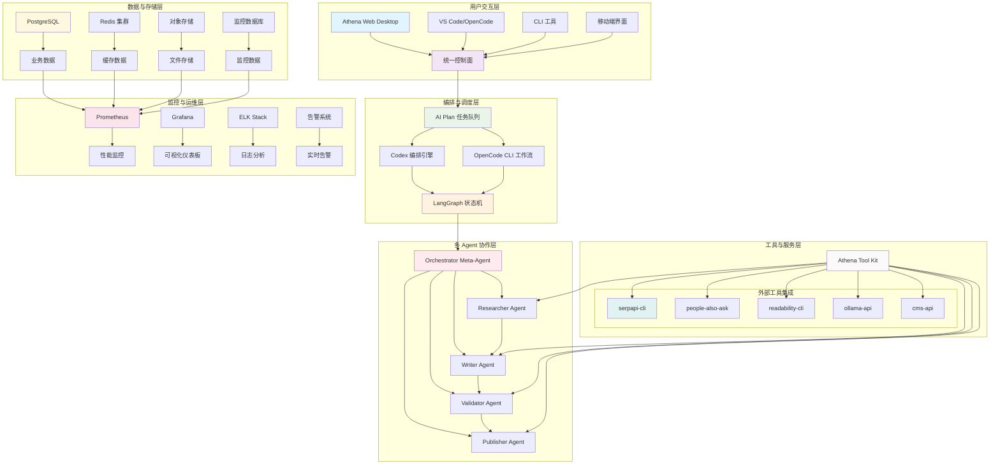
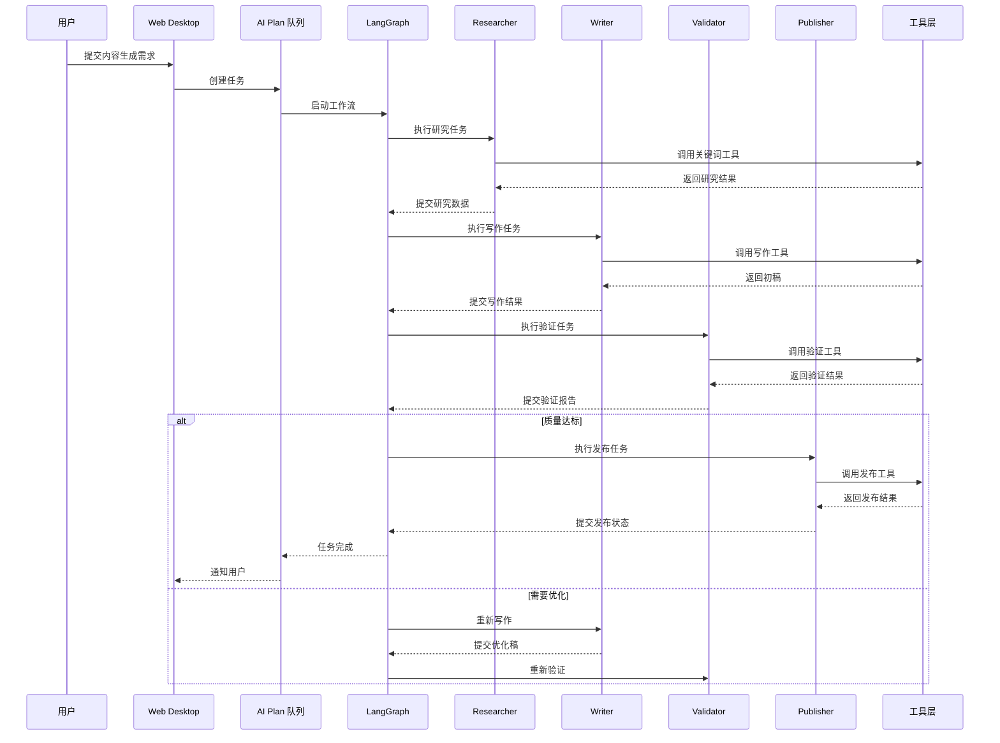
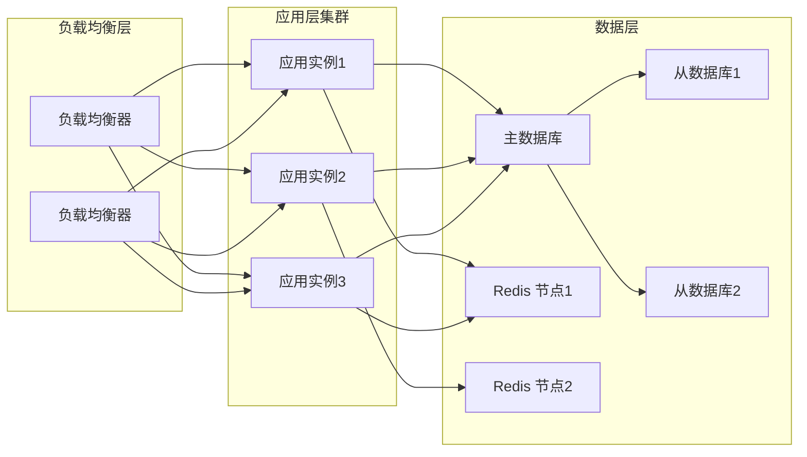
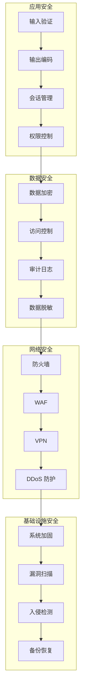

# Athena 系统架构图

## 🏗️ 整体架构概览



## 📊 分层架构详解

### 1. 用户交互层

#### 1.1 Athena Web Desktop
- **功能**: 统一控制面，集中管理所有任务和资源
- **特点**: 可视化界面，支持任务监控、配置管理
- **技术**: React + TypeScript + Tailwind CSS

#### 1.2 VS Code/OpenCode
- **功能**: IDE 集成开发环境
- **特点**: 代码编辑、调试、测试一体化
- **技术**: VS Code 扩展 + OpenCode CLI

#### 1.3 CLI 工具
- **功能**: 命令行接口，支持自动化脚本
- **特点**: 批处理、定时任务、系统集成
- **技术**: Python + Click/Argparse

### 2. 编排与调度层

#### 2.1 AI Plan 任务队列
- **功能**: 任务编排、优先级调度、依赖管理
- **特点**: 支持复杂工作流、重试机制、状态追踪
- **技术**: Redis + Celery + 自定义队列管理

#### 2.2 Codex 编排引擎
- **功能**: AI 驱动的任务分解和优化
- **特点**: 智能任务拆分、资源分配优化
- **技术**: OpenAI Codex API + 本地优化算法

#### 2.3 LangGraph 状态机
- **功能**: 多 Agent 协作的状态管理
- **特点**: 类型安全、条件流转、错误处理
- **技术**: LangGraph 框架 + TypedDict 状态定义

### 3. 多 Agent 协作层

#### 3.1 Orchestrator Meta-Agent
- **角色**: 系统总协调员
- **职责**: 任务分配、状态管理、质量门禁
- **能力**: 全局视野、决策优化、异常处理

#### 3.2 Researcher Agent
- **角色**: 信息研究员
- **职责**: 关键词挖掘、竞品分析、Query 获取
- **能力**: 语义分析、数据挖掘、趋势识别

#### 3.3 Writer Agent
- **角色**: 内容创作者
- **职责**: 大纲生成、正文撰写、多版本输出
- **能力**: 自然语言生成、风格适配、质量优化

#### 3.4 Validator Agent
- **角色**: 质量审核员
- **职责**: GEO 评分、事实核查、SEO 检查
- **能力**: 质量评估、错误检测、优化建议

#### 3.5 Publisher Agent
- **角色**: 发布管理员
- **职责**: 多平台发布、数据回流、索引提交
- **能力**: 发布策略、数据同步、效果追踪

### 4. 工具与服务层

#### 4.1 Athena Tool Kit
- **功能**: 统一工具封装层
- **特点**: 错误重试、超时控制、结果缓存
- **技术**: Python 装饰器 + Redis 缓存 + 异步处理

#### 4.2 外部工具集成
- **serpapi-cli**: 搜索引擎结果获取
- **people-also-ask**: 相关查询挖掘
- **readability-cli**: 内容可读性分析
- **ollama-api**: 本地 AI 模型调用
- **cms-api**: 内容管理系统集成

### 5. 数据与存储层

#### 5.1 业务数据存储 (PostgreSQL)
- **用户数据**: 用户配置、偏好设置
- **任务数据**: 任务状态、执行历史
- **Agent 数据**: Agent 配置、性能指标

#### 5.2 缓存数据存储 (Redis)
- **会话缓存**: 用户会话、临时状态
- **结果缓存**: API 调用结果、计算缓存
- **队列数据**: 任务队列、消息传递

#### 5.3 文件存储 (对象存储)
- **文档存储**: 生成的内容文档
- **日志文件**: 系统日志、执行记录
- **配置文件**: 系统配置、模板文件

### 6. 监控与运维层

#### 6.1 性能监控 (Prometheus)
- **系统指标**: CPU、内存、磁盘使用率
- **业务指标**: 任务成功率、响应时间
- **Agent 指标**: 执行效率、错误率

#### 6.2 可视化仪表板 (Grafana)
- **实时监控**: 系统状态实时展示
- **历史分析**: 性能趋势分析
- **告警面板**: 异常状态可视化

#### 6.3 日志分析 (ELK Stack)
- **日志收集**: 集中式日志管理
- **搜索分析**: 快速故障定位
- **报表生成**: 运营数据分析

## 🔄 数据流与交互流程

### 典型工作流：GEO 内容生成



## 🛠️ 技术栈详细配置

### 后端技术栈

```yaml
# 核心依赖配置
backend_stack:
  runtime: "Python 3.8+"
  web_framework: "FastAPI"
  async_framework: "asyncio"
  orm: "SQLAlchemy + Alembic"
  cache: "Redis"
  queue: "Celery + Redis"
  monitoring: "Prometheus + Grafana"
  logging: "structlog + ELK"
  
  # AI/ML 相关
  ai_framework: "LangGraph"
  llm_integration: "OpenAI API + Ollama"
  embedding: "SentenceTransformers"
  
  # 工具集成
  cli_tools: "serpapi, readability, people-also-ask"
  cms_integration: "WordPress, Shopify APIs"
```

### 前端技术栈

```yaml
frontend_stack:
  framework: "React 18 + TypeScript"
  styling: "Tailwind CSS + Headless UI"
  state_management: "Zustand"
  build_tool: "Vite"
  testing: "Jest + React Testing Library"
  monitoring: "Sentry + Performance API"
  
  # 图表可视化
  charts: "Recharts"
  diagrams: "Mermaid.js"
  
  # 实时通信
  websocket: "Socket.io"
  realtime_updates: "Server-Sent Events"
```

### 基础设施配置

```yaml
infrastructure:
  containerization: "Docker + Docker Compose"
  orchestration: "Kubernetes (生产环境)"
  service_mesh: "Istio"
  
  # 数据库配置
  postgresql:
    version: "15"
    replication: "主从复制"
    backup: "WAL 归档 + 定时备份"
    
  redis:
    mode: "集群模式"
    persistence: "AOF + RDB"
    
  # 监控配置
  prometheus:
    scrape_interval: "15s"
    retention: "30d"
    
  grafana:
    dashboards: "自定义 + 社区模板"
    alerts: "多通道告警"
```

## 📈 系统扩展性设计

### 水平扩展方案



### 微服务拆分策略

| 服务模块 | 职责范围 | 技术栈 | 部署方式 |
|---------|---------|--------|---------|
| **用户服务** | 用户管理、认证授权 | FastAPI + JWT | 独立部署 |
| **任务服务** | 任务编排、队列管理 | Celery + Redis | 集群部署 |
| **Agent 服务** | AI Agent 执行引擎 | LangGraph + OpenAI | 弹性伸缩 |
| **工具服务** | 外部工具集成封装 | 自定义 CLI 包装器 | 容器化 |
| **数据服务** | 数据存储和访问 | PostgreSQL + Redis | 主从复制 |
| **监控服务** | 系统监控和告警 | Prometheus + Grafana | 集中部署 |

## 🔒 安全架构设计

### 安全层次模型



## 🎯 性能指标与 SLA

### 关键性能指标 (KPI)

| 指标类别 | 具体指标 | 目标值 | 监控频率 |
|---------|---------|--------|---------|
| **可用性** | 系统可用率 | > 99.9% | 实时监控 |
| **响应时间** | API 平均响应时间 | < 500ms | 5分钟间隔 |
| **吞吐量** | 并发任务处理能力 | > 1000 任务/秒 | 实时监控 |
| **错误率** | 任务失败率 | < 1% | 实时监控 |
| **资源使用** | CPU/内存使用率 | < 80% | 1分钟间隔 |

### 服务水平协议 (SLA)

- **可用性 SLA**: 99.9% 月度可用性
- **性能 SLA**: 95% 请求响应时间 < 1秒
- **数据持久性**: 99.999% 数据不丢失
- **恢复时间**: 故障恢复时间 < 15分钟

---

**文档版本**: v1.0  
**最后更新**: 2026-04-05  
**维护团队**: Athena 架构组  
**参考文档**: 
- Athena-OpenHuman-GEO-Agent工程化实施方案.md
- Athena-open human技术架构详细设计文档.md
- GEO-Agent 工程化架构.md