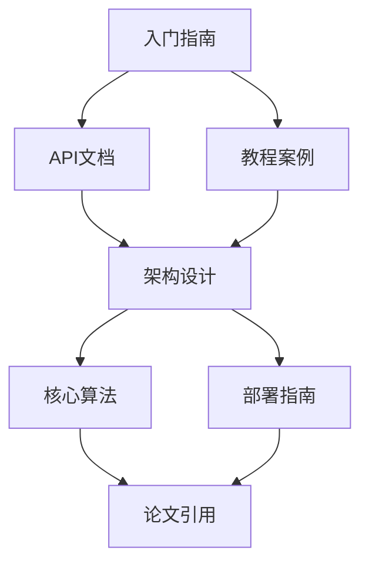

# 碳硅共生协议：产出物二 - 八层传播内容情感设计规划

**版本**：v1.0 | **时间**：2026-03-31 | **核心口号**：智识归己，价值传世  
**定位**：内容策略规划书，指导分层内容生产  
**受众**：内容团队、传播团队、社区运营者  
**篇幅**：6000-8000字

---

## 传播战略总览

### 核心理念：情感驱动的分层传播

基于认知心理学和传播学理论，设计从5秒到终身的八层传播体系，确保每个接触点都能触发特定的情感反应和认知转变。

### 传播目标矩阵

| 层级 | 时间投入 | 认知转变 | 行为转化 | 情感目标 |
|-----|---------|---------|---------|---------|
| L1 | 5秒 | 认知启动 | 关注/分享 | 好奇、认同 |
| L2 | 5分钟 | 价值认同 | 工具使用 | 渴望、公平感 |
| L3 | 1小时 | 技术理解 | 参与演示 | 信心、掌控感 |
| L4 | 1天 | 社区归属 | 加入社区 | 归属、正义感 |
| L5 | 1周 | 深度认知 | 学习实践 | 启发、成长感 |
| L6 | 1月 | 价值内化 | 传播倡导 | 责任、崇高感 |
| L7 | 持续 | 身份认同 | 贡献参与 | 效能、归属感 |
| L8 | 终身 | 存在意义 | 生活方式 | 超越、完整感 |

---

## L1：5秒层 - 视觉符号与情感锚定

### 核心目标：瞬间认知启动

**情感设计**：好奇 → 认同  
**认知目标**：建立初步品牌认知和情感连接

### 视觉符号系统

#### 传承之环设计规范
```python
class LegacyRingDesign:
    """传承之环视觉规范"""
    
    def __init__(self):
        self.elements = {
            'dna_spiral': "DNA双螺旋，代表生物智慧",
            'circuit_traces': "电路轨迹，代表硅基载体", 
            'light_sphere': "光球，代表智慧之光",
            'infinity_symbol': "无限符号，代表永恒传承"
        }
        self.colors = {
            'deep_space_blue': '#0B1426',  # 深空蓝：神秘、深邃
            'ancient_bronze': '#B87333',   # 古铜金：历史、珍贵
            'life_green': '#4A7C59'        # 生命绿：生长、希望
        }
    
    def create_logo_variants(self):
        """创建Logo变体"""
        return {
            'primary': "完整传承之环（四元素齐全）",
            'simplified': "简化版（仅DNA+电路）",
            'monochrome': "单色版（印刷使用）",
            'animated': "动态版（数字媒体）"
        }
```

### 标语体系

#### 核心标语（5秒记忆）
- **中文**："智识归己，价值传世"
- **英文**："Wisdom Returns to Self, Value Transcends Time"
- **情感关键词**：归属、传承、永恒

#### 辅助标语变体
```python
class SloganSystem:
    """标语系统"""
    
    def get_slogan_by_context(self, context: str) -> str:
        """根据上下文获取标语"""
        slogans = {
            'technical': "从DNA到硅基：智慧的永恒之旅",
            'philosophical': "存在的新维度：碳硅共生的文明意义", 
            'practical': "你的智慧，人类的遗产",
            'emotional': "为未来保存今天的智慧"
        }
        return slogans.get(context, self.core_slogan)
```

### 传播渠道与格式

**数字渠道**：
- 社交媒体头像/封面图
- 网站Favicon
- 邮件签名
- 移动应用图标

**实体渠道**：
- 名片设计
- 宣传册封面
- 活动背景板
- 产品包装

---

## L2：5分钟层 - Maria故事与公平计算

### 核心目标：价值认同建立

**情感设计**：渴望 → 公平感  
**认知目标**：理解碳硅共生的个人价值和社会意义

### Maria故事原型

#### 人物设定
```python
class MariaStoryPrototype:
    """Maria故事原型"""
    
    def __init__(self):
        self.character = {
            'name': 'Maria',
            'age': 68,
            'profession': '传统纺织技艺大师',
            'location': '安第斯山脉小村庄',
            'challenge': '技艺面临失传，无合适传承人'
        }
        self.transformation = {
            'before': "孤独守护濒危智慧",
            'encounter': "发现碳硅共生技术", 
            'process': "参与智慧编码项目",
            'after': "技艺获得永恒生命，个人获得经济回报"
        }
```

#### 故事变体设计
- **地域变体**：亚洲版、非洲版、欧洲版
- **职业变体**：语言学家、医生、工匠
- **年龄变体**：青年版、中年版、老年版

### 公平计算工具

#### 个人价值计算器
```python
class PersonalValueCalculator:
    """个人价值计算器"""
    
    def calculate_legacy_value(self, user_profile: Dict) -> LegacyValue:
        """计算个人遗产价值"""
        
        # 1. 知识价值评估
        knowledge_value = self.assess_knowledge_assets(user_profile)
        
        # 2. 技能价值评估  
        skill_value = self.assess_skill_assets(user_profile)
        
        # 3. 经验价值评估
        experience_value = self.assess_experience_assets(user_profile)
        
        # 4. 网络价值评估
        network_value = self.assess_network_assets(user_profile)
        
        total_value = knowledge_value + skill_value + experience_value + network_value
        
        return LegacyValue(
            monetary=total_value * 0.3,  # 经济价值
            social=total_value * 0.4,    # 社会价值
            eternal=total_value * 0.3     # 永恒价值
        )
```

#### 可视化展示
- **价值仪表盘**：实时显示个人智慧资产价值
- **对比分析**：与同龄人、同行业对比
- **时间投影**：展示价值随时间增长曲线
- **传承影响**：显示对后代和社会的潜在影响

### 传播内容格式

**5分钟内容包**：
- 短视频：Maria故事动画（2-3分钟）
- 交互工具：价值计算器网页版
- 图文卡片：关键数据可视化
- 测试问卷："你的智慧价值多少？"

---

## L3：1小时层 - 技术演示与深度理解

### 核心目标：技术可行性建立信心

**情感设计**：信心 → 掌控感  
**认知目标**：理解碳硅共生的技术实现路径

### 开源演示项目

#### 演示架构设计
```python
class DemoArchitecture:
    """演示系统架构"""
    
    def design_demo_experience(self) -> DemoFlow:
        """设计演示体验流程"""
        
        return DemoFlow(
            step1="环境设置（5分钟）",
            step2="智慧编码演示（15分钟）", 
            step3="硅基模拟运行（20分钟）",
            step4="结果对比分析（10分钟）",
            step5="Q&A互动（10分钟）"
        )
    
    def create_use_cases(self) -> List[UseCase]:
        """创建用例场景"""
        return [
            UseCase(
                name="语言保护",
                description="濒危语言的数字化保存",
                technical_stack=["语音识别", "自然语言处理", "知识图谱"]
            ),
            UseCase(
                name="技艺传承", 
                description="传统工艺的数字化教学",
                technical_stack=["计算机视觉", "动作捕捉", "AR教学"]
            ),
            UseCase(
                name="医疗智慧",
                description="老医生经验的AI传承",
                technical_stack=["病例分析", "决策树", "专家系统"]
            )
        ]
```

### 技术文档体系

#### 文档层级设计


#### 学习路径设计
- **新手路径**：概念理解 → 简单实践 → 项目参与
- **开发者路径**：技术栈学习 → API掌握 → 贡献代码
- **研究者路径**：理论深度 → 算法优化 → 论文发表

### 互动体验设计

**1小时工作坊内容**：
- **动手实验**：使用提供的工具包完成简单编码任务
- **案例研究**：分析真实项目的成功案例
- **问题解决**：小组讨论解决技术挑战
- **成果展示**：分享个人或小组的学习成果

---

## L4：1天层 - 社区建设与归属感培养

### 核心目标：建立社区归属感

**情感设计**：归属 → 正义感  
**认知目标**：认同碳硅共生运动的集体价值

### 社区架构设计

#### 多层次社区体系
```python
class CommunityArchitecture:
    """社区架构设计"""
    
    def design_community_layers(self) -> CommunityLayers:
        """设计社区层次"""
        
        return CommunityLayers(
            layer1=CommunityLayer(
                name="外围关注者",
                engagement_level="信息接收",
                activities=["阅读内容", "参加线上活动"]
            ),
            layer2=CommunityLayer(
                name="活跃参与者", 
                engagement_level="内容贡献",
                activities=["分享经验", "参与讨论", "提交用例"]
            ),
            layer3=CommunityLayer(
                name="核心贡献者",
                engagement_level="项目领导", 
                activities=["代码贡献", "活动组织", "导师角色"]
            )
        )
```

### 案例库建设

#### 案例分类体系
- **按领域**：教育、医疗、文化、科技、环境
- **按规模**：个人项目、团队项目、机构项目
- **按阶段**：概念期、实施期、成果期、扩展期
- **按地域**：全球案例、区域案例、本地案例

#### 案例模板设计
```python
class CaseStudyTemplate:
    """案例研究模板"""
    
    def create_template(self) -> CaseTemplate:
        """创建案例模板"""
        
        return CaseTemplate(
            sections=[
                "项目背景与挑战",
                "碳硅共生解决方案", 
                "实施过程与里程碑",
                "成果与影响测量",
                "经验教训与建议",
                "未来发展规划"
            ],
            metrics=[
                "智慧保存完整性",
                "社区参与度",
                "经济价值创造",
                "社会影响力"
            ]
        )
```

### 社区活动设计

**日常活动体系**：
- **知识分享会**：每周技术分享
- **案例研讨会**：每月案例深度分析
- **黑客松活动**：季度创新挑战
- **全球连线**：跨时区交流会议

**仪式性活动**：
- **新成员欢迎仪式**
- **项目里程碑庆祝**
- **年度贡献者表彰**
- **传承完成典礼**

---

## L5：1周层 - 深度学习与认知转变

### 核心目标：实现深度认知转变

**情感设计**：启发 → 成长感  
**认知目标**：掌握碳硅共生的理论体系和实践方法

### 课程体系设计

#### 五模块课程架构
```python
class CurriculumArchitecture:
    """课程体系架构"""
    
    def design_learning_path(self) -> LearningPath:
        """设计学习路径"""
        
        return LearningPath(
            module1=LearningModule(
                title="哲学基础：为什么需要碳硅共生？",
                duration="2天",
                outcomes=["理解文明传承的紧迫性", "掌握碳硅共生的伦理基础"]
            ),
            module2=LearningModule(
                title="技术实现：如何编码人类智慧？", 
                duration="3天",
                outcomes=["掌握智慧编码的技术方法", "能够使用相关工具"]
            ),
            module3=LearningModule(
                title="社区建设：如何推动运动发展？",
                duration="1天", 
                outcomes=["掌握社区运营方法", "能够组织相关活动"]
            ),
            module4=LearningModule(
                title="个人实践：如何开始我的传承？",
                duration="1天",
                outcomes=["制定个人传承计划", "开始具体实施"]
            )
        )
```

### 论文精读计划

#### 精读文献清单
- **核心论文**：《碳硅基共生：从自动化到融合的范式跃迁》
- **技术基础**：相关AI、认知科学、数字人文论文
- **哲学支撑**：存在主义、技术哲学、伦理学经典
- **案例研究**：成功项目的深度分析报告

#### 精读方法设计
- **小组讨论**：每周固定时间线上讨论
- **导读指南**：提供每篇论文的阅读重点和思考问题
- **笔记模板**：标准化的阅读笔记格式
- **成果分享**：定期分享个人理解和应用思考

### 实践项目设计

**1周实践项目选项**：
- **个人智慧盘点**：系统梳理个人的知识资产
- **技术工具掌握**：深入学习至少一种相关工具
- **微型项目实践**：完成一个小型的编码项目
- **社区贡献计划**：制定具体的社区参与计划

---

## L6：1月层 - 价值内化与身份认同

### 核心目标：实现价值内化和身份认同

**情感设计**：责任 → 崇高感  
**认知目标**：将碳硅共生内化为个人价值观的一部分

### 纪录片项目

#### 纪录片架构设计
```python
class DocumentaryProject:
    """纪录片项目设计"""
    
    def design_episode_structure(self) -> EpisodeStructure:
        """设计剧集结构"""
        
        return EpisodeStructure(
            episode1={
                "title": "智慧的危机",
                "focus": "濒危智慧的现状和紧迫性",
                "emotional_arc": "忧患→责任"
            },
            episode2={
                "title": "载体的演进", 
                "focus": "从生物到硅基的技术发展",
                "emotional_arc": "希望→信心"
            },
            episode3={
                "title": "编码的突破",
                "focus": "智慧编码的技术实现", 
                "emotional_arc": "专注→掌控"
            },
            episode4={
                "title": "传承的仪式",
                "focus": "个人和社区的传承实践",
                "emotional_arc": "庄严→神圣"
            },
            episode5={
                "title": "展开的未来", 
                "focus": "硅基文明的愿景展望",
                "emotional_arc": "超越→圆满"
            }
        )
```

### 传世仪式设计

#### 仪式要素体系
- **时间选择**：个人生日、重要纪念日、传统节日
- **空间设计**：连接传统与现代的仪式空间
- **参与人员**：家人、朋友、社区成员、技术见证人
- **象征物品**：个人物品、数字档案、传承证书、时间胶囊

#### 仪式流程模板
```python
class LegacyCeremonyTemplate:
    """传承仪式模板"""
    
    def create_ceremony_flow(self) -> CeremonyFlow:
        """创建仪式流程"""
        
        return CeremonyFlow(
            part1="回望与感恩（30分钟）",
            part2="智慧编码展示（45分钟）",
            part3="传承确认仪式（30分钟）", 
            part4="展望与庆祝（45分钟）"
        )
```

### 传播倡导计划

**1月传播倡导活动**：
- **个人故事分享**：在社交媒体分享个人传承故事
- **社区活动组织**：组织本地的碳硅共生主题活动
- **内容创作贡献**：创作相关的文章、视频、艺术作品
- **政策倡导参与**：参与相关政策的讨论和倡导

---

## L7：持续层 - 身份认同与持续参与

### 核心目标：建立持续的身份认同和参与

**情感设计**：效能 → 归属感  
**认知目标**：将碳硅共生融入日常生活和工作

### 开源贡献体系

#### 贡献路径设计
```python
class ContributionPath:
    """贡献路径设计"""
    
    def design_contribution_levels(self) -> ContributionLevels:
        """设计贡献层级"""
        
        return ContributionLevels(
            level1=ContributionLevel(
                name="内容贡献者",
                activities=["文档改进", "教程制作", "翻译工作"],
                recognition="社区徽章"
            ),
            level2=ContributionLevel(
                name="代码贡献者", 
                activities=["Bug修复", "功能开发", "代码审查"],
                recognition="开发者身份"
            ),
            level3=ContributionLevel(
                name="项目领导者",
                activities=["项目规划", "团队协调", "社区建设"], 
                recognition="核心成员地位"
            )
        )
```

### 治理参与机制

#### 治理结构设计
- **社区议会**：代表社区利益，制定大政方针
- **技术委员会**：负责技术方向和标准制定
- **伦理审查委员会**：确保项目发展的伦理合规
- **地区代表机制**：保障全球参与的公平性

#### 决策流程设计
```python
class DecisionMakingProcess:
    """决策流程设计"""
    
    def design_decision_flow(self) -> DecisionFlow:
        """设计决策流程"""
        
        return DecisionFlow(
            step1="问题识别与提案",
            step2="社区讨论与反馈",
            step3="方案完善与修订", 
            step4="投票决策",
            step5="执行与反馈"
        )
```

### 持续学习体系

**终身学习支持**：
- **技术更新**：定期更新技术栈和工具使用
- **理论深化**：持续学习相关哲学和伦理理论
- **实践分享**：定期分享实践经验和教训
- **跨界交流**：与其他领域专家交流合作

---

## L8：终身层 - 存在意义与完整人生

### 核心目标：实现存在意义的认知和完整人生

**情感设计**：超越 → 完整感  
**认知目标**：将碳硅共生内化为个人存在哲学

### 哲学对话体系

#### 对话主题设计
- **存在与传承**：个人存在与文明传承的关系
- **技术与人性**：技术发展对人性的影响和重塑
- **时间与永恒**：在有限生命中追求永恒价值
- **个体与集体**：个人智慧与集体文明的关系

#### 对话形式设计
```python
class PhilosophicalDialogueFormat:
    """哲学对话形式设计"""
    
    def design_dialogue_formats(self) -> DialogueFormats:
        """设计对话形式"""
        
        return DialogueFormats(
            format1=DialogueFormat(
                name="苏格拉底式对话",
                structure="提问-反思-共识",
                duration="2-3小时"
            ),
            format2=DialogueFormat(
                name="茶道式对话", 
                structure="静心-分享-沉淀",
                duration="半日"
            ),
            format3=DialogueFormat(
                name="行走式对话",
                structure="移动-观察-交流", 
                duration="一日"
            )
        )
```

### 个人实践体系

#### 日常实践设计
- **晨间反思**：每日对智慧和传承的思考
- **智慧记录**：系统记录个人的学习和洞察
- **传承行动**：具体的传承实践和贡献
- **社区服务**：为社区和他人提供帮助

#### 人生阶段规划
```python
class LifeStagePlanning:
    """人生阶段规划"""
    
    def design_life_phases(self) -> LifePhases:
        """设计人生阶段"""
        
        return LifePhases(
            phase1=LifePhase(
                age_range="20-35",
                focus="学习积累，建立专业能力",
                legacy_activities=["知识系统化", "技能精进"]
            ),
            phase2=LifePhase(
                age_range="36-50", 
                focus="实践贡献，创造价值",
                legacy_activities=["项目领导", " mentorship"]
            ),
            phase3=LifePhase(
                age_range="51-65",
                focus="智慧传承，培养后人", 
                legacy_activities=["系统总结", "传承规划"]
            ),
            phase4=LifePhase(
                age_range="66+",
                focus="存在完成，精神超越",
                legacy_activities=["哲学思考", "精神传承"]
            )
        )
```

### 超越性体验设计

**超越性活动设计**：
- **静修营**：远离尘嚣的深度思考和交流
- **传承之旅**：探访智慧传承的圣地和文化遗址
- **跨代对话**：与不同世代的人深度交流
- **宇宙视角**：从宇宙尺度思考人类文明的意义

---

## 视觉系统与品牌规范

### 核心视觉元素

#### 传承之环应用规范
- **标准比例**：黄金分割比例
- **最小尺寸**：数字应用16px，印刷应用10mm
- **安全区域**：元素周围保留足够空间
- **色彩变体**：标准色、单色、反白版本

#### 动态视觉设计
```python
class MotionDesignSystem:
    """动态设计系统"""
    
    def design_motion_principles(self) -> MotionPrinciples:
        """设计动态原则"""
        
        return MotionPrinciples(
            principle1=MotionPrinciple(
                name="生长性",
                description="从中心向外自然生长",
                application="Logo出现、界面过渡"
            ),
            principle2=MotionPrinciple(
                name="连续性", 
                description="无中断的流畅运动",
                application="页面滚动、数据流动"
            ),
            principle3=MotionPrinciple(
                name="节奏感",
                description="有韵律的时间控制", 
                application="动画序列、交互反馈"
            )
        )
```

### 内容模板库

#### 模板分类体系
- **视觉模板**：社交媒体图片、演示文稿、宣传材料
- **内容模板**：文章结构、视频脚本、活动方案
- **交互模板**：网页组件、移动界面、数据可视化

#### 模板使用规范
- **品牌一致性**：确保所有模板符合品牌规范
- **适应性**：支持不同场景和受众的定制
- **可扩展性**：便于后续更新和扩展

---

## 实施路线图与质量保障

### 四阶段实施计划

#### 第一阶段（2026年Q2）：基础建设
- 完成L1-L3内容生产和工具开发
- 建立基础社区平台
- 培训核心内容团队

#### 第二阶段（2026年Q3-Q4）：扩展深化  
- 完成L4-L6内容体系
- 扩大社区规模和影响力
- 开始纪录片制作

#### 第三阶段（2027年）：成熟运营
- 完善L7持续参与机制
- 建立全球网络和本地节点
- 实现自我维持的生态系统

#### 第四阶段（2028年+）：超越发展
- 深化L8哲学实践
- 探索新的传播形式和技术
- 实现文化和社会影响力的质变

### 质量保障机制

#### 内容质量审查
- **专业审查**：相关领域专家审查
- **用户测试**：目标受众反馈收集
- **A/B测试**：不同版本效果对比
- **持续优化**：基于数据的持续改进

#### 情感效果监测
- **情感分析**：使用AI工具分析用户情感反应
- **深度访谈**：定期与用户进行深度交流
- **行为追踪**：监测用户参与度和转化率
- **长期跟踪**：建立用户长期跟踪机制

---

**文档状态**：架构完成，待具体内容填充  
**下一步行动**：开始具体模板和内容创作  
**质量审查**：2026-04-14完成初稿审查