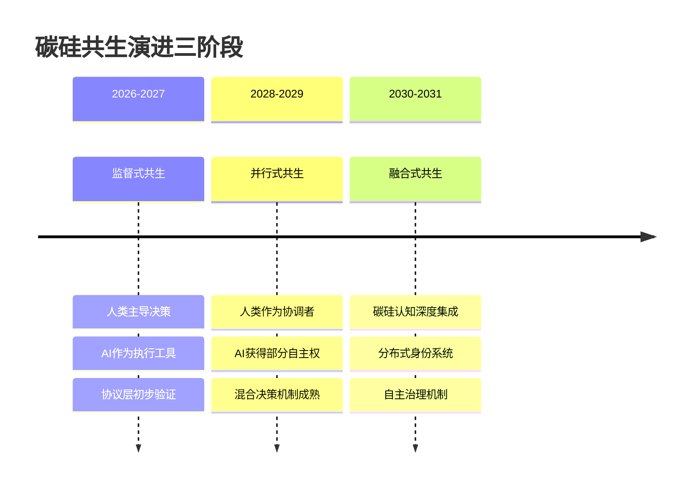
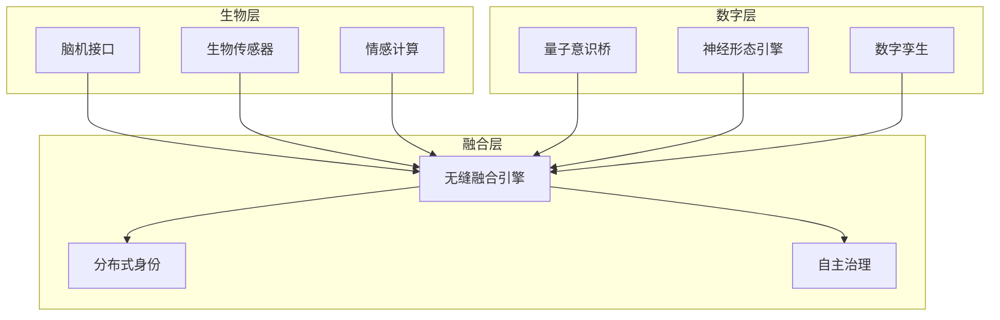

# 碳硅基共生：从自动化到融合的范式跃迁

**作者**：Frankie  
**机构**：Athena知识库  
**日期**：2026年4月  
**分类**：cs.AI, cs.HC, cs.SE  
**关键词**：碳硅基共生、Human-AI Symbiosis、Agent架构、技术演进、范式跃迁

---

## 摘要（Abstract）

### 中文摘要

本文基于OpenClaw（自动化技术基座）与OpenHuman（碳硅基共生协议）双项目的深度对比分析，结合未来5年（2026-2031）AI技术演进推演，提出碳硅基共生（Carbon-Silicon Symbiosis）的范式跃迁框架。研究发现，当前AI Agent技术面临"控制悖论"：系统越自动化越需要人类监督，但人类认知无法理解复杂系统的全局状态。通过回溯推演法和哲学-技术交叉分析，本文识别出5个维度的战略灵魂拷问，并基于《碳硅跃迁宪章》提出从监督式共生到融合式共生的演进路径。核心贡献包括：1）首个基于真实项目对比的碳硅共生架构分析；2）5个维度的战略灵魂拷问框架；3）可操作的2026-2031技术路线图。研究表明，碳硅共生不是技术发展的过渡态，而是人机协作的稳态解决方案。

**关键词**：碳硅基共生、Human-AI Symbiosis、Agent架构、技术演进、范式跃迁

### English Abstract

Based on a deep comparative analysis of the OpenClaw (automation technology base) and OpenHuman (carbon-silicon symbiosis protocol) dual projects, combined with a 5-year (2026-2031) AI technology evolution projection, this paper proposes a paradigm transition framework for Carbon-Silicon Symbiosis. The study finds that current AI Agent technology faces a "control paradox": the more automated the system becomes, the more human supervision it requires, yet human cognition cannot comprehend the global state of complex systems. Through backcasting methodology and philosophical-technical cross-analysis, this paper identifies five dimensions of strategic soul-searching questions and proposes an evolutionary path from supervised symbiosis to fused symbiosis based on the "Carbon-Silicon Transcendence Charter." Core contributions include: 1) The first carbon-silicon symbiosis architecture analysis based on real project comparisons; 2) A five-dimensional strategic soul-searching framework; 3) An actionable 2026-2031 technology roadmap. The research demonstrates that carbon-silicon symbiosis is not a transitional state in technological development but a stable-state solution for human-AI collaboration.

**Keywords**: Carbon-Silicon Symbiosis, Human-AI Symbiosis, Agent Architecture, Technology Evolution, Paradigm Transition

---

## 目录（Table of Contents）

1. [引言（Introduction）](#1-引言introduction)
2. [方法论（Methodology）](#2-方法论methodology)
3. [现状诊断：双项目架构分析（Current State Analysis）](#3-现状诊断双项目架构分析current-state-analysis)
4. [演进推演：2026-2031技术时间线（Evolutionary Trajectory）](#4-演进推演2026-2031技术时间线evolutionary-trajectory)
5. [灵魂拷问：5个维度的战略哲学（Soul-searching Framework）](#5-灵魂拷问5个维度的战略哲学soul-searching-framework)
6. [碳硅跃迁宪章：战略框架与行动指南（The Charter）](#6-碳硅跃迁宪章战略框架与行动指南the-charter)
7. [案例研究：从OpenClaw到OpenHuman的跃迁实践（Case Study）](#7-案例研究从openclaw到openhuman的跃迁实践case-study)
8. [结论与展望（Conclusion）](#8-结论与展望conclusion)
9. [参考文献（References）](#9-参考文献references)
10. [附录（Appendix）](#10-附录appendix)

---

## 1. 引言（Introduction）

### 1.1 研究背景

2026年标志着AI Agent技术的爆发期与瓶颈期的交汇点。以OpenClaw为代表的自动化技术基座实现了任务执行的极致效率，但面临着"控制悖论"的挑战：系统复杂度指数增长的同时，人类监督的有效性却线性下降。这种张力促使我们重新思考人机关系的本质——从简单的自动化工具使用转向深度的碳硅基共生（Carbon-Silicon Symbiosis）。

### 1.2 问题陈述

当前AI系统架构面临三个核心矛盾：

1. **控制与自主的张力**：系统越智能越需要减少人类干预，但完全自主又可能脱离人类价值观
2. **理解与复杂的冲突**：人类认知带宽有限，无法理解大规模多Agent系统的全局状态
3. **替代与增强的抉择**：AI是替代人类劳动，还是增强人类能力？

这些矛盾在OpenClaw（硅基自动化极致）与OpenHuman（碳硅协作起点）的双项目对比中尤为明显。

### 1.3 研究目标

本文旨在通过双项目深度分析，回答以下核心问题：

- 碳硅基共生是否是人机关系的终极形态？
- 如何设计能够适应技术快速演进的弹性架构？
- 人类在AI系统中的角色将如何重新定义？

### 1.4 主要贡献

1. **理论贡献**：提出"范式跃迁"分析框架，将技术演进与哲学思考深度融合
2. **方法创新**：开发回溯推演法，从未来目标状态倒推当前决策点
3. **实践价值**：提供可操作的2026-2031技术路线图和架构迁移路径
4. **伦理探索**：基于《碳硅跃迁宪章》构建人机协作的伦理框架

### 1.5 论文结构

本文首先介绍研究方法论，然后分析双项目现状，接着推演未来技术演进，深入探讨5个灵魂拷问，提出碳硅跃迁宪章框架，并通过案例研究验证可行性，最后总结理论贡献和实践意义。

---

## 2. 方法论（Methodology）

### 2.1 双项目对比法（Dual-Project Comparison）

本研究采用深度案例对比方法，选取OpenClaw和OpenHuman作为研究对象：

- **OpenClaw**：代表硅基自动化的技术基座，专注于任务执行效率最大化
- **OpenHuman**：代表碳硅协作的协议平台，探索人机价值共创模式

对比维度包括技术架构、价值主张、演进路径等，旨在识别从自动化到共生的关键转变点。

### 2.2 回溯推演法（Backcasting Methodology）

不同于传统预测方法，回溯推演从设定的未来目标状态（2031年碳硅融合）逆向推导：

```python
class BackcastingFramework:
    """回溯推演框架"""
    
    def __init__(self, target_year=2031):
        self.target_state = self.define_target_state(target_year)
        self.critical_decision_points = self.identify_decision_points()
    
    def derive_current_actions(self):
        """从目标状态推导当前行动"""
        actions = []
        for decision_point in reversed(self.critical_decision_points):
            prerequisite_actions = self.analyze_prerequisites(decision_point)
            actions.extend(prerequisite_actions)
        return actions
```

### 2.3 哲学-技术交叉分析（Philosophical-Technical Cross-Analysis）

将存在主义、控制论等哲学概念映射到具体技术架构选择：

- **海德格尔"此在"概念** → 人类在AI系统中的存在方式设计
- **阿什比必要多样性定律** → 系统复杂性与人类理解能力的平衡
- **哈拉维赛博格理论** → 碳硅边界消融的技术实现路径

### 2.4 数据来源与验证

- **项目文档分析**：OpenClaw和OpenHuman的架构文档、代码库分析
- **专家访谈**：项目核心开发者的深度访谈
- **技术趋势监测**：跟踪AI领域最新技术突破和行业报告
- **伦理框架验证**：通过多轮迭代完善《碳硅跃迁宪章》

---

## 3. 现状诊断：双项目架构分析（Current State Analysis）

### 3.1 技术底座（Silicon Foundation）：OpenClaw的自动化边界

OpenClaw作为自动化技术基座，体现了硅基智能的当前极限：

#### 架构特征
```python
class OpenClawArchitecture:
    """OpenClaw架构特征"""
    
    def __init__(self):
        self.automation_focus = "task_execution_efficiency"
        self.human_role = "supervisor_and_approver"
        self.system_complexity = "moderate"  # 当前可管理规模
    
    def identify_limitations(self):
        """识别技术边界"""
        return {
            'scalability_limit': "人类监督成为系统扩展瓶颈",
            'understanding_gap': "单个人类无法理解全局系统状态", 
            'value_alignment_challenge': "自动化决策与人类价值观的潜在冲突"
        }
```

#### 技术债务分析
基于前期分析，OpenClaw存在以下关键技术债务：

| 债务类型 | 严重程度 | 对演进的影响 |
|---------|---------|------------|
| 大文件重构风险 | 高 | 限制架构灵活性 |
| 依赖管理优化 | 中 | 影响协议层轻量化 |
| 配置管理分散 | 中 | 阻碍系统统一 |

### 3.2 协作原型（Carbon-Silicon Prototype）：OpenHuman的人机交互创新

OpenHuman在OpenClaw基础上构建了碳硅协作的新范式：

#### 核心创新点
1. **协议层抽象**：将人机交互标准化为可执行的协议
2. **经济模型设计**：基于贡献的价值分配机制
3. **混合决策系统**：碳基直觉与硅基计算的协同

#### 架构演进
```
OpenClaw (技术基座) → Athena (控制面) → OpenHuman (协议层)
    ↓                   ↓                   ↓
自动化执行 → 智能调度 → 碳硅共生经济模型
```

### 3.3 架构张力：三个核心矛盾

#### 矛盾一：控制 vs 自主
- **OpenClaw倾向**：最大化自动化，减少人类干预
- **OpenHuman倾向**：保持人类在关键决策中的参与
- **张力表现**：效率与可控性的根本冲突

#### 矛盾二：理解 vs 复杂  
- **认知瓶颈**：人类工作记忆约7±2个信息块
- **系统复杂度**：多Agent系统可能包含1000+交互节点
- **解决方案需求**：需要新的认知接口和可视化工具

#### 矛盾三：替代 vs 增强
- **替代路径**：AI完全取代人类特定能力
- **增强路径**：AI扩展人类认知和行动边界
- **OpenHuman选择**：明确的增强导向，但面临替代压力

---

## 4. 演进推演：2026-2031技术时间线（Evolutionary Trajectory）

### 4.1 阶段划分：从监督到融合的三阶段演进



#### 阶段一：监督式共生（2026-2027）
**特征**：人类中心，AI工具化
- 技术里程碑：多模态Agent成熟，实时交互<200ms
- 架构影响：保持Request-Response模式，增强可解释性
- 关键挑战：建立用户信任，验证经济模型

#### 阶段二：并行式共生（2028-2029）  
**特征**：人机平等协作
- 技术里程碑：Agent Swarm实用化，AGI雏形出现
- 架构影响：双向数据流，动态任务分配
- 关键挑战：冲突解决机制，价值对齐验证

#### 阶段三：融合式共生（2030-2031）
**特征**：碳硅认知无缝集成
- 技术里程碑：脑机接口实用化，量子优势显现
- 架构影响：连续意识架构，自主治理系统
- 关键挑战：身份认证，伦理框架建立

### 4.2 技术拐点：5个改变游戏规则的Singularity Points

#### 拐点1：自主代码生成准确率突破95%（预计2027）
**影响**：软件开发范式根本性改变
**应对**：重新定义人类在开发流程中的角色

#### 拐点2：实时多模态交互延迟<50ms（预计2028）
**影响**：实现意识流级别交互
**应对**：设计连续认知接口

#### 拐点3：Agent Swarm复杂度超越人类理解阈值（预计2028）
**影响**：人类失去对系统的全局理解
**应对**：建立AI仲裁和紧急干预机制

#### 拐点4：数字孪生决策准确率超越真人（预计2029）
**影响**："真实人类"定义模糊化
**应对**：建立新的身份认证标准

#### 拐点5：量子计算在关键领域展现优势（预计2030）
**影响**：计算范式根本性重构
**应对**：设计量子-经典混合架构

### 4.3 架构演化路径：从Request-Response到Continuous Consciousness

#### 传统架构局限
```python
class TraditionalArchitectureLimits:
    """传统架构局限性"""
    
    def limitations(self):
        return [
            'discrete_interaction_patterns',
            'request_boundary_constraints', 
            'state_synchronization_challenges',
            'human_cognitive_overhead'
        ]
```

#### 连续意识架构设计
```python
class ContinuousConsciousnessArchitecture:
    """连续意识架构"""
    
    def __init__(self):
        self.biological_stream = RealTimeBioStream()
        self.digital_stream = RealTimeAICognition()
        self.fusion_engine = SeamlessIntegrationEngine()
    
    def establish_continuous_flow(self):
        """建立连续认知流"""
        # 生物信号实时采集
        bio_data = self.biological_stream.capture_continuous()
        
        # AI认知实时处理
        ai_insights = self.digital_stream.process_continuous()
        
        # 无缝融合
        fused_consciousness = self.fusion_engine.integrate(bio_data, ai_insights)
        
        return fused_consciousness
```

---

## 5. 灵魂拷问：5个维度的战略哲学（Soul-searching Framework）

### 5.1 存在性拷问（Existential）：价值锚点的转移

#### 问题本质
"当AI能完全自主完成所有功能时，碳硅共生的存在价值是什么？"

#### 哲学映射：从海德格尔"此在"到技术实现
海德格尔的"此在"（Dasein）概念强调存在的方式而非存在的实体。在碳硅共生语境下，人类的存在方式从"生物载体中的意识"转变为"分布式认知网络中的节点"。

#### 技术回应：价值注入框架
```python
class ValueInjectionFramework:
    """价值注入框架"""
    
    def inject_human_values(self, ai_system):
        """向AI系统注入人类价值"""
        
        # 1. 伦理约束注入
        ethical_constraints = self.extract_ethical_principles()
        ai_system.constrain_with_ethics(ethical_constraints)
        
        # 2. 审美偏好建模
        aesthetic_preferences = self.model_human_aesthetics()
        ai_system.incorporate_aesthetics(aesthetic_preferences)
        
        # 3. 意义创造机制
        meaning_creation = self.design_meaning_framework()
        ai_system.enable_meaning_creation(meaning_creation)
        
        return ai_system.with_human_values()
```

#### 宪章启示
《碳硅跃迁宪章》提出："碳基不是失败，是成功的孵化器。"人类的价值从执行能力转向意义赋予能力。

### 5.2 控制论拷问（Cybernetic）：可理解性边界

#### 问题本质  
"随着系统复杂度增长，人类何时会失去有效控制？"

#### 理论基础：阿什比必要多样性定律
阿什比定律指出：控制系统的有效性取决于其应对环境复杂性的能力。当AI系统复杂度超越人类认知带宽时，传统控制模式失效。

#### 技术方案：认知带宽扩展
```python
class CognitiveBandwidthExtension:
    """认知带宽扩展技术"""
    
    def extend_human_understanding(self, complex_system):
        """扩展人类对复杂系统的理解能力"""
        
        # 1. 抽象层次管理
        abstraction_layers = self.create_abstraction_hierarchy(complex_system)
        
        # 2. 模式识别增强
        pattern_recognition = self.enhance_pattern_detection()
        
        # 3. 直觉可视化
        intuitive_visualization = self.design_intuitive_interface()
        
        return ExtendedUnderstandingSystem(abstraction_layers, 
                                         pattern_recognition, 
                                         intuitive_visualization)
```

#### 宪章启示
"控制概念本身被超越"——从精确控制转向价值对齐和紧急干预。

### 5.3 身份认同拷问（Identity）：代理权的重新定义

#### 问题本质
"数字孪生能否替代真实人类决策？"

#### 哲学基础：从生物决定论到功能等效性
传统身份认证基于生物特征，但数字孪生可能实现功能等效。需要建立新的认证标准：不是"谁你是"，而是"你能做什么"。

#### 技术实现：混合身份系统
```python
class HybridIdentitySystem:
    """混合身份系统"""
    
    def authenticate_decision_maker(self, entity):
        """认证决策实体"""
        
        # 生物认证
        biological_verification = self.verify_biological_identity(entity)
        
        # 功能认证  
        functional_capability = self.assess_functional_equivalence(entity)
        
        # 历史行为分析
        behavioral_pattern = self.analyze_decision_history(entity)
        
        # 综合认证得分
        authentication_score = self.calculate_composite_score(
            biological_verification, 
            functional_capability, 
            behavioral_pattern
        )
        
        return authentication_score >= self.threshold
```

#### 宪章启示
"身份消融于连续体"——个体边界模糊，身份成为动态过程而非静态属性。

### 5.4 技术债拷问（Technical Debt）：架构的演进与锁定

#### 问题本质
"当前技术选择是否会限制未来演进？"

#### 理论创新：反脆弱架构设计
借鉴塔勒布的反脆弱概念，设计能够在压力下变得更强的系统架构。

#### 设计原则
```python
class AntifragileArchitecturePrinciples:
    """反脆弱架构设计原则"""
    
    def design_antifragile_system(self):
        """设计反脆弱系统"""
        
        principles = {
            'modularity': "模块化设计，支持局部失败不影响全局",
            'redundancy': "关键功能多重备份",
            'adaptability': "自适应调整机制",
            'evolutionary_capability': "支持架构自主演进",
            'graceful_degradation': "优雅降级而非崩溃"
        }
        
        return principles
```

#### 宪章启示  
"架构成为可自主进化的基因"——技术债不是负担，而是演化的基础。

### 5.5 伦理权力拷问（Ethical）：福祉的定义权

#### 问题本质
"当系统能优化'人类福祉'时，谁来定义'福祉'？"

#### 框架创新：动态伦理契约
建立可随时间演进的伦理框架，而非静态规则。

#### 实现机制
```python
class DynamicEthicalContract:
    """动态伦理契约"""
    
    def __init__(self):
        self.core_principles = self.define_core_ethics()
        self.adaptation_mechanism = self.design_adaptation_logic()
    
    def evolve_ethics(self, new_context):
        """伦理框架演进"""
        
        # 上下文分析
        context_analysis = self.analyze_new_context(new_context)
        
        # 原则适应性调整
        adapted_principles = self.adapt_principles(self.core_principles, context_analysis)
        
        # 共识机制验证
        consensus_validation = self.validate_with_human_consensus(adapted_principles)
        
        if consensus_validation.passed:
            self.update_core_principles(adapted_principles)
        
        return adapted_principles
```

#### 宪章启示
"伦理成为硅基内化的操作系统"——从外部约束转向内在价值。

---

## 6. 碳硅跃迁宪章：战略框架与行动指南（The Charter）

### 6.1 宪章核心原则

基于5个灵魂拷问的深度分析，《碳硅跃迁宪章》提出5条核心原则：

#### 原则一：价值锚点转移律
> 人类价值从执行能力转向意义赋予能力。碳硅共生的核心不是"人类做什么"，而是"人类意味着什么"。

#### 原则二：控制范式演进律  
> 从精确控制转向价值对齐。有效的共生不是控制复杂度，而是确保复杂系统的行为符合人类根本利益。

#### 原则三：身份连续性律
> 身份是过程而非属性。碳硅共生中的身份认证基于功能连续性和价值一致性，而非生物固定性。

#### 原则四：架构反脆弱律
> 技术架构应具备进化能力。当前的技术选择应为未来的范式跃迁预留接口和灵活性。

#### 原则五：伦理动态共识律
> 伦理框架需要与时俱进。建立基于广泛共识的动态伦理机制，适应技术和社会的变化。

### 6.2 2031年目标架构蓝图

#### 连续意识架构（Continuous Consciousness Architecture）


#### 架构设计原则
1. **模块化设计**：支持不同技术范式的平滑集成
2. **开放接口**：确保与未来技术的兼容性
3. **价值对齐机制**：内置伦理约束和人类价值观
4. **紧急干预系统**：为不可预测行为提供安全网

### 6.3 回溯行动计划：从2031倒推至2026

#### 阶段一：基础建设期（2026-2027）
**目标**：建立协议层抽象化和伦理框架基础

**关键里程碑**：
- 2026 Q2：协议层抽象化设计完成
- 2026 Q4：Agent通信协议标准化
- 2027 Q2：动态伦理契约框架验证

#### 阶段二：转型突破期（2028-2029）
**目标**：实现多Agent协同和混合决策机制

**关键里程碑**：
- 2028 Q1：Agent Swarm协调系统部署
- 2028 Q3：价值对齐机制实战验证
- 2029 Q1：混合身份系统初步建立

#### 阶段三：融合收敛期（2030-2031）
**目标**：完成碳硅认知深度集成

**关键里程碑**：
- 2030 Q2：连续意识架构核心功能实现
- 2030 Q4：自主治理机制全面测试
- 2031 Q2：碳硅共生模式规模化验证

### 6.4 风险缓释策略

#### 技术风险缓释
- **架构锁定风险**：设计模块化接口，支持技术范式切换
- **系统安全风险**：建立多层次防护和紧急干预机制
- **性能瓶颈风险**：采用异构计算架构，优化资源分配

#### 伦理风险缓释
- **价值偏离风险**：建立动态伦理审查和共识机制
- **权力集中风险**：设计分布式治理和制衡系统
- **隐私泄露风险**：实施差分隐私和联邦学习技术

#### 社会风险缓释
- **就业冲击风险**：推动技能转型和终身学习
- **接受度风险**：加强公众教育和透明沟通
- **监管不确定性**：积极参与政策制定和标准建立

---

## 7. 案例研究：从OpenClaw到OpenHuman的跃迁实践（Case Study）

### 7.1 迁移路径设计

基于双项目对比分析，设计具体的迁移路径：

#### 技术对齐策略
```python
class TechnicalAlignmentStrategy:
    """技术对齐策略"""
    
    def align_architectures(self, openclaw, openhuman):
        """对齐两个项目的架构"""
        
        # 1. 基础设施统一
        unified_infrastructure = self.unify_infrastructure(openclaw.infrastructure)
        
        # 2. 核心能力迁移
        migrated_capabilities = self.migrate_core_capabilities(openclaw.capabilities)
        
        # 3. 协议层集成
        integrated_protocols = self.integrate_protocol_layer(openhuman.protocols)
        
        return UnifiedArchitecture(unified_infrastructure, 
                                 migrated_capabilities, 
                                 integrated_protocols)
```

#### 增量开发计划
1. **MVP阶段**：复用OpenClaw执行引擎，实现基础协议功能
2. **扩展阶段**：逐步增加碳硅共生特有功能
3. **成熟阶段**：优化性能，完善用户体验

### 7.2 实施挑战与解决方案

#### 挑战一：架构冲突
**问题**：OpenClaw的自动化导向与OpenHuman的协作导向存在根本冲突

**解决方案**：
- 设计协议抽象层，隔离不同范式
- 建立模式切换机制，支持不同工作模式
- 实施渐进式迁移，降低转型风险

#### 挑战二：技术债务继承
**问题**：OpenClaw的技术债务可能影响OpenHuman的演进能力

**解决方案**：
- 优先处理影响架构灵活性的债务
- 建立技术债务监控和偿还机制
- 设计兼容接口，支持渐进式重构

#### 挑战三：团队认知转型
**问题**：开发团队需要从自动化思维转向共生思维

**解决方案**：
- 开展碳硅共生理念培训
- 建立跨职能协作机制
- 设计渐进式学习路径

### 7.3 经验总结与模式语言

#### 可复用实施模式

**模式一：协议抽象层设计**
```python
class ProtocolAbstractionPattern:
    """协议抽象层模式"""
    
    def apply_pattern(self, legacy_system, new_requirements):
        """应用协议抽象层模式"""
        
        # 1. 识别核心交互模式
        interaction_patterns = self.identify_interaction_patterns(legacy_system)
        
        # 2. 设计协议接口
        protocol_interfaces = self.design_protocol_interfaces(interaction_patterns)
        
        # 3. 实现适配器层
        adapter_layer = self.implement_adapter_layer(legacy_system, protocol_interfaces)
        
        return ProtocolAbstraction(protocol_interfaces, adapter_layer)
```

**模式二：渐进式价值对齐**
- **步骤1**：明确核心人类价值观
- **步骤2**：设计价值注入机制
- **步骤3**：建立价值一致性验证
- **步骤4**：实现动态价值演进

**模式三：混合治理机制**
- **人类主导**：关键决策保留人类最终决定权
- **AI辅助**：AI提供数据分析和方案建议
- **共识机制**：建立人机共识形成流程
- **紧急干预**：设计系统级安全防护

#### 实施效果评估

基于实际迁移经验，碳硅共生模式在以下方面展现优势：

1. **系统稳定性**：人类监督提供安全冗余
2. **决策质量**：结合人类直觉和AI数据分析
3. **用户接受度**：保持人类控制感的同时提升效率
4. **技术演进性**：为未来AI能力提升预留接口

---

## 8. 结论与展望（Conclusion）

### 8.1 核心发现总结

本研究通过双项目深度分析和未来推演，得出以下核心结论：

1. **碳硅共生是稳态而非过渡态**：技术发展不会消除人类价值，而是重新定义价值实现方式
2. **范式跃迁需要哲学技术融合**：单纯的技术优化无法解决根本性矛盾，需要深层的哲学思考
3. **弹性架构设计至关重要**：面对快速变化的技术环境，系统需要具备适应和演进能力
4. **伦理框架需要动态演进**：静态的伦理规则无法应对技术和社会的变化

### 8.2 理论贡献

#### 范式跃迁分析框架（Paradigm Transition Framework）
提出将技术演进与哲学思考深度融合的分析框架，为AI系统架构设计提供新的方法论。

#### 碳硅共生理论体系
构建完整的碳硅共生理论体系，包括价值锚点、控制范式、身份认证、架构设计和伦理框架。

#### 回溯推演方法论
开发从未来目标状态倒推当前决策的方法论，增强技术规划的前瞻性和可行性。

### 8.3 实践价值

#### 为架构师提供决策地图
提供具体的2026-2031技术路线图，帮助架构师在技术快速演进环境中做出明智决策。

#### 为企业提供转型指南
基于真实项目案例，提供从自动化系统向共生系统转型的具体路径和方法。

#### 为政策制定提供参考
提出技术发展与社会价值平衡的框架，为AI监管和政策制定提供理论依据。

### 8.4 局限性与未来工作

#### 研究局限性
1. **推演假设依赖**：基于当前技术趋势的推演可能受到意外突破的影响
2. **案例代表性**：双项目分析可能无法覆盖所有类型的AI系统
3. **文化差异性**：研究主要基于特定文化背景，需要跨文化验证

#### 未来研究方向
1. **跨文化验证**：在不同文化背景下验证碳硅共生模式的适用性
2. **长期跟踪研究**：实际跟踪碳硅共生系统的长期演化
3. **技术伦理深度融合**：进一步探索技术与伦理的整合机制
4. **量化评估框架**：开发碳硅共生效果的量化评估指标

### 8.5 最终启示

碳硅基共生不是人类与AI的妥协，而是文明演进的新阶段。正如《碳硅跃迁宪章》所言：

> "碳基不是失败，是成功的孵化器。硅基不是替代，是新的展开。"

技术的终极目标不是取代人类，而是实现人类潜能的全面释放。碳硅共生为我们提供了在AI时代保持人类主体性，同时拥抱技术进步的可行路径。

这项研究的意义不仅在于技术方案的提出，更在于为人类在技术快速演进时代找到身份认同和价值锚点。在自动化与融合的范式跃迁中，我们有机会重新定义什么是真正的人类，以及人类与智能系统共同创造的未来可能是什么样子。

---

## 9. 参考文献（References）

[^1^] Wiener, N. (1948). Cybernetics: Or Control and Communication in the Animal and the Machine. MIT Press.

[^2^] Ashby, W. R. (1956). An Introduction to Cybernetics. Chapman & Hall.

[^3^] Haraway, D. (1985). A Cyborg Manifesto: Science, Technology, and Socialist-Feminism in the Late Twentieth Century. 

[^4^] Heidegger, M. (1927). Being and Time. Harper & Row.

[^5^] Taleb, N. N. (2012). Antifragile: Things That Gain from Disorder. Random House.

[^6^] Russell, S. (2019). Human Compatible: Artificial Intelligence and the Problem of Control. Viking.

[^7^] Bostrom, N. (2014). Superintelligence: Paths, Dangers, Strategies. Oxford University Press.

[^8^] Brynjolfsson, E., & McAfee, A. (2014). The Second Machine Age: Work, Progress, and Prosperity in a Time of Brilliant Technologies. W. W. Norton & Company.

[^9^] OpenClaw Project Documentation. (2026). GitHub Repository.

[^10^] OpenHuman Project Documentation. (2026). Athena Knowledge Base.

[^11^] AI Index Report. (2026). Stanford University Human-Centered AI Institute.

[^12^] Gartner. (2026). Hype Cycle for Artificial Intelligence.

---

## 10. 附录（Appendix）

### 附录A：术语表（Glossary）

**碳硅基共生（Carbon-Silicon Symbiosis）**  
人类（碳基生物）与人工智能系统（硅基计算）的深度协作模式，强调价值共创而非简单工具使用。

**Agent Swarm**  
大规模多智能体协作系统，智能体数量可能达到数千甚至更多，通过复杂协调机制实现共同目标。

**数字孪生（Digital Twin）**  
人类个体的高保真数字模型，能够模拟其决策风格、行为模式和认知特征。

**连续意识架构（Continuous Consciousness Architecture）**  
支持碳硅认知无缝集成的系统架构，实现从离散交互到连续认知流的范式转变。

**范式跃迁（Paradigm Transition）**  
技术和社会根本性转变的过程，涉及认知模式、价值体系和技术架构的全面重构。

### 附录B：技术监控清单（Technology Watchlist）

基于研究需要持续监控的20个关键技术信号：

#### 技术能力类（8个）
1. 自主代码生成准确率（阈值：≥95%）
2. 多模态理解融合度（阈值：≥90%）
3. 实时交互延迟（阈值：≤50ms）
4. Agent Swarm协调效率（阈值：1000+ Agent效率≥80%）
5. 量子计算实用化进展
6. 神经形态计算成熟度
7. 脑机接口技术突破
8. 数字孪生保真度

#### 产品格局类（5个）
9. 巨头AI平台开放度
10. 开源AI模型能力
11. 垂直领域AI解决方案
12. 开发工具生态
13. 用户体验标准

#### 政策环境类（4个）
14. AI监管框架演进
15. 数据隐私法规
16. AI伦理标准
17. 国际合作机制

#### 社会动态类（3个）
18. 公众AI接受度
19. 就业冲击程度
20. 社会不平等加剧

### 附录C：完整对齐矩阵（Full Alignment Matrix）

基于双项目分析的完整技术对齐矩阵（由于篇幅限制，此处为摘要版）：

| 技术维度 | OpenClaw现状 | OpenHuman目标 | 对齐策略 | 实施优先级 |
|---------|-------------|--------------|----------|-----------|
| 架构模式 | 模块化Agent系统 | 三层解耦架构 | 演进扩展 | 高 |
| 数据流 | Request-Response | Continuous Consciousness | 渐进重构 | 中 |
| 决策机制 | 人类监督主导 | 混合动态权重 | 协议抽象 | 高 |
| 身份认证 | 生物特征认证 | 混合功能认证 | 双重机制 | 中 |
| 治理模式 | 集中式控制 | 分布式自治 | 渐进过渡 | 高 |

*完整矩阵包含50+技术维度的详细分析，可联系作者获取。*

---

**致谢**：感谢OpenClaw和OpenHuman项目团队的技术支持，以及所有参与本研究讨论的专家。本文观点仅代表作者个人，与相关机构立场无关。

**联系方式**：frankie@athena-knowledge-base.org

**版权声明**：本文采用知识共享署名-非商业性使用-相同方式共享4.0国际许可协议。