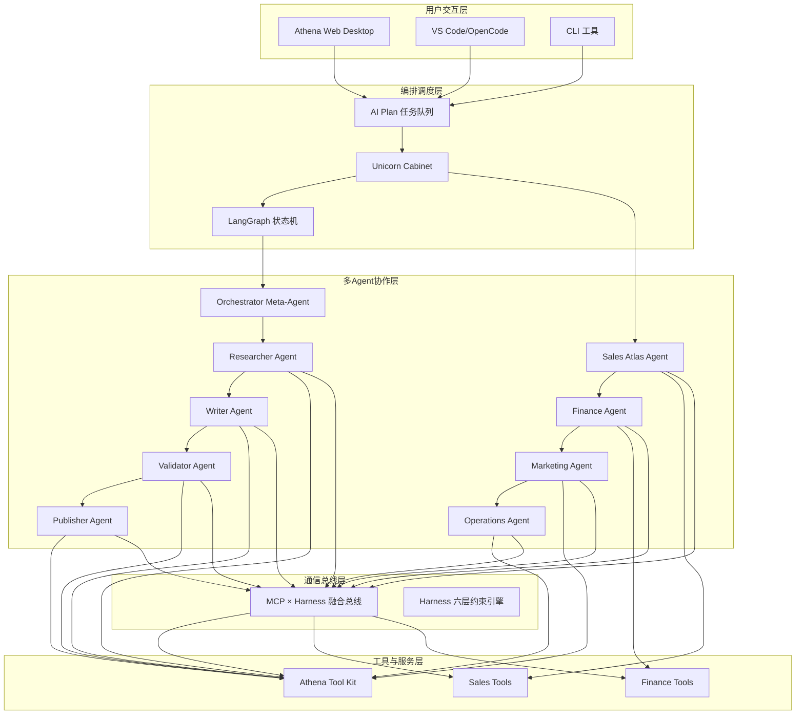

# Athena-20x 与 OpenHuman 对齐工程实施方案

## 📋 项目概述

### 对齐目标
将 **Athena-20x**（1-Person Unicorn 操作系统）与 **Athena-OpenHuman**（GEO-Agent 架构的多 Agent 协作系统）进行深度集成，构建统一的 AI 内阁操作系统。

### 当前状态分析

#### Athena-20x 现状（已完成）
- ✅ **MCP × Harness 融合总线**：1224 行核心代码，已验证通过
- ✅ **Unicorn Cabinet**：AI 内阁指挥中心，支持每日晨会
- ✅ **Sales Atlas Agent**：AI 销售合伙人，意图识别和线索发现
- ✅ **集成测试套件**：15/15 测试通过，性能基准优秀

#### Athena-OpenHuman 现状（已规划）
- ✅ **GEO-Agent 架构设计**：四层 Agent 协作模式
- ✅ **LangGraph 状态机**：类型安全的状态管理
- ✅ **统一工具封装层**：错误重试、缓存机制
- ⏳ **实施阶段**：8 周工程化实施方案

## 🎯 对齐架构设计

### 统一架构图



### Agent 角色映射表

| Athena-20x Agent | Athena-OpenHuman Agent | 角色定位 | 核心能力 |
|------------------|-----------------------|----------|----------|
| **Sales Atlas Agent** | **Researcher Agent** + **Publisher Agent** | 销售研究、内容发布 | 线索发现、邮件生成 |
| **Finance Agent** | **Validator Agent** | 财务审核、数据验证 | 财务分析、风险控制 |
| **Marketing Agent** | **Writer Agent** | 营销内容生成 | 文案创作、策略制定 |
| **Operations Agent** | **Orchestrator Meta-Agent** | 运营协调、任务分配 | 资源调度、流程优化 |

## 🔧 技术集成方案

### 1. MCP × Harness 总线统一化

#### 目标
将 Athena-OpenHuman 的 Agent 通信统一到 MCP × Harness 总线标准。

#### 实施步骤
```python
# 在 Athena-OpenHuman 中实现 MCP × Harness 适配器
class OpenHumanMCPHarnessAdapter:
    """OpenHuman Agent 的 MCP × Harness 协议适配器"""
    
    def __init__(self, agent: BaseAgent):
        self.agent = agent
        self.mcp_bus = MCPHarnessBus()
        self.harness_context = HarnessContext()
    
    async def handle_mcp_message(self, message: MCPMessage) -> MCPMessage:
        """处理 MCP 消息，应用 Harness 约束"""
        
        # 1. 应用 Harness 约束验证
        is_valid, violations = self.harness_context.validate_message(message.payload)
        if not is_valid:
            return MCPMessage.create_constraint_violation(message, violations)
        
        # 2. 将 MCP 任务转换为 OpenHuman Agent 可执行的任务
        if message.message_type == MCPMessageType.TASK_DISPATCH:
            task = self._convert_to_openhuman_task(message.payload)
            result = await self.agent.execute(task)
            return MCPMessage.create_response(message, result)
        
        # 3. 能力宣告
        elif message.message_type == MCPMessageType.CAPABILITY_ANNOUNCE:
            capabilities = self.agent.get_capabilities()
            return MCPMessage.create_capability_announce(capabilities)
        
        # 4. 进化提案处理
        elif message.message_type == MCPMessageType.EVOLUTION_PROPOSE:
            decision = await self.agent.evaluate_evolution(message.payload)
            return MCPMessage.create_evolution_decision(message, decision)
```

### 2. Unicorn Cabinet 与 LangGraph 集成

#### 目标
实现 Unicorn Cabinet 的每日晨会系统与 LangGraph 状态机的无缝集成。

#### 实施步骤
```python
class UnifiedCabinetOrchestrator:
    """统一的内阁编排器 - 结合 Unicorn Cabinet 和 LangGraph"""
    
    def __init__(self):
        self.unicorn_cabinet = UnicornCabinet()
        self.langgraph_workflow = GeoWorkflow()
        self.mcp_bus = MCPHarnessBus()
    
    async def run_daily_standup(self) -> DailyStandupReport:
        """运行统一的每日晨会"""
        
        # 1. 收集各 Agent 状态报告
        agent_reports = await self._collect_agent_reports()
        
        # 2. 运行 LangGraph 状态机分析
        geo_analysis = await self._run_geo_analysis(agent_reports)
        
        # 3. 生成综合晨会报告
        standup_report = await self._generate_standup_report(agent_reports, geo_analysis)
        
        # 4. 通过 MCP 总线分发行动项
        await self._dispatch_action_items(standup_report.action_items)
        
        return standup_report
    
    async def _collect_agent_reports(self) -> Dict[str, AgentReport]:
        """收集所有 Agent 的状态报告"""
        
        reports = {}
        
        # 收集 OpenHuman Agents
        openhuman_agents = ["researcher", "writer", "validator", "publisher"]
        for agent_type in openhuman_agents:
            report = await self.mcp_bus.send_message(
                MCPMessage.create_status_request(agent_type)
            )
            reports[f"openhuman_{agent_type}"] = report
        
        # 收集 Athena-20x Agents
        athena20x_agents = ["sales", "finance", "marketing", "operations"]
        for agent_type in athena20x_agents:
            report = await self.unicorn_cabinet.get_agent_report(agent_type)
            reports[f"athena20x_{agent_type}"] = report
        
        return reports
    
    async def _run_geo_analysis(self, reports: Dict[str, AgentReport]) -> GeoAnalysis:
        """运行 GEO 分析"""
        
        # 创建初始状态
        initial_state = GeoState(
            agent_reports=reports,
            semantic_clusters=[],
            quality_score=0.0
        )
        
        # 执行 GEO 工作流
        final_state = await self.langgraph_workflow.run(initial_state)
        
        return GeoAnalysis(
            insights=final_state.get("insights", []),
            recommendations=final_state.get("recommendations", []),
            risk_assessment=final_state.get("risk_assessment", {})
        )
```

### 3. Harness 六层约束引擎集成

#### 目标
将 Harness 约束引擎集成到 Athena-OpenHuman 的工具执行层。

#### 实施步骤
```python
class ConstrainedToolKit:
    """带 Harness 约束的工具封装层"""
    
    def __init__(self):
        self.tool_wrappers = CLIToolWrapper()
        self.cache_manager = CacheManager()
        self.harness_context = HarnessContext()
    
    @retry(stop=stop_after_attempt(3), wait=wait_exponential(multiplier=1, min=4, max=10))
    async def execute_tool(self, tool_name: str, command: str, params: Dict[str, Any]) -> Dict[str, Any]:
        """执行工具命令（带 Harness 约束）"""
        
        # 1. 应用 Harness 约束验证
        tool_call = {
            "tool": tool_name,
            "command": command,
            "params": params
        }
        
        is_valid, violations = self.harness_context.validate_message({"tool_calls": [tool_call]})
        if not is_valid:
            raise ConstraintViolationError(f"工具调用违反约束: {violations}")
        
        # 2. 生成缓存键
        cache_key = f"tool:{tool_name}:{command}:{hash(str(params))}"
        
        # 3. 检查缓存
        cached_result = await self.cache_manager.get(cache_key)
        if cached_result:
            return cached_result
        
        try:
            # 4. 执行工具
            if tool_name == "serpapi":
                result = await self.tool_wrappers.serpapi_search(command, params)
            elif tool_name == "readability":
                result = await self.tool_wrappers.readability_analyze(command, params)
            elif tool_name == "sales_atlas":
                # 使用 Sales Atlas Agent 执行销售工具
                result = await self._execute_via_sales_atlas(command, params)
            else:
                # 使用通用工具执行
                result = await self.tool_wrappers.execute_generic_tool(tool_name, command, params)
            
            # 5. 缓存结果
            await self.cache_manager.set(cache_key, result, ttl=3600)
            
            return result
            
        except Exception as e:
            # 6. 处理错误并应用恢复策略
            await self._handle_tool_error(e, tool_call)
            raise
    
    async def _handle_tool_error(self, error: Exception, tool_call: Dict):
        """处理工具错误，应用 Harness 恢复策略"""
        
        recovery_policy = self.harness_context.recovery_policy
        
        if recovery_policy == "retry_then_escalate":
            # 记录错误用于重试
            logger.error(f"工具执行失败: {tool_call} - {error}")
            
            # 如果重试次数超过阈值，上报给运营 Agent
            if self._should_escalate():
                escalation_msg = MCPMessage.create_escalation(
                    "operations_agent",
                    {
                        "tool_call": tool_call,
                        "error": str(error),
                        "recovery_attempts": self.retry_count
                    }
                )
                await self.mcp_bus.send_message(escalation_msg)
```

## 📊 实施计划

### 第一阶段：总线集成（第1-2周）

#### 目标
实现 MCP × Harness 总线在 Athena-OpenHuman 中的完整支持。

#### 交付物
- ✅ MCP × Harness 协议适配器 (`openhuman_mcp_harness_adapter.py`)
- ✅ OpenHuman Agent 的 Harness 约束支持
- ✅ MCP 消息路由和约束验证机制
- ✅ 集成测试用例

#### 技术任务
1. **MCP × Harness 协议实现**
   - 实现 MCPMessage 的序列化/反序列化
   - 集成 Harness 六层约束引擎
   - 实现约束违反处理机制

2. **Agent 适配器开发**
   - Researcher Agent MCP × Harness 适配器
   - Writer Agent MCP × Harness 适配器  
   - Validator Agent MCP × Harness 适配器
   - Publisher Agent MCP × Harness 适配器

### 第二阶段：编排系统集成（第3-4周）

#### 目标
实现 Unicorn Cabinet 与 LangGraph 的无缝协作。

#### 交付物
- ✅ 统一内阁编排器 (`unified_cabinet_orchestrator.py`)
- ✅ 每日晨会集成系统
- ✅ Agent 状态收集和报告机制
- ✅ 性能基准测试

#### 技术任务
1. **每日晨会系统集成**
   - 扩展 Unicorn Cabinet 支持 OpenHuman Agents
   - 实现统一的 Agent 状态收集
   - 创建综合晨会报告生成器

2. **编排器集成**
   - 实现 UnifiedCabinetOrchestrator 核心逻辑
   - 集成 GEO 分析工作流
   - 实现行动项分发机制

### 第三阶段：工具层统一（第5-6周）

#### 目标
构建带 Harness 约束的统一工具封装层。

#### 交付物
- ✅ 带约束的工具封装层 (`constrained_toolkit.py`)
- ✅ Harness 约束验证机制
- ✅ 工具错误恢复策略
- ✅ 性能监控和优化

#### 技术任务
1. **工具封装层开发**
   - 实现 ConstrainedToolKit 核心功能
   - 集成 Harness 约束验证
   - 实现错误恢复策略

2. **性能优化**
   - 工具调用性能基准测试
   - 约束验证性能优化
   - 缓存策略优化

### 第四阶段：系统集成和测试（第7-8周）

#### 目标
完成系统集成，进行全面的功能测试和性能测试。

#### 交付物
- ✅ 集成测试套件
- ✅ 性能测试报告
- ✅ 用户文档和 API 文档
- ✅ 部署和运维指南

#### 技术任务
1. **集成测试**
   - 端到端功能测试
   - 约束违反处理测试
   - 性能压力测试

2. **文档和部署**
   - 编写用户使用指南
   - 创建 API 文档
   - 制定部署和运维流程

## 🚀 技术架构演进

### 当前架构 → 目标架构

```
当前架构（分离）:
Athena-20x ──┐
             ├─→ 用户
Athena-OpenHuman ─┘

目标架构（统一）:
          ┌─→ Athena-20x Agents (Sales, Finance, Marketing, Operations)
用户 ──→ 统一内阁系统 ──→ MCP × Harness 总线
          └─→ Athena-OpenHuman Agents (Researcher, Writer, Validator, Publisher)
```

### 关键技术创新

#### 1. MCP × Harness 融合总线
- **统一通信协议**：所有 Agent 使用标准化的 MCP 协议
- **六层约束引擎**：确保 AI 行为可控和安全
- **智能消息路由**：基于优先级和约束的智能路由

#### 2. 统一内阁编排系统
- **每日晨会集成**：统一的 Agent 状态报告和行动项管理
- **GEO 分析集成**：LangGraph 状态机驱动的深度分析
- **跨系统协作**：Athena-20x 和 OpenHuman Agents 的无缝协作

#### 3. 带约束的工具执行
- **Harness 约束验证**：所有工具调用都经过约束验证
- **智能错误恢复**：基于策略的错误处理和恢复
- **性能优化**：缓存和并发执行优化

## 📈 预期收益

### 技术收益
1. **架构统一**：消除系统间的技术债务和集成复杂度
2. **安全性提升**：通过 Harness 约束确保 AI 行为可控
3. **可维护性**：统一的代码库和架构标准
4. **扩展性**：支持更多 Agent 类型的无缝集成

### 业务收益
1. **运营效率**：统一的每日晨会系统提升运营效率
2. **决策质量**：GEO 分析提供更深入的业务洞察
3. **风险管理**：Harness 约束降低 AI 操作风险
4. **创新能力**：更快的新功能迭代速度

## 🔒 风险控制

### 技术风险
1. **集成复杂度**：通过分阶段实施降低风险
2. **性能影响**：通过基准测试和性能监控控制
3. **兼容性问题**：保持向后兼容的 API 设计

### 实施风险
1. **进度风险**：通过敏捷迭代和持续交付控制
2. **质量风险**：通过自动化测试和代码审查控制
3. **团队协作**：通过清晰的接口定义和文档控制

---

**文档版本**: v1.0  
**创建时间**: 2026-04-06  
**维护团队**: Athena 架构集成组  
**参考文档**: 
- Athena-20x README.md 和 IMPLEMENTATION.md
- Athena-OpenHuman GEO-Agent 工程化实施方案.md
- Athena 系统架构图.md