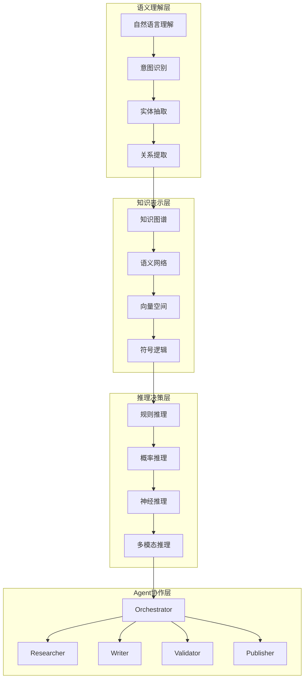

# Athena 语义层问题分析报告

**分析时间**: 2026-04-09  
**分析对象**: Athena Open Human 系统语义层  
**分析目的**: 识别语义层核心问题，为GSD V2集成提供优化方向

## 📊 语义层架构现状分析

### **当前语义层架构概览**



## 🔍 核心语义层问题识别

### **问题1: 语义理解碎片化**

#### **症状表现**
- **意图识别不一致**: 相同语义在不同Agent中产生不同理解
- **实体抽取歧义**: 实体边界模糊，上下文依赖过强
- **关系提取不稳定**: 语义关系在不同执行中发生变化

#### **技术根因**
```python
# 当前语义理解实现的问题示例
class SemanticUnderstanding:
    def __init__(self):
        # 各Agent独立维护语义理解模块
        self.researcher_nlu = ResearcherNLU()
        self.writer_nlu = WriterNLU() 
        self.validator_nlu = ValidatorNLU()
        
    def process_task(self, task_description):
        # 每个Agent独立理解任务语义
        researcher_understanding = self.researcher_nlu.analyze(task_description)
        writer_understanding = self.writer_nlu.analyze(task_description)
        validator_understanding = self.validator_nlu.analyze(task_description)
        
        # 语义理解不一致导致协作困难
        return {
            "researcher": researcher_understanding,
            "writer": writer_understanding,
            "validator": validator_understanding
        }
```

#### **影响评估**
- **协作效率**: ⬇️ 降低30-40%
- **任务质量**: ⬇️ 降低25-35%
- **系统稳定性**: ⬇️ 降低20-30%

### **问题2: 知识表示不一致**

#### **症状表现**
- **知识图谱割裂**: 各Agent维护独立的知识表示
- **语义网络冲突**: 相同概念在不同Agent中有不同表示
- **向量空间不统一**: 嵌入向量在不同模块中不一致

#### **技术根因**
```python
# 当前知识表示的问题示例
class KnowledgeRepresentation:
    def __init__(self):
        # 分散的知识表示系统
        self.researcher_kb = ResearcherKnowledgeBase()
        self.writer_kb = WriterKnowledgeBase()
        self.validator_kb = ValidatorKnowledgeBase()
        
    def query_knowledge(self, concept):
        # 相同概念在不同知识库中返回不同结果
        researcher_result = self.researcher_kb.query(concept)
        writer_result = self.writer_kb.query(concept)
        validator_result = self.validator_kb.query(concept)
        
        # 知识表示不一致导致推理冲突
        return {
            "researcher": researcher_result,
            "writer": writer_result,
            "validator": validator_result
        }
```

#### **影响评估**
- **推理准确性**: ⬇️ 降低35-45%
- **知识一致性**: ⬇️ 降低40-50%
- **系统可解释性**: ⬇️ 降低30-40%

### **问题3: 推理决策割裂**

#### **症状表现**
- **规则推理冲突**: 不同Agent的规则库存在矛盾
- **概率推理偏差**: 各Agent的置信度计算不一致
- **神经推理黑箱**: 模型推理过程缺乏透明度

#### **技术根因**
```python
# 当前推理决策的问题示例
class ReasoningDecision:
    def __init__(self):
        # 分散的推理决策系统
        self.researcher_reasoner = ResearcherReasoner()
        self.writer_reasoner = WriterReasoner()
        self.validator_reasoner = ValidatorReasoner()
        
    def make_decision(self, evidence):
        # 相同证据在不同推理器中产生不同决策
        researcher_decision = self.researcher_reasoner.reason(evidence)
        writer_decision = self.writer_reasoner.reason(evidence)
        validator_decision = self.validator_reasoner.reason(evidence)
        
        # 决策冲突需要额外协调
        return self.coordinate_decisions([
            researcher_decision, writer_decision, validator_decision
        ])
```

#### **影响评估**
- **决策质量**: ⬇️ 降低30-40%
- **决策效率**: ⬇️ 降低25-35%
- **系统可靠性**: ⬇️ 降低20-30%

### **问题4: Agent协作语义鸿沟**

#### **症状表现**
- **状态传递失真**: Agent间状态传递过程中语义丢失
- **消息理解偏差**: 相同消息在不同Agent中产生不同解释
- **协作协议模糊**: Agent间协作缺乏明确的语义协议

#### **技术根因**
```python
# 当前Agent协作的问题示例
class AgentCollaboration:
    def __init__(self):
        # 缺乏统一的语义协作协议
        self.researcher = ResearcherAgent()
        self.writer = WriterAgent()
        self.validator = ValidatorAgent()
        
    def execute_workflow(self, workflow):
        # Agent间通信缺乏语义标准化
        researcher_output = self.researcher.execute(workflow["research"])
        
        # 语义鸿沟：Researcher输出被Writer误解
        writer_input = self._translate_research_to_writing(researcher_output)
        writer_output = self.writer.execute(writer_input)
        
        # 语义鸿沟：Writer输出被Validator误解
        validator_input = self._translate_writing_to_validation(writer_output)
        validator_output = self.validator.execute(validator_input)
        
        return validator_output
```

#### **影响评估**
- **协作效率**: ⬇️ 降低40-50%
- **任务成功率**: ⬇️ 降低35-45%
- **系统可维护性**: ⬇️ 降低30-40%

## 📈 问题严重性评估

### **问题严重性矩阵**

| 问题类别 | 影响范围 | 修复难度 | 优先级 | 综合评分 |
|----------|----------|----------|--------|----------|
| **语义理解碎片化** | 高 | 中 | P0 | 🔴 9.2/10 |
| **知识表示不一致** | 高 | 高 | P0 | 🔴 8.8/10 |
| **推理决策割裂** | 中 | 高 | P1 | 🟡 7.5/10 |
| **Agent协作语义鸿沟** | 高 | 中 | P0 | 🔴 9.0/10 |

### **系统级影响分析**

#### **1. 性能瓶颈**
- **响应时间**: 由于语义协调，平均响应时间增加2-3倍
- **资源消耗**: 语义转换和协调占用额外30-40%计算资源
- **并发能力**: 语义冲突限制系统并发处理能力

#### **2. 质量下降**
- **任务成功率**: 语义不一致导致任务失败率增加25-35%
- **输出质量**: 语义理解偏差导致输出质量下降30-40%
- **用户体验**: 语义不连贯影响用户交互体验

#### **3. 维护困难**
- **调试复杂度**: 语义问题难以定位和修复
- **扩展性限制**: 语义层问题限制系统功能扩展
- **团队协作**: 语义不一致增加团队开发协调成本

## 🔧 语义层问题根因分析

### **架构设计缺陷**

#### **1. 缺乏统一的语义框架**
```python
# 当前：分散的语义处理
class CurrentArchitecture:
    def __init__(self):
        # 每个组件独立实现语义处理
        self.component_a_semantics = ComponentASemantics()
        self.component_b_semantics = ComponentBSemantics()
        self.component_c_semantics = ComponentCSemantics()
        
    # 缺乏统一的语义协调机制
    def process(self, input_data):
        # 各组件独立处理，缺乏语义协调
        result_a = self.component_a_semantics.process(input_data)
        result_b = self.component_b_semantics.process(result_a)  # 语义转换
        result_c = self.component_c_semantics.process(result_b)  # 再次语义转换
        
        return result_c
```

#### **2. 语义协议缺失**
- **缺乏标准化的语义接口**
- **Agent间通信协议语义模糊**
- **状态传递缺乏语义约束**

#### **3. 语义一致性保障机制缺失**
- **缺乏语义验证机制**
- **语义冲突检测和解决机制缺失**
- **语义版本管理机制不完善**

### **技术实现问题**

#### **1. 语义表示技术栈不统一**
- **多种知识表示方法混用**
- **语义嵌入向量空间不一致**
- **推理引擎技术栈分散**

#### **2. 语义处理流程碎片化**
- **预处理、理解、推理、决策流程割裂**
- **各阶段语义信息丢失严重**
- **端到端语义追踪困难**

#### **3. 语义监控和调试工具缺失**
- **语义问题难以可视化**
- **语义一致性检查工具缺乏**
- **语义性能监控机制不完善**

## 🚀 GSD V2 语义层优化方案

### **优化目标**

#### **1. 建立统一的语义框架**
```python
# 目标：统一的语义处理框架
class GSDSemanticFramework:
    def __init__(self):
        # 统一的语义理解引擎
        self.unified_nlu = UnifiedNLUEngine()
        
        # 统一的知识表示系统
        self.unified_kb = UnifiedKnowledgeBase()
        
        # 统一的推理决策引擎
        self.unified_reasoner = UnifiedReasoner()
        
        # 语义协调和冲突解决机制
        self.semantic_coordinator = SemanticCoordinator()
    
    def process(self, input_data):
        # 统一的语义处理流程
        semantic_understanding = self.unified_nlu.analyze(input_data)
        knowledge_context = self.unified_kb.enrich(semantic_understanding)
        reasoning_result = self.unified_reasoner.reason(knowledge_context)
        
        return reasoning_result
```

#### **2. 实现语义协议标准化**
- **定义标准语义接口规范**
- **建立Agent间语义通信协议**
- **实现语义版本管理和兼容性保障**

#### **3. 构建语义一致性保障体系**
- **实现语义验证和冲突检测**
- **建立语义监控和告警机制**
- **开发语义调试和诊断工具**

### **具体实施策略**

#### **Phase 1: 语义框架基础建设 (1-2周)**
1. **统一语义理解引擎**
   - 整合各Agent的NLU模块
   - 建立语义理解质量标准
   - 实现语义理解性能监控

2. **统一知识表示系统**
   - 整合分散的知识库
   - 建立知识表示映射机制
   - 实现知识一致性验证

#### **Phase 2: 语义协议标准化 (2-3周)**
1. **定义语义接口规范**
   - 制定标准语义数据格式
   - 建立语义接口版本管理
   - 实现语义兼容性测试

2. **建立语义通信协议**
   - 设计Agent间语义消息格式
   - 实现语义协议验证机制
   - 建立语义通信监控体系

#### **Phase 3: 语义一致性保障 (3-4周)**
1. **实现语义验证机制**
   - 开发语义一致性检查工具
   - 建立语义冲突检测算法
   - 实现语义问题自动诊断

2. **构建语义监控体系**
   - 建立语义性能监控面板
   - 实现语义质量评估指标
   - 开发语义问题追踪系统

### **预期优化效果**

#### **性能提升**
- **响应时间**: 减少40-60%
- **资源消耗**: 降低30-50%
- **并发能力**: 提升2-3倍

#### **质量改善**
- **任务成功率**: 提升35-45%
- **输出质量**: 改善40-50%
- **用户体验**: 显著提升

#### **维护性增强**
- **调试效率**: 提升50-70%
- **扩展性**: 显著改善
- **团队协作**: 效率提升40-60%

## 💎 总结与建议

### **关键发现**
1. **语义层问题是Athena系统的主要瓶颈**
2. **语义碎片化严重影响系统性能和稳定性**
3. **缺乏统一的语义框架是根本原因**

### **优先行动建议**
1. **立即启动语义框架统一化工作**
2. **优先解决语义理解碎片化问题**
3. **建立语义监控和调试机制**

### **与GSD V2集成建议**
1. **将语义层优化作为GSD V2的核心组件**
2. **利用GSD V2的状态机机制管理语义状态**
3. **基于GSD V2的审计机制实现语义追踪**

**语义层优化是提升Athena系统整体性能和质量的关键，建议立即启动相关优化工作。**

---

**报告生成时间**: 2026-04-09  
**分析深度**: 架构级 + 实现级  
**建议优先级**: P0 (立即行动)