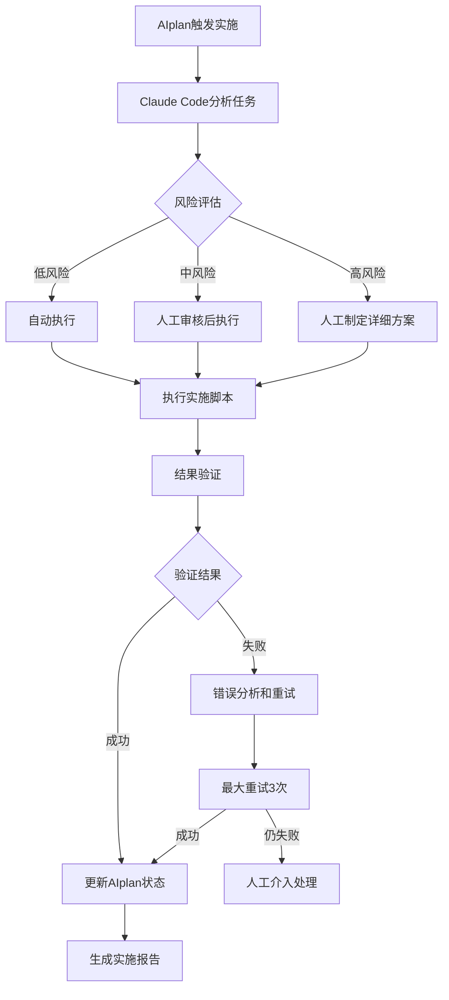

# GSD V2 智能渐进式实施工作流

**制定时间**: 2026-04-08  
**实施策略**: 渐进式 + 自动化 + AIplan集成  
**核心原则**: 稳定性优先，兼容性保障，智能跟进

## 🎯 实施策略选择分析

### **方案对比评估**

| 方案 | 优势 | 风险 | 推荐度 |
|------|------|------|--------|
| **纯手动实施** | 控制精细，风险可控 | 效率低，一致性差 | ⭐⭐ |
| **Claude Code自动化** | 效率高，一致性好 | 风险较高，调试复杂 | ⭐⭐⭐ |
| **混合智能工作流** | 平衡效率与控制，AIplan跟进 | 复杂度中等 | ⭐⭐⭐⭐⭐ |

### **推荐方案: 混合智能工作流**
**核心设计**: Claude Code自动化实施 + AIplan智能跟进 + 人工关键节点审核

## 🔧 智能渐进式实施架构

### **三层架构设计**
```
┌─────────────────┐
│   AIplan管理层  │ ← 进度跟踪、风险评估、决策支持
├─────────────────┤
│ Claude Code执行层 │ ← 自动化实施、配置生成、代码编写
├─────────────────┤
│   人工审核层     │ ← 关键节点审核、风险控制、质量保证
└─────────────────┘
```

## 🚀 四阶段渐进式实施计划

### **第一阶段: 基础架构准备 (1-2周)**

#### **目标**: 建立GSD V2核心架构基础

#### **AIplan任务定义**
```json
{
  "phase": "phase1_foundation",
  "tasks": [
    {
      "id": "task1_1",
      "title": "创建GSD V2目录结构",
      "description": "建立核心目录结构，包括core、config、workflows等",
      "automation": "claude_code",
      "script": "scripts/gsd_v2_setup_phase1.sh",
      "checkpoints": ["目录创建", "权限设置", "基础配置"],
      "risk_level": "low",
      "estimated_duration": "2小时"
    },
    {
      "id": "task1_2", 
      "title": "实现状态机引擎",
      "description": "开发state-machine.sh状态机引擎",
      "automation": "claude_code",
      "script": "scripts/implement_state_machine.sh",
      "checkpoints": ["状态定义", "转换逻辑", "审计日志"],
      "risk_level": "medium",
      "estimated_duration": "4小时"
    }
  ]
}
```

#### **Claude Code自动化脚本模板**
```bash
#!/bin/bash
# scripts/gsd_v2_setup_phase1.sh

set -euo pipefail

# GSD V2 基础目录结构创建
BASE_DIR="$HOME/.openclaw"

echo "🚀 开始GSD V2 Phase 1 基础架构准备..."

# 创建核心目录结构
directories=(
    "core"
    "config" 
    "workflows"
    "agents"
    "hooks"
    "logs"
    "state"
)

for dir in "${directories[@]}"; do
    mkdir -p "$BASE_DIR/$dir"
    echo "✅ 创建目录: $BASE_DIR/$dir"
done

# 设置权限
chmod 755 "$BASE_DIR"
chmod 700 "$BASE_DIR/state"

# 创建基础配置文件
echo '{"version": "gsd_v2_1.0", "created_at": "'$(date -Iseconds)'"}' > "$BASE_DIR/version.json"

echo "🎯 Phase 1 完成! 基础架构准备就绪"
```

### **第二阶段: 核心组件集成 (2-3周)**

#### **目标**: 集成核心控制组件，建立审计追踪

#### **AIplan智能跟进机制**
```yaml
# AIplan 跟进配置
tracking_config:
  check_interval: 3600  # 每小时检查一次进度
  alert_thresholds:
    execution_time: 7200  # 任务执行超过2小时告警
    error_count: 3       # 连续错误3次告警
    
automation_checks:
  - name: "目录结构完整性"
    script: "scripts/verify_directory_structure.sh"
    expected_result: "所有核心目录存在且权限正确"
    
  - name: "状态机功能验证"
    script: "scripts/test_state_machine.sh"
    expected_result: "状态转换正常，审计日志记录完整"
```

#### **Claude Code实施模板**
```python
# scripts/implement_state_machine.py
"""GSD V2 状态机引擎实施脚本"""

import os
import json
from datetime import datetime
from pathlib import Path

class GSDV2StateMachine:
    """GSD V2 状态机引擎"""
    
    def __init__(self, base_dir):
        self.base_dir = Path(base_dir)
        self.state_file = self.base_dir / "state" / "global-state.json"
        self.log_file = self.base_dir / "logs" / "state-transitions.jsonl"
        
        # GSD V2 状态定义
        self.STATES = ["IDLE", "SCAN", "PLAN", "DISPATCH", "EXECUTE", "VERIFY", "EVOLVE", "ARCHIVE"]
        self.current_state = "IDLE"
        
    def initialize(self):
        """初始化状态机"""
        # 确保目录存在
        self.state_file.parent.mkdir(parents=True, exist_ok=True)
        self.log_file.parent.mkdir(parents=True, exist_ok=True)
        
        # 初始化状态文件
        if not self.state_file.exists():
            initial_state = {
                "state": "IDLE",
                "wave_id": None,
                "agent": None,
                "start_time": None,
                "checkpoint": None,
                "attempts": 0,
                "version": "gsd_v2_1.0"
            }
            self._write_state(initial_state)
            
        self._load_current_state()
        
    def transition(self, new_state, trigger, metadata=None):
        """状态转换（带审计日志）"""
        old_state = self.current_state
        timestamp = datetime.now().isoformat()
        
        # 验证状态转换合法性
        if not self._validate_transition(old_state, new_state):
            raise ValueError(f"非法状态转换: {old_state} -> {new_state}")
        
        # 更新状态
        new_state_data = {
            "state": new_state,
            "transition_time": timestamp,
            "trigger": trigger,
            "metadata": metadata or {}
        }
        
        self._write_state(new_state_data)
        
        # 记录审计日志
        audit_entry = {
            "timestamp": timestamp,
            "old_state": old_state,
            "new_state": new_state,
            "trigger": trigger,
            "metadata": metadata
        }
        
        self._log_audit(audit_entry)
        self.current_state = new_state
        
        print(f"✅ 状态转换: {old_state} -> {new_state} (触发: {trigger})")
        
    def _validate_transition(self, old_state, new_state):
        """验证状态转换合法性"""
        # GSD V2: 严格有序的状态转换
        valid_transitions = {
            "IDLE": ["SCAN"],
            "SCAN": ["PLAN", "IDLE"],
            "PLAN": ["DISPATCH", "SCAN"],
            "DISPATCH": ["EXECUTE", "PLAN"],
            "EXECUTE": ["VERIFY", "DISPATCH"],
            "VERIFY": ["EVOLVE", "EXECUTE"],
            "EVOLVE": ["ARCHIVE", "VERIFY"],
            "ARCHIVE": ["IDLE"]
        }
        
        return new_state in valid_transitions.get(old_state, [])
```

### **第三阶段: 工作流迁移 (3-4周)**

#### **目标**: 逐步迁移现有工作流到GSD V2架构

#### **AIplan迁移策略**
```yaml
migration_strategy:
  approach: "渐进式迁移"
  phases:
    - phase: "只读验证"
      duration: "1周"
      tasks: ["状态机监控", "审计日志验证", "性能基准测试"]
      
    - phase: "影子模式"  
      duration: "2周"
      tasks: ["并行执行", "结果对比", "差异分析"]
      
    - phase: "正式切换"
      duration: "1周"
      tasks: ["流量切换", "监控告警", "回滚预案"]

rollback_plan:
  triggers:
    - "连续错误率 > 5%"
    - "关键功能失效"
    - "性能下降 > 20%"
  
  procedures:
    - "立即停止GSD V2流量"
    - "恢复原有工作流"
    - "问题分析和修复"
```

#### **智能迁移脚本**
```python
# scripts/migrate_workflow_to_gsd_v2.py
"""工作流向GSD V2迁移的智能脚本"""

class WorkflowMigrator:
    """工作流迁移器"""
    
    def __init__(self, gsd_v2_system, legacy_system):
        self.gsd_v2 = gsd_v2_system
        self.legacy = legacy_system
        self.migration_log = []
        
    def analyze_compatibility(self):
        """分析兼容性"""
        analysis = {
            "compatible_components": [],
            "incompatible_components": [],
            "requires_modification": [],
            "migration_effort": "medium"  # low/medium/high
        }
        
        # 自动化兼容性分析
        for component in self.legacy.get_components():
            if self._is_directly_compatible(component):
                analysis["compatible_components"].append(component)
            elif self._can_be_adapted(component):
                analysis["requires_modification"].append(component)
            else:
                analysis["incompatible_components"].append(component)
                
        return analysis
    
    def create_migration_plan(self, analysis):
        """创建迁移计划"""
        plan = {
            "phases": [],
            "estimated_duration": "3-4周",
            "risk_assessment": "medium",
            "success_criteria": []
        }
        
        # 基于分析结果制定计划
        if analysis["compatible_components"]:
            plan["phases"].append({
                "name": "直接迁移兼容组件",
                "components": analysis["compatible_components"],
                "duration": "1周"
            })
            
        if analysis["requires_modification"]:
            plan["phases"].append({
                "name": "适配修改组件", 
                "components": analysis["requires_modification"],
                "duration": "2周"
            })
            
        return plan
```

### **第四阶段: 优化完善 (持续)**

#### **目标**: 持续优化和演进

#### **AIplan持续改进机制**
```yaml
continuous_improvement:
  metrics_tracking:
    - "系统稳定性指标"
    - "执行效率指标"
    - "错误率统计"
    - "用户满意度"
    
  optimization_cycles:
    frequency: "每周"
    activities:
      - "性能分析"
      - "问题复盘"
      - "优化实施"
      - "效果验证"
      
  feedback_loops:
    - "用户反馈收集"
    - "自动化测试结果"
    - "监控告警分析"
    - "审计日志分析"
```

## 🔄 智能实施工作流设计

### **自动化实施流程**


### **AIplan集成配置**
```json
{
  "gsd_v2_implementation": {
    "tracking_strategy": "smart_progressive",
    "automation_level": "high",
    "human_review_points": ["phase_transitions", "risk_mitigation", "quality_gates"],
    "success_metrics": {
      "stability": ">99.9% uptime",
      "performance": "<2s response time", 
      "compatibility": "100% feature parity",
      "adoption": ">90% workflow migration"
    },
    "alerting_rules": {
      "performance_degradation": ">20% slowdown",
      "error_rate_spike": ">5% for 5min",
      "migration_stall": "no progress for 24h"
    }
  }
}
```

## 🛡️ 风险控制与质量保证

### **多重保障机制**

#### **1. 自动化测试验证**
```bash
#!/bin/bash
# scripts/gsd_v2_validation_suite.sh

echo "🧪 GSD V2 实施验证套件"

# 基础架构验证
./scripts/verify_directory_structure.sh
./scripts/test_state_machine.sh

# 功能验证
./scripts/test_audit_logging.sh
./scripts/test_error_recovery.sh

# 性能验证
./scripts/benchmark_performance.sh

echo "✅ 验证完成，准备进入下一阶段"
```

#### **2. 渐进式流量切换**
```python
# 流量切换控制器
class TrafficSwitcher:
    """渐进式流量切换控制器"""
    
    def __init__(self):
        self.current_traffic_split = {
            "legacy": 100,  # 100%流量走原有系统
            "gsd_v2": 0     # 0%流量走GSD V2
        }
        
    def gradual_switch(self, duration_hours=168):  # 默认1周
        """渐进式流量切换"""
        steps = duration_hours // 24  # 每天调整一次
        
        for step in range(steps):
            # 逐步增加GSD V2流量比例
            gsd_v2_percent = min(100, (step + 1) * (100 // steps))
            legacy_percent = 100 - gsd_v2_percent
            
            self._update_traffic_split(gsd_v2_percent, legacy_percent)
            
            # 监控关键指标
            if not self._check_health_metrics():
                self._rollback_traffic_split()
                raise Exception("健康指标异常，回滚流量分配")
            
            time.sleep(24 * 3600)  # 等待24小时
```

#### **3. 智能回滚机制**
```python
# 智能回滚控制器
class SmartRollbackController:
    """智能回滚控制器"""
    
    def __init__(self, monitoring_system):
        self.monitor = monitoring_system
        self.rollback_triggers = [
            ("error_rate", ">", 0.05, "5%错误率阈值"),
            ("response_time", ">", 3000, "3秒响应时间阈值"),
            ("system_availability", "<", 0.99, "99%可用性阈值")
        ]
        
    def monitor_and_rollback(self):
        """监控并执行智能回滚"""
        while True:
            metrics = self.monitor.get_current_metrics()
            
            for trigger in self.rollback_triggers:
                metric_name, operator, threshold, description = trigger
                
                if self._evaluate_trigger(metrics[metric_name], operator, threshold):
                    print(f"🚨 触发回滚: {description}")
                    self._execute_rollback()
                    return
                    
            time.sleep(60)  # 每分钟检查一次
```

## 📊 实施进度跟踪与报告

### **AIplan智能跟进仪表板**
```yaml
dashboard_config:
  overview:
    - "总体进度百分比"
    - "当前阶段状态"
    - "关键指标趋势"
    - "风险等级评估"
    
  detailed_tracking:
    phases:
      - "phase1_foundation":
          progress: "85%"
          next_milestone: "状态机集成测试"
          risks: "低"
          
      - "phase2_core_integration": 
          progress: "45%"
          next_milestone: "审计日志系统"
          risks: "中"
          
  automation_insights:
    - "Claude Code执行成功率"
    - "自动化测试通过率"
    - "人工审核通过率"
    - "问题解决效率"
```

### **智能报告生成**
```python
# 智能报告生成器
class SmartReportGenerator:
    """智能实施报告生成器"""
    
    def generate_weekly_report(self):
        """生成周度实施报告"""
        report = {
            "summary": self._generate_summary(),
            "progress_analysis": self._analyze_progress(),
            "risk_assessment": self._assess_risks(),
            "recommendations": self._generate_recommendations(),
            "next_steps": self._plan_next_steps()
        }
        
        return self._format_report(report)
    
    def _generate_recommendations(self):
        """基于数据分析生成智能建议"""
        recommendations = []
        
        # 基于执行数据分析
        if self.analysis.get('automation_success_rate', 0) < 0.9:
            recommendations.append("优化Claude Code脚本，提高执行成功率")
            
        if self.analysis.get('migration_speed', 0) < self.expected_speed:
            recommendations.append("调整迁移策略，加快实施进度")
            
        return recommendations
```

## 🚀 立即执行建议

### **第一步: 环境准备 (今日)**
1. **配置AIplan跟踪任务**
   ```bash
   # 创建GSD V2实施跟踪任务
   python3 scripts/setup_aiplan_tracking.py --project gsd_v2_implementation
   ```

2. **准备Claude Code执行环境**
   ```bash
   # 验证Claude Code Router状态
   ccr status
   # 配置自动化执行权限
   ```

### **第二步: 启动第一阶段 (明日)**
1. **执行基础架构准备**
   ```bash
   # 自动执行Phase 1任务
   python3 scripts/execute_phase1.py --automation claude_code --review manual
   ```

2. **建立AIplan监控**
   ```bash
   # 启动智能跟进
   python3 scripts/start_smart_tracking.py --project gsd_v2
   ```

### **第三步: 持续跟进 (每日)**
1. **查看实施进度**
   ```bash
   # 查看AIplan仪表板
   python3 scripts/show_dashboard.py --project gsd_v2
   ```

2. **处理告警和异常**
   ```bash
   # 监控告警信息
   python3 scripts/monitor_alerts.py --project gsd_v2
   ```

## 💎 最终实施策略总结

### **推荐方案: 混合智能工作流**
**核心优势**:
- ✅ **效率与控制平衡**: Claude Code自动化 + 人工关键审核
- ✅ **智能跟进**: AIplan实时监控和进度跟踪
- ✅ **风险可控**: 多重保障机制和智能回滚
- ✅ **持续优化**: 基于数据的持续改进循环

### **实施优先级**
1. **立即开始**: Phase 1基础架构准备
2. **并行进行**: AIplan智能跟进系统搭建
3. **逐步扩展**: 后续阶段的自动化实施

### **成功关键**
- **渐进式实施**: 确保每个阶段稳定后再推进
- **自动化验证**: 建立完整的测试验证体系
- **智能监控**: 实时跟踪实施进度和风险
- **持续改进**: 基于反馈不断优化实施策略

**此智能工作流方案将确保GSD V2实施的稳定性、效率性和可跟踪性，建议立即开始执行。**

---

**方案版本**: v1.0  
**制定时间**: 2026-04-08  
**建议执行**: 立即开始Phase 1基础架构准备