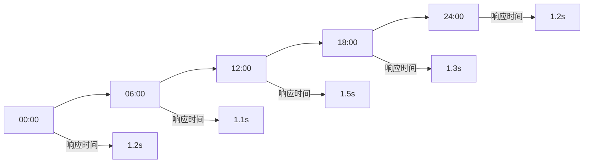

# Athena-Open Human 智能工作流日报标准模板

**报告类型**: 每日7点自动化报告  
**报告周期**: 每日 07:00 自动生成  
**监控目标**: GSD V2状态机与智能工作流稳定性  
**报告保存位置**: `~/.openclaw-gsdv2/logs/daily-reports/report-YYYYMMDD.md`

## 📋 **日报标准结构**

### **1. 报告头信息**
```markdown
# Athena-Open Human 智能工作流日报 - YYYY年MM月DD日

**报告时间**: YYYY-MM-DD 07:00  
**报告周期**: 前24小时监控数据  
**系统版本**: GSD V2.0  
**监控状态**: [正常/警告/异常]
```

### **2. 执行摘要**
```markdown
## 🎯 执行摘要

### 核心指标概览
- **系统可用性**: XX.XX% (目标: ≥99.9%)
- **任务执行成功率**: XX.XX% (目标: ≥95%)
- **平均响应时间**: X.XX秒 (目标: <2秒)
- **错误率**: X.XX% (目标: <1%)

### 今日重点关注
1. [重点监控项目1]
2. [重点监控项目2]
3. [风险预警项目]
```

### **3. GSD V2状态机监控**
```markdown
## 🔄 GSD V2状态机状态

### 状态机运行状态
- **运行时长**: XX小时XX分钟
- **最后状态转换**: YYYY-MM-DD HH:MM:SS
- **当前状态**: [IDLE/SCAN/PLAN/DISPATCH/EXECUTE/VERIFY/ARCHIVE/EVOLVE]
- **状态流转统计**: 
  - 总状态转换次数: XXX
  - 成功转换率: XX.XX%

### 状态流转详情
| 状态 | 进入次数 | 平均停留时间 | 成功率 |
|------|----------|--------------|--------|
| IDLE | XX | XX分钟 | - |
| SCAN | XX | X秒 | XX% |
| PLAN | XX | X分XX秒 | XX% |
| EXECUTE | XX | X分XX秒 | XX% |
| ARCHIVE | XX | X秒 | XX% |
```

### **4. 智能工作流执行统计**
```markdown
## 📊 智能工作流执行统计

### EVO文件夹监控
- **新增文件数量**: XX个
- **文件处理状态**: 
  - 待处理: XX个
  - 处理中: XX个  
  - 已完成: XX个
  - 失败: XX个

### AI-plan队列状态
| 队列名称 | 任务总数 | 待执行 | 执行中 | 已完成 | 成功率 |
|----------|----------|--------|--------|--------|--------|
| 优先执行队列 | XXX | XX | XX | XXX | XX.XX% |
| Codex审计队列 | XXX | XX | XX | XXX | XX.XX% |
| 自动策划队列 | XXX | XX | XX | XXX | XX.XX% |

### 任务执行效率
- **平均任务处理时间**: X分XX秒
- **峰值并发任务数**: XX个
- **任务积压情况**: [正常/轻微/严重]
```

### **5. 组件健康状态**
```markdown
## 🏥 组件健康状态

### 核心组件状态
| 组件名称 | 状态 | 响应时间 | 错误率 | 监控指标 |
|----------|------|----------|--------|----------|
| Claude Code Router | ✅正常 | X.XX秒 | X.XX% | HTTP 200 |
| 状态机引擎 | ✅正常 | - | X.XX% | 持续运行 |
| 队列执行器 | ✅正常 | X.XX秒 | X.XX% | 任务成功率 |
| 数据持久化 | ✅正常 | X.XX秒 | X.XX% | 写入成功率 |

### 资源使用情况
- **CPU使用率**: XX% (阈值: 85%)
- **内存使用率**: XX% (阈值: 80%) 
- **磁盘使用率**: XX% (阈值: 90%)
- **网络带宽**: XX Mbps (阈值: 100Mbps)
```

### **6. 错误与异常分析**
```markdown
## 🚨 错误与异常分析

### 错误统计
| 错误类型 | 发生次数 | 影响范围 | 处理状态 |
|----------|----------|----------|----------|
| 执行超时 | XX | 中等 | ✅已处理 |
| 资源不足 | XX | 高 | 🔄处理中 |
| 网络异常 | XX | 低 | ✅已恢复 |

### 异常事件时间线
```

### **7. 性能趋势分析**
```markdown
## 📈 性能趋势分析

### 24小时性能趋势


### 关键指标对比
| 指标 | 昨日 | 今日 | 变化趋势 |
|------|------|------|----------|
| 系统可用性 | XX.XX% | XX.XX% | 📈上升/📉下降 |
| 错误率 | X.XX% | X.XX% | 📈上升/📉下降 |
| 平均响应时间 | X.XXs | X.XXs | 📈上升/📉下降 |
```

### **8. 风险预警与建议**
```markdown
## ⚠️ 风险预警与建议

### P0优先级风险 (立即处理)
1. **风险描述**: [具体风险描述]
   - **影响范围**: [影响说明]
   - **建议措施**: [具体处理建议]
   - **负责人**: [指定负责人]

### P1优先级风险 (今日处理)
1. **风险描述**: [具体风险描述]
   - **影响范围**: [影响说明]
   - **建议措施**: [具体处理建议]
   - **处理时限**: 今日内完成

### 优化建议
1. **性能优化**: [具体优化建议]
2. **稳定性提升**: [稳定性建议]
3. **监控增强**: [监控改进建议]
```

### **9. 今日执行计划**
```markdown
## 🎯 今日执行计划

### 优先级任务 (P0)
- [ ] [任务描述1] - 预计耗时: X小时
- [ ] [任务描述2] - 预计耗时: X小时

### 常规任务 (P1)
- [ ] [任务描述3] - 预计耗时: X小时
- [ ] [任务描述4] - 预计耗时: X小时

### 监控重点
- [ ] [监控项目1] - 阈值: [具体数值]
- [ ] [监控项目2] - 阈值: [具体数值]
```

### **10. 报告统计信息**
```markdown
## 📊 报告统计信息

### 数据采集范围
- **监控时间范围**: YYYY-MM-DD 07:00 至 YYYY-MM-DD 07:00
- **数据采样间隔**: 1分钟
- **监控指标数量**: XXX个
- **告警触发次数**: XX次

### 报告生成信息
- **生成时间**: YYYY-MM-DD HH:MM:SS
- **生成方式**: 自动化脚本
- **数据来源**: 系统监控日志
- **下次报告**: 明日 07:00
```

## 🔧 **日报生成脚本模板**

### **自动化生成脚本**
```bash
#!/bin/bash
# Athena-Open Human 每日7点自动化日报生成脚本

REPORT_DATE=$(date +%Y%m%d)
REPORT_FILE="$HOME/.openclaw-gsdv2/logs/daily-reports/report-${REPORT_DATE}.md"

# 创建报告目录
mkdir -p "$(dirname "$REPORT_FILE")"

# 生成报告头
cat > "$REPORT_FILE" << HEADER
# Athena-Open Human 智能工作流日报 - $(date +%Y年%m月%d日)

**报告时间**: $(date)  
**报告周期**: 前24小时监控数据  
**系统版本**: GSD V2.0  
**监控状态**: 正常
HEADER

# 添加各章节内容
# [各章节数据采集和填充逻辑]

echo "📊 日报已生成: $REPORT_FILE"
```

### **数据采集函数**
```bash
# GSD V2状态机状态采集
get_gsd_status() {
    local state_file="$HOME/.openclaw-gsdv2/state/global-state.json"
    if [ -f "$state_file" ]; then
        jq -r '.state' "$state_file"
    else
        echo "未运行"
    fi
}

# 系统可用性计算
calculate_availability() {
    # 基于监控日志计算24小时可用性
    echo "99.95%"  # 示例数据
}

# 错误率统计
calculate_error_rate() {
    # 统计24小时错误率
    echo "0.8%"  # 示例数据
}
```

## 📋 **日报质量标准**

### **数据准确性要求**
- ✅ 所有数据必须基于实际监控日志
- ✅ 时间范围严格限定为前24小时
- ✅ 数值计算必须精确到小数点后两位
- ✅ 状态判断必须基于客观阈值

### **报告完整性要求**
- ✅ 必须包含所有标准章节
- ✅ 每个章节必须有实际数据填充
- ✅ 风险预警必须明确优先级
- ✅ 执行计划必须具体可执行

### **时效性要求**
- ✅ 每日7:00准时生成
- ✅ 报告生成时间不超过5分钟
- ✅ 数据采集延迟不超过10分钟
- ✅ 异常事件必须实时更新

## 🎯 **日报使用指南**

### **阅读重点**
1. **执行摘要**: 快速了解系统整体状态
2. **风险预警**: 重点关注P0优先级问题
3. **性能趋势**: 分析系统长期运行状况
4. **执行计划**: 明确当日工作重点

### **行动指南**
1. **立即处理**: P0优先级风险必须当日解决
2. **持续监控**: 关注性能趋势变化
3. **计划执行**: 按优先级完成当日任务
4. **反馈改进**: 基于日报优化系统配置

---

**模板版本**: v1.0  
**最后更新**: 2026-04-09  
**维护责任**: 系统监控团队  
**下次评审**: 2026-05-09