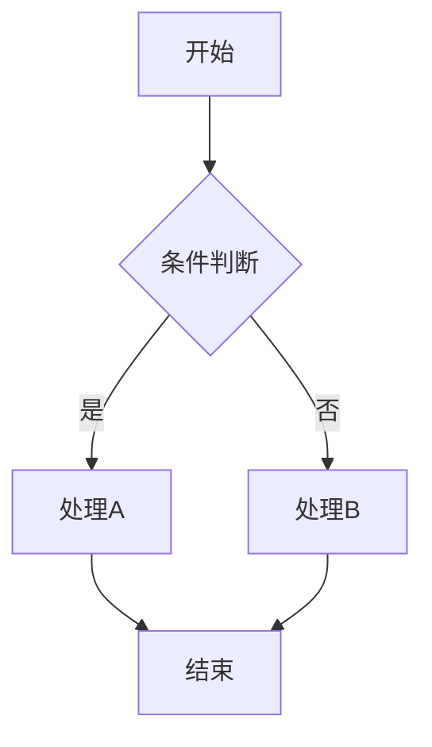
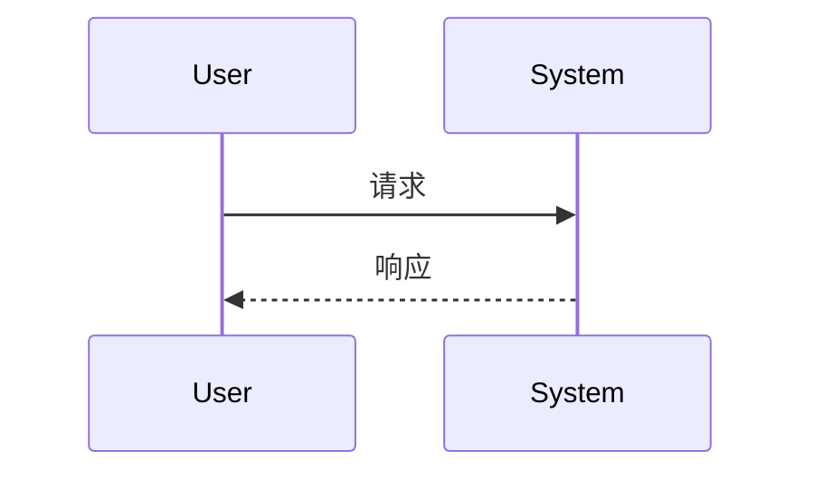
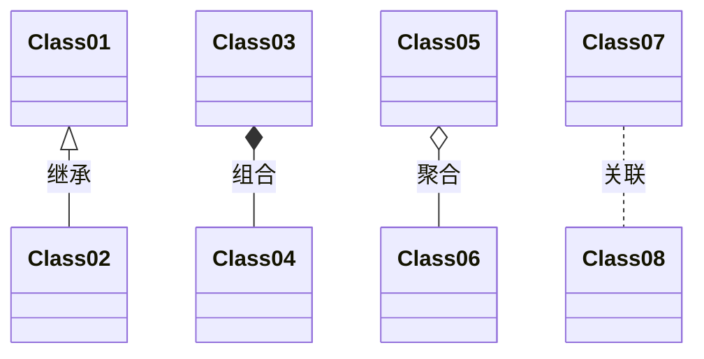
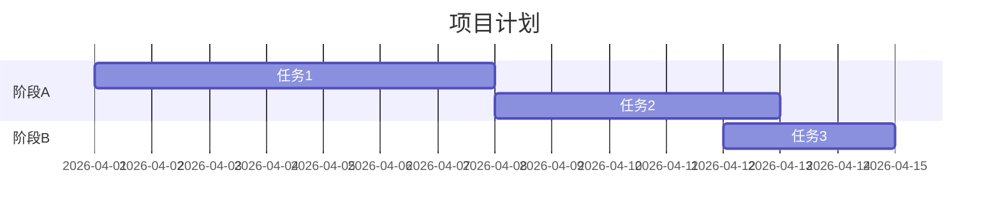
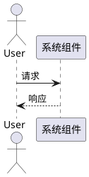

# Markdown高级技巧指南

## 概述
本文档介绍OpenClaw项目中使用的Markdown高级特性和扩展语法，帮助贡献者创建更丰富、更专业的文档。

## 扩展语法支持

### 表格增强功能

#### 表格对齐
```markdown
| 左对齐 | 居中对齐 | 右对齐 |
|:-------|:--------:|-------:|
| 内容   | 内容     | 内容   |
```

#### 表格合并单元格
某些Markdown处理器支持HTML表格以实现复杂布局：
```html
<table>
  <tr>
    <td colspan="2">跨两列</td>
  </tr>
  <tr>
    <td>单元格1</td>
    <td>单元格2</td>
  </tr>
</table>
```

### 脚注和引用
```markdown
这是正文内容[^1]，包含一个脚注引用。

[^1]: 这是脚注内容，会显示在文档底部。
```

### 定义列表
```markdown
术语一
: 定义一

术语二  
: 定义二
  可以包含多行内容
```

### 任务列表
```markdown
- [x] 已完成任务
- [ ] 待完成任务
- [ ] 另一个任务
```

## 代码块高级用法

### 语法高亮支持
````markdown
```python
# Python代码
def hello():
    print("Hello")
```

```javascript
// JavaScript代码
function hello() {
    console.log("Hello");
}
```

```yaml
# YAML配置
database:
  host: localhost
  port: 5432
```

```bash
# Shell命令
echo "Hello"
```
````

### 代码块标题和行号
````markdown
```python title="示例.py" linenums="1"
def example():
    return "Hello"
```
````

### 代码块内联高亮
````markdown
```python
def important_function():  # (1)!
    # 重要功能实现
    pass

1. 这是关键函数，需要特别注意
```
````

### 代码块diff显示
````markdown
```diff
- 删除的行
+ 添加的行
  未修改的行
```
````

## 数学公式支持

### 行内公式
```markdown
当 $a \ne 0$ 时，方程 $ax^2 + bx + c = 0$ 有两个解。
```

### 块级公式
```markdown
$$
x = {-b \pm \sqrt{b^2-4ac} \over 2a}
$$
```

### 常用数学符号
```markdown
- 求和: $\sum_{i=1}^{n} i = \frac{n(n+1)}{2}$
- 积分: $\int_{a}^{b} f(x) dx$
- 希腊字母: $\alpha, \beta, \gamma, \Delta$
- 分数: $\frac{a}{b}$
- 上下标: $x^{2}, x_{i}$
```

## 图表和图形

### Mermaid图表
````markdown

````

#### 序列图
````markdown

````

#### 类图
````markdown

````

#### 甘特图
````markdown

````

### PlantUML支持
````markdown

````

## 文档内部导航

### 目录生成
某些处理器支持自动生成目录：
```markdown
[TOC]
```

### 锚点链接
```markdown
## 章节标题 {#section-id}

跳转到[特定章节](#section-id)
```

### 回到顶部链接
```markdown
[返回顶部](#概述)
```

## 多媒体集成

### 视频嵌入
```markdown
<video controls width="100%">
  <source src="../assets/videos/demo.mp4" type="video/mp4">
  您的浏览器不支持视频标签。
</video>
```

### 音频嵌入
```markdown
<audio controls>
  <source src="../assets/audio/explanation.mp3" type="audio/mpeg">
  您的浏览器不支持音频元素。
</audio>
```

### PDF嵌入
```markdown
<iframe src="../assets/pdfs/specification.pdf" width="100%" height="600px">
  您的浏览器不支持iframe。
</iframe>
```

## 高级文本格式

### 上标和下标
```markdown
H<sub>2</sub>O 是水的化学式。

E = mc<sup>2</sup> 是质能方程。
```

### 键盘快捷键
```markdown
按 <kbd>Ctrl</kbd>+<kbd>C</kbd> 复制，按 <kbd>Ctrl</kbd>+<kbd>V</kbd> 粘贴。
```

### 缩写
```markdown
*[HTML]: 超文本标记语言
*[CSS]: 层叠样式表

HTML和CSS是网页开发的基础技术。
```

### 标记文本
```markdown
这是==重要内容==需要特别关注。
```

## 文档元数据

### Front Matter（YAML格式）
```yaml
---
title: 文档标题
author: 作者名
date: 2026-04-19
version: 1.0
tags: [文档, 指南, Markdown]
---
```

### 属性列表
```markdown
{#id .class1 .class2 key=value}
```

## 性能优化技巧

### 图片优化
1. **压缩图片**: 使用工具如TinyPNG压缩图片
2. **响应式图片**: 使用``标签的`srcset`属性
3. **懒加载**: 添加`loading="lazy"`属性

```html

```

### 链接优化
1. **相对路径**: 优先使用相对路径而非绝对路径
2. **标题属性**: 为重要链接添加`title`属性
3. **无跟踪链接**: 添加`rel="nofollow"`到外部链接

```markdown
[示例链接](https://example.com "示例网站"){rel=nofollow}
```

## 兼容性注意事项

### 处理器差异
不同Markdown处理器支持的功能不同：

| 功能 | GitHub Flavored Markdown | CommonMark | Markdown Extra |
|------|--------------------------|------------|----------------|
| 表格 | ✅ | ❌ | ✅ |
| 脚注 | ❌ | ❌ | ✅ |
| 定义列表 | ❌ | ❌ | ✅ |
| 任务列表 | ✅ | ❌ | ❌ |

### 回退策略
对于高级功能，提供回退内容：
````markdown


*如果图表无法显示，请查看以下文本描述：*
从A到B的流程...
````

## 自动化工具

### 预提交检查
```bash
# 检查Markdown格式
npx markdownlint-cli docs/**/*.md

# 检查链接有效性
python3 scripts/check_document_links.py --directory docs/
```

### 批量转换
```bash
# 转换Word文档到Markdown
pandoc document.docx -o document.md

# 转换HTML到Markdown
pandoc webpage.html -o content.md
```

### 质量检查
```bash
# 检查拼写
aspell check document.md

# 检查写作风格
vale document.md
```

## 最佳实践总结

1. **渐进增强**: 使用基础Markdown确保最大兼容性，再添加高级功能
2. **语义化标记**: 使用适当的标题层级和列表类型
3. **可访问性**: 为所有图片添加替代文本，为链接添加描述
4. **性能优化**: 压缩图片，优化链接，避免过度使用大型图表
5. **测试验证**: 在不同平台和工具中测试文档渲染效果

---

**最后更新**: 2026-04-19  
**版本**: 1.0  
**维护者**: OpenClaw文档团队  
**文档状态**: 活跃维护中  

> **提示**: 本指南基于CommonMark规范和GitHub Flavored Markdown扩展。具体支持情况可能因渲染工具而异。