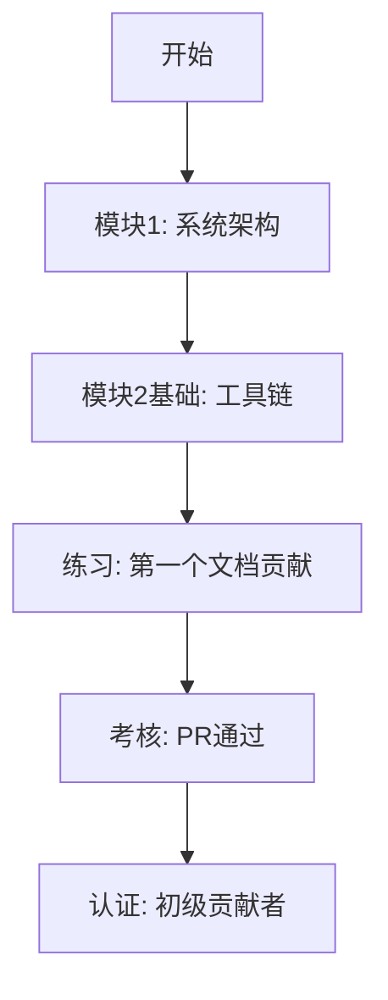
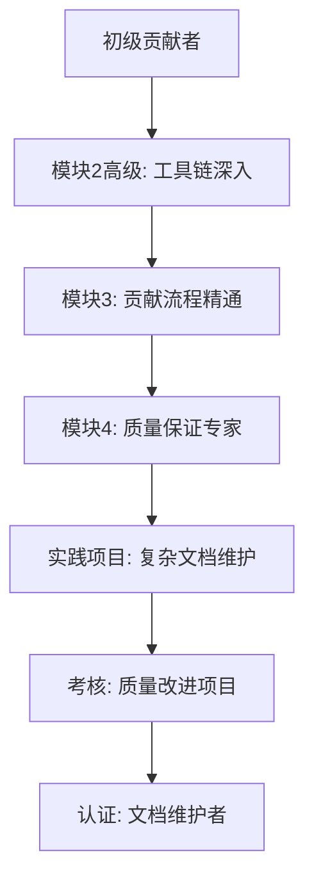
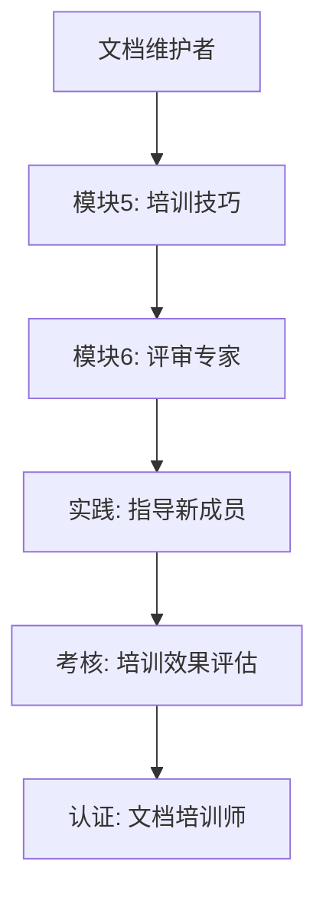

# 团队培训与知识转移计划

## 概述

本文档制定OpenClaw项目文档系统的团队培训与知识转移计划，旨在确保团队成员能够正确使用和维护文档系统，建立"文档优先"的开发文化。计划基于文档迁移项目成果、质量评估报告和维护路线图，提供系统的培训方案。

## 培训目标

### 短期目标 (1个月内)
1. **系统认知**: 团队成员了解文档系统架构和分类体系
2. **工具掌握**: 掌握核心文档工具链的基本使用
3. **贡献能力**: 能够正确创建、更新和维护文档
4. **质量意识**: 理解文档质量标准和检查要求

### 中期目标 (3个月内)
1. **熟练运用**: 熟练使用自动化工具进行文档维护
2. **最佳实践**: 遵循文档写作和维护的最佳实践
3. **主动贡献**: 主动发现并改进文档质量问题
4. **知识传承**: 能够指导新成员使用文档系统

### 长期目标 (6个月内)
1. **文化建立**: "文档优先"成为团队共识
2. **质量自主**: 团队自主维护文档质量，减少外部干预
3. **流程优化**: 持续优化文档工作流程和工具链
4. **知识扩展**: 将文档系统经验扩展到其他项目

## 培训对象与分级

### 1. 新团队成员 (入职1个月内)
**培训重点**: 快速上手，了解文档系统基本使用
- **前置要求**: 无
- **培训时长**: 2小时核心培训 + 1小时实操
- **考核方式**: 完成第一个文档贡献PR

### 2. 常规贡献者 (所有团队成员)
**培训重点**: 掌握工具链，遵循标准流程
- **前置要求**: 了解项目基础
- **培训时长**: 4小时综合培训 + 2小时实践
- **考核方式**: 文档质量检查通过率≥90%

### 3. 文档维护者 (指定核心成员)
**培训重点**: 深入理解系统架构，掌握高级工具
- **前置要求**: 熟悉文档工具链
- **培训时长**: 8小时深度培训 + 4小时项目实践
- **考核方式**: 独立解决复杂文档问题，优化工具链

### 4. 文档评审员 (各领域专家)
**培训重点**: 质量评审标准，最佳实践指导
- **前置要求**: 领域专业知识
- **培训时长**: 3小时评审培训 + 实际评审实践
- **考核方式**: 评审质量和效率评估

## 培训内容体系

### 模块1: 文档系统架构 (1小时)
**目标**: 理解文档系统设计理念和组织结构

#### 核心内容
1. **MAREF三才六层模型**
   - 模型原理和设计理念
   - 六层分类标准和应用场景
   - 文档分类决策树

2. **目录结构解析**
   - `docs/`目录组织逻辑
   - 各子目录的功能和定位
   - 文档分类映射表

3. **文档生命周期**
   - 创建 → 评审 → 发布 → 维护 → 归档
   - 各阶段的质量要求和检查点
   - 角色和职责分配

#### 学习资源
- [系统架构概述](../../architecture/system-design.md)
- [MAREF框架介绍](../../architecture/maref-framework.md)
- [文档分类指南](documentation-classification-guide.md)

### 模块2: 工具链使用 (2小时)
**目标**: 掌握文档自动化工具的基本操作

#### 核心内容
1. **质量检查工具**
   - `check_document_links.py`: 链接有效性检查
   - `validate_document_format.py`: 格式规范验证
   - `check_document_completeness.py`: 内容完整性分析
   - `analyze_document_readability.py`: 可读性评估

2. **维护管理工具**
   - `batch_update_documents.py`: 批量更新操作
   - `fix_internal_links.py`: 链接修复工具
   - `document_version_manager.py`: 版本管理工具
   - `archive_old_documents.py`: 文档归档管理

3. **自动化工作流**
   - 预提交检查配置 (`.git/hooks/pre-commit`)
   - CI/CD流水线集成 (GitHub Actions)
   - 定期维护任务 (cron配置)

#### 实操练习
```bash
# 练习1: 检查指定文档的链接
python3 scripts/check_document_links.py --file docs/user/getting-started.md

# 练习2: 验证文档格式合规性
python3 scripts/validate_document_format.py --file docs/user/user-guide.md --fix

# 练习3: 分析文档可读性
python3 scripts/analyze_document_readability.py --file docs/architecture/system-design.md --json

# 练习4: 批量更新文档元数据
python3 scripts/batch_update_documents.py --directory docs/user/ --update-metadata
```

#### 学习资源
- [文档工具使用教程](documentation-tools-tutorial.md)
- [自动化工作流配置指南](../../technical/deployment/automation-workflow-config.md)

### 模块3: 文档贡献流程 (1.5小时)
**目标**: 掌握标准文档创建和更新流程

#### 核心内容
1. **创建新文档**
   - 分类选择: 基于MAREF模型确定文档位置
   - 命名规范: 英文优先、短横线分隔、日期格式
   - 模板使用: 选择合适模板快速开始
   - 内容标准: 结构、元数据、质量要求

2. **更新现有文档**
   - 小规模更新: 单文件编辑和质量检查
   - 大规模更新: 批量工具使用和验证
   - 元数据维护: 最后更新日期、版本号
   - 链接管理: 内部引用和外部链接

3. **评审与合并流程**
   - PR创建: 描述变更内容和影响
   - 质量检查: 自动化检查和手动审查
   - 评审标准: 准确性、完整性、一致性
   - 合并后验证: 链接有效性、格式合规性

#### 实操练习
```bash
# 练习1: 创建新文档并验证
cp docs/templates/user-guide-template.md docs/user/new-feature-guide.md
# 编辑内容
python3 scripts/validate_document_format.py --file docs/user/new-feature-guide.md
python3 scripts/check_document_links.py --file docs/user/new-feature-guide.md

# 练习2: 更新现有文档元数据
python3 scripts/batch_update_documents.py --file docs/architecture/system-design.md --update-last-modified

# 练习3: 模拟PR创建和检查
# 创建分支、提交变更、运行完整质量检查
```

#### 学习资源
- [文档贡献指南](contributing.md)
- [文档写作指南](documentation-writing-guide.md)
- [Markdown高级技巧](markdown-advanced.md)

### 模块4: 质量保证与最佳实践 (1.5小时)
**目标**: 理解文档质量标准，掌握最佳实践

#### 核心内容
1. **质量指标体系**
   - 可读性评分: Flesch-Kincaid算法和标准
   - 完整性检查: 元数据、结构、内容维度
   - 格式合规: Markdown规范和安全要求
   - 链接有效性: 内部引用和外部链接

2. **最佳实践指南**
   - 写作技巧: 清晰、准确、简洁的表达
   - 结构设计: 逻辑组织、层次分明
   - 示例使用: 代码示例、图表、表格
   - 术语统一: 项目术语表和一致性

3. **常见问题与解决方案**
   - 链接失效的预防和修复
   - 格式错误的识别和修正
   - 内容过时的检测和更新
   - 可读性提升的具体方法

#### 案例研究
1. **优秀文档分析**: 选择高质量文档分析其特点
2. **问题文档改进**: 识别低质量文档并制定改进方案
3. **质量对比**: 改进前后的质量指标对比

#### 学习资源
- [文档质量评估标准](../../technical/specifications/document-quality-standards.md)
- [最佳实践案例库](../../technical/operations/best-practices-catalog.md)

## 培训实施计划

### 第一阶段: 试点培训 (第1个月)
**时间**: 2026年4月最后一周
**对象**: 核心团队 (5-8人)
**内容**: 模块1-2基础培训
**形式**: 线下工作坊 + 实操练习
**产出**:
- 培训材料验证和改进建议
- 首批认证的文档贡献者
- 培训效果评估报告

### 第二阶段: 全员培训 (第2个月)
**时间**: 2026年5月
**对象**: 全体团队成员
**内容**: 完整培训体系 (模块1-4)
**形式**: 分批线上培训 + 分组实践
**产出**:
- 团队整体文档能力基线评估
- 个性化培训需求分析
- 培训体系优化方案

### 第三阶段: 深化培训 (第3个月)
**时间**: 2026年6月
**对象**: 文档维护者和评审员
**内容**: 高级工具和评审技巧
**形式**: 小班深度培训 + 导师指导
**产出**:
- 文档维护者认证体系
- 评审标准和流程优化
- 知识传承机制建立

### 第四阶段: 持续学习 (第4-6个月)
**时间**: 2026年7月-9月
**对象**: 所有团队成员
**内容**: 定期更新和进阶培训
**形式**: 月度分享会 + 季度工作坊
**产出**:
- 持续改进的培训体系
- 内部培训师团队建设
- 跨团队知识共享机制

## 培训材料与资源

### 核心培训材料
| 材料类型 | 名称 | 用途 | 状态 |
|----------|------|------|------|
| **演示文稿** | `文档系统培训.pptx` | 理论讲解 | 待创建 |
| **实操手册** | `工具链实操指南.pdf` | 动手练习 | 待创建 |
| **视频教程** | `文档工具使用视频系列` | 自学材料 | 待录制 |
| **练习题库** | `文档贡献练习案例集` | 能力评估 | 待创建 |
| **快速参考** | `文档系统速查卡.pdf` | 日常使用 | 待创建 |

### 在线学习平台
1. **GitHub学习路径**: 结构化学习内容和练习
2. **内部Wiki**: 培训材料和参考资料集中管理
3. **视频平台**: 录制培训视频供随时学习
4. **交互式教程**: 在线实操环境，即时反馈

### 学习路径设计
#### 路径1: 快速入门 (1周)


#### 路径2: 专业提升 (4周)


#### 路径3: 导师成长 (8周)


## 考核与认证体系

### 考核方式
#### 1. 理论测试 (选择题、简答题)
- 文档系统架构理解
- 工具链功能认知
- 质量标准掌握程度

#### 2. 实操考核
- 文档创建和编辑能力
- 工具链正确使用
- 问题诊断和解决

#### 3. 项目实践
- 实际文档贡献质量
- 团队协作和评审能力
- 持续改进意识

### 认证等级
#### 青铜级: 初级贡献者
**要求**:
- 通过理论测试 (≥80分)
- 完成第一个文档贡献PR
- 掌握基础工具使用

**权限**:
- 创建和更新用户文档
- 参与文档校对和链接修复
- 访问基础培训材料

#### 白银级: 常规贡献者
**要求**:
- 通过实操考核 (≥85分)
- 完成3个质量达标的文档贡献
- 掌握完整工具链使用

**权限**:
- 创建和更新所有类型文档
- 参与文档评审 (辅助角色)
- 访问高级培训材料
- 获得文档贡献积分

#### 黄金级: 文档维护者
**要求**:
- 通过项目实践考核 (≥90分)
- 独立解决复杂文档问题
- 指导初级贡献者经验

**权限**:
- 文档分类和重构权限
- 正式文档评审资格
- 工具链开发和优化权限
- 培训新成员资格

#### 白金级: 文档架构师
**要求**:
- 体系化文档系统改进经验
- 培训师认证和实际培训成果
- 重大文档项目领导经验

**权限**:
- 文档体系架构设计权限
- 质量标准制定和调整权限
- 培训体系设计和实施权限
- 跨项目知识转移领导权限

## 培训效果评估与改进

### 评估指标
#### 反应层面 (学员满意度)
- 培训内容相关性评分
- 讲师表现评价
- 培训材料质量反馈
- 总体满意度调查

#### 学习层面 (知识掌握)
- 培训前后测试对比
- 技能实操考核成绩
- 知识应用能力评估

#### 行为层面 (实际应用)
- 文档贡献数量和质量
- 工具链使用频率和效果
- 文档评审参与度和质量
- 问题解决能力提升

#### 结果层面 (业务影响)
- 文档质量指标改善 (可读性、完整性)
- 团队文档工作效率提升
- 新成员上手时间缩短
- 知识传承效果增强

### 评估方法
#### 定量评估
1. **前后测试对比**: 统计知识掌握提升程度
2. **贡献数据统计**: 分析培训后文档贡献变化
3. **质量指标追踪**: 监控文档质量趋势变化
4. **效率测量**: 记录文档相关任务完成时间

#### 定性评估
1. **学员访谈**: 深度了解培训体验和收获
2. **观察记录**: 观察实际工作中的文档实践
3. **案例分析**: 分析典型成功和失败案例
4. **焦点小组**: 收集团队反馈和改进建议

### 持续改进机制
#### 月度评审
- 收集培训反馈数据
- 分析培训效果指标
- 识别问题和改进机会
- 调整培训内容和方法

#### 季度优化
- 评估培训体系整体效果
- 更新培训材料和资源
- 优化认证标准和流程
- 规划下一阶段培训重点

#### 年度总结
- 分析全年培训成果
- 评估文档文化建立程度
- 制定长期培训发展战略
- 规划跨团队知识共享扩展

## 资源配置与支持

### 人员配置
| 角色 | 数量 | 职责 | 时间投入 |
|------|------|------|----------|
| **培训负责人** | 1人 | 培训体系设计和管理 | 20%时间 |
| **培训讲师** | 2-3人 | 培训实施和指导 | 10-15%时间 |
| **导师团队** | 5-8人 | 一对一指导和实践支持 | 5-10%时间 |
| **材料开发** | 2人 | 培训材料创建和维护 | 15%时间 (前期) |

### 时间投入估算
| 培训阶段 | 核心团队 | 全体团队 | 总投入 (人时) |
|----------|----------|----------|--------------|
| **试点培训** | 8人 × 4小时 | - | 32人时 |
| **全员培训** | - | 20人 × 8小时 | 160人时 |
| **深化培训** | 5人 × 12小时 | - | 60人时 |
| **持续学习** | - | 20人 × 2小时/月 | 40人时/月 |

### 工具和平台支持
| 资源类型 | 具体需求 | 负责团队 | 完成时间 |
|----------|----------|----------|----------|
| **培训环境** | 实操服务器和测试数据 | 运维团队 | 2026-04-25 |
| **学习平台** | 内部Wiki和视频平台 | 技术团队 | 2026-04-30 |
| **考核系统** | 在线测试和评估工具 | 技术团队 | 2026-05-10 |
| **认证系统** | 贡献度追踪和认证管理 | 技术团队 | 2026-05-20 |

## 风险与应对措施

### 培训参与度风险
| 风险 | 影响 | 应对措施 |
|------|------|----------|
| **时间冲突** | 培训出席率低 | 提供多个时间选择，录制视频供补看 |
| **缺乏动力** | 参与积极性不高 | 建立认证和激励机制，与绩效挂钩 |
| **难度不适** | 内容过难或过易 | 分级培训，个性化学习路径 |
| **实践不足** | 理论到实践转化困难 | 增加实操练习，提供导师指导 |

### 培训效果风险
| 风险 | 影响 | 应对措施 |
|------|------|----------|
| **知识遗忘** | 培训后很快忘记 | 定期复习和强化训练，提供速查资料 |
| **应用障碍** | 工作中难以应用 | 真实项目实践，逐步导入工作流程 |
| **质量倒退** | 初期质量下降后反弹 | 持续监控和支持，及时干预和指导 |
| **文化阻力** | "文档优先"文化难以建立 | 领导示范，成功案例宣传，持续倡导 |

### 资源保障风险
| 风险 | 影响 | 应对措施 |
|------|------|----------|
| **讲师不足** | 培训无法按计划开展 | 培养内部讲师，建立讲师梯队 |
| **材料过时** | 培训内容与实际脱节 | 定期更新机制，与实际工作同步 |
| **平台故障** | 在线学习中断 | 备用方案，离线材料准备 |
| **预算限制** | 培训资源不足 | 优先级排序，分阶段实施 |

## 附录

### A. 培训时间表模板
```markdown
# 文档系统培训时间表 (示例)

## 第1周: 基础认知
- 周一 10:00-11:00: 模块1-文档系统架构 (理论)
- 周三 14:00-16:00: 模块2-工具链使用基础 (实操)
- 周五 15:00-16:00: 练习辅导和答疑

## 第2周: 技能掌握
- 周一 10:00-11:30: 模块3-文档贡献流程 (理论+案例)
- 周三 14:00-15:30: 模块4-质量保证最佳实践 (理论)
- 周五 全天: 个人实践项目 (自主安排)

## 第3周: 实践考核
- 周三 14:00-17:00: 实操考核和项目评审
- 周五 16:00-17:00: 结果反馈和认证颁发
```

### B. 培训反馈问卷模板
```markdown
# 文档系统培训反馈问卷

## 基本信息
- 姓名: ______
- 部门: ______
- 培训时间: ______
- 培训模块: ______

## 满意度评价 (1-5分)
1. 培训内容相关性: □1 □2 □3 □4 □5
2. 讲师讲解清晰度: □1 □2 □3 □4 □5
3. 实操练习有效性: □1 □2 □3 □4 □5
4. 培训材料质量: □1 □2 □3 □4 □5
5. 总体满意度: □1 □2 □3 □4 □5

## 开放性问题
1. 本次培训最有价值的部分是什么？
2. 哪些内容需要改进或补充？
3. 你在实践中遇到的主要困难是什么？
4. 对后续培训有什么建议？
```

### C. 相关文档链接
1. [文档贡献指南](contributing.md)
2. [文档工具使用教程](documentation-tools-tutorial.md)
3. [文档写作指南](documentation-writing-guide.md)
4. [文档维护路线图](../../technical/project/document-maintenance-roadmap.md)
5. [文档质量评估标准](../../technical/specifications/document-quality-standards.md)

### D. 培训联系人
- **培训协调**: 文档团队培训负责人
- **技术支持**: 工具链开发团队
- **内容咨询**: 文档架构师团队
- **反馈渠道**: GitHub Issues (`training-feedback`标签)

---

**最后更新**: 2026-04-19  
**版本**: 1.0  
**维护者**: OpenClaw文档培训团队  
**文档状态**: 实施计划  

> **提示**: 本培训计划将根据实际执行情况和反馈持续优化，建议每季度评审更新。